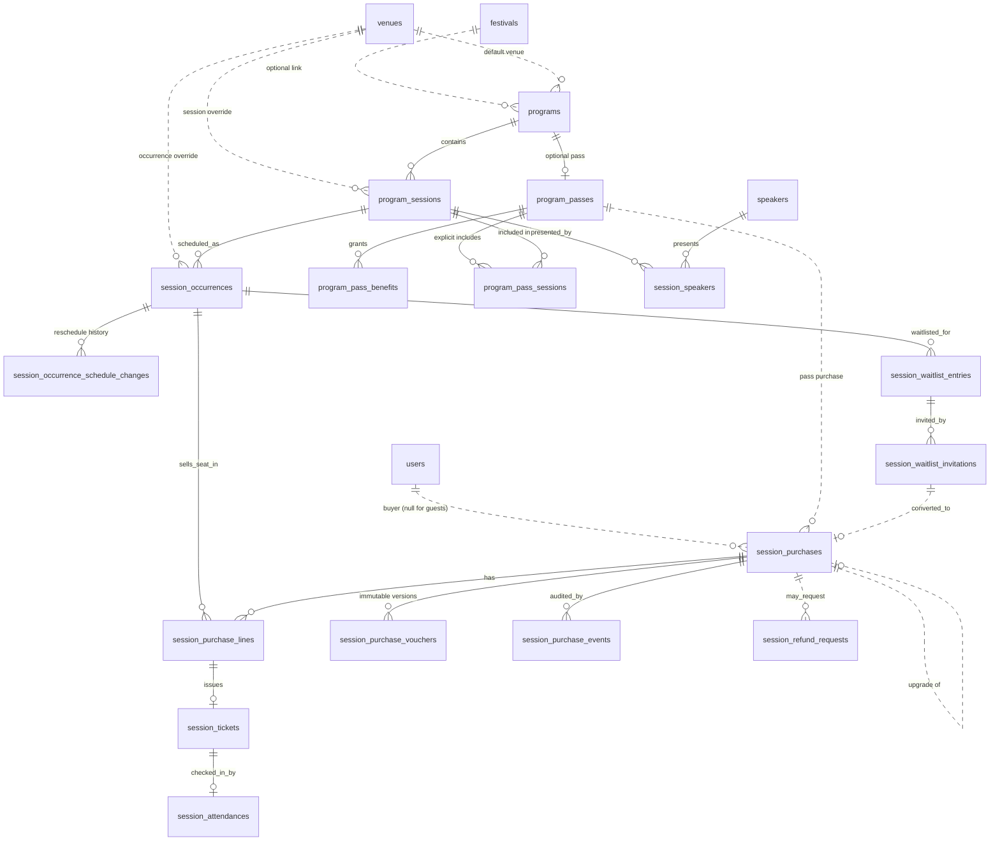
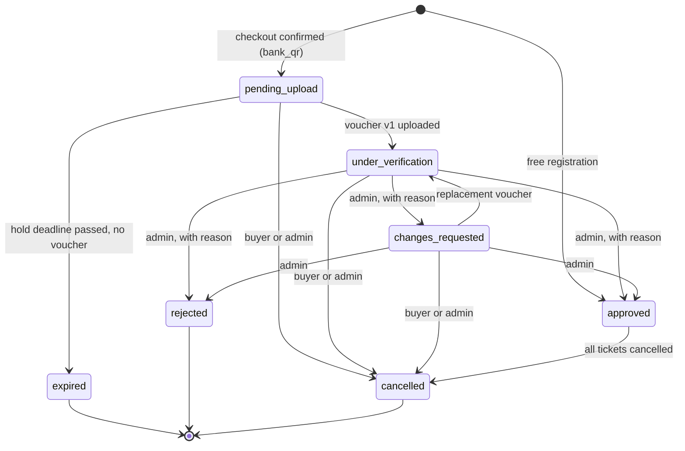

# Architecture: Paid Programs and Sessions (Phase 0)

**Product:** Glitter

**Date:** 2026-07-25

**Status:** Phase 0 deliverable — contracts and architecture. Phases 0–2 built.

**Reference PRD:** [PRD-paid-programs-and-sessions.md](./PRD-paid-programs-and-sessions.md)

**Reference roadmap:** [ROADMAP-paid-programs-and-sessions.md](./ROADMAP-paid-programs-and-sessions.md)

---

## 0a. Scope change — multi-session cart deferred (2026-07-30)

The multi-session cart is **cut from the MVP** ([PRD §0a](./PRD-paid-programs-and-sessions.md)). A buyer registers for one session at a time.

Nothing in this document is invalidated. `session_purchase_lines` remains one row per occurrence, and `startPaidCheckout` already accepts several — verified against the database — so the schema and the locking discipline are unchanged. What is deferred is the **UI** that would let a buyer select more than one, and the combined-total presentation that goes with it.

**Do not simplify on the strength of this deferral.** Deterministic `FOR UPDATE` lock ordering (§9) and one line row per occurrence (§6.11) stay exactly as specified: the former prevents deadlock between any two overlapping purchases, and the latter is the shape approval, cancellation, and check-in already read.

---

## 0b. Scope change — Week Pass deferred (2026-07-29)

The Week Pass is **cut from the MVP** ([PRD §0b](./PRD-paid-programs-and-sessions.md)). Everything in this document that exists to serve the pass is marked **[Deferred — post-MVP]** and left in place, because the design work is done and re-deriving it later would be waste.

Deferred here: §6.8 `program_passes`, §6.9 `program_pass_benefits`, the `program_pass_sessions` join, the `passId` / `passCode` / `upgradeOfPurchaseId` columns on §6.10 `session_purchases`, the pass-code branch of §7.3 check-in resolution, and §7.5 upgrade-to-a-pass.

**As-built note.** None of the pass tables or columns were ever created — the deferral costs no migration. Three pieces of forward-compatible residue do exist in `db/schema.ts` and are deliberately kept:

- `purchase_line_source` still carries the `pass_session` value alongside `individual_session`.
- `session_purchase_lines` still enforces `source <> 'pass_session' OR unitPrice = 0`.
- `session_purchase_event_type` still carries `upgrade_initiated` and `upgrade_completed`.

All are unreachable while no pass exists. Removing an enum value would need a Postgres enum rewrite for no benefit, and keeping them means the pass can land later as pure addition.

**Load-bearing beyond the pass.** Two mechanisms were justified partly by the pass but are required regardless, and must not be simplified on the strength of this deferral:

- Deterministic `FOR UPDATE` lock ordering (§9). It prevents deadlock between any two multi-line purchases, not only between a pass and an individual sale.
- One `session_purchase_lines` row per occurrence (§6.11). The cart depends on this shape as much as the pass did.

---

## 1. Purpose

This document closes the ambiguity that Phase 0 of the roadmap requires to be closed before any
table, mutation, or financial workflow is built. It is the contract Phase 1 implements: entity
names, column-level shapes, state machines, invariants, and the concurrency, idempotency, token,
audit, expiration, and rollout strategies.

No schema or migration is created by this phase. Column specifications below are written in
Drizzle terms so Phase 1 is mechanical transcription rather than fresh design.

The one exception — the canonical "active participant" definition — is delivered as code in this
phase, because the roadmap requires it to be _queryable_, not merely described:
[app/lib/programs/eligibility.ts](../app/lib/programs/eligibility.ts).

## 2. Decisions that resolve the PRD's open notes

The PRD §17 and roadmap §5 list decisions that must not be deferred. Each is resolved here.

| #   | Open note                                                            | Decision                                                                                                                                                                                                                                                                                                                                                                                       |
| --- | -------------------------------------------------------------------- | ---------------------------------------------------------------------------------------------------------------------------------------------------------------------------------------------------------------------------------------------------------------------------------------------------------------------------------------------------------------------------------------------- |
| 1   | Canonical source for "active participant"                            | `users.status === "verified"` and no ban sanction in effect. Pure predicate + query sibling; snapshotted with its evidence on every purchase. §8                                                                                                                                                                                                                                               |
| 2   | Final entity and state names without festival/store semantics        | Names in §6. No new entity references `festivalType`, sectors, booths, reservations, festival activities, or store products.                                                                                                                                                                                                                                                                   |
| 3   | Transactional seat locking preventing overselling and double release | Inventory is **derived**, never a counter. Occurrence rows are locked `FOR UPDATE` in deterministic id order; availability is recomputed inside the transaction. §9                                                                                                                                                                                                                            |
| 4   | How rescheduling is represented                                      | The occurrence keeps its identity and primary key; its schedule columns are updated, `rescheduledAt` is stamped, and an immutable `session_occurrence_schedule_changes` row records from/to. Tickets point at the occurrence, so validity survives with no ticket mutation. §7.1                                                                                                               |
| 5   | Configurable waitlist invitation duration                            | `programs.waitlistInvitationWindowMinutes` (nullable → falls back to `program_settings`, default 1440). Follows the existing `festivalActivities.waitlistWindowMinutes` precedent. §7.4                                                                                                                                                                                                        |
| 6   | Partial cancellation for multi-session purchases                     | Cancellation is modeled at the **ticket** level. A purchase's `cancelled` state is derived from all its tickets being cancelled; a partially cancelled purchase stays `approved`. No refund path is reachable from attendee-initiated cancellation. §7.2, §7.3. Remaining work is UX copy only, owed in Phase 5. The ticket-level model already answers the pass case whenever the pass ships. |
| 7   | Festival Fast Pass as an extensible benefit                          | **[Deferred — post-MVP with the pass, §0b.]** `program_pass_benefits` rows typed by `pass_benefit_type`; would store `festival_fast_pass` and perform no fulfillment. §6.9                                                                                                                                                                                                                     |
| 8   | Do not use store products as the representation of tickets           | `session_tickets` is a first-class table. `products`, `orders`, `orderItems`, and `carts` are untouched. §5                                                                                                                                                                                                                                                                                    |

## 3. Glossary

| Term                    | Meaning in this domain                                                                                                                                                                                     |
| ----------------------- | ---------------------------------------------------------------------------------------------------------------------------------------------------------------------------------------------------------- |
| **Program**             | An editorial grouping of sessions with a date range, a default venue, and an optional festival link (plus an optional pass once that ships). Glitter Week is one program.                                  |
| **Session**             | The purchasable _content_: title, type, description, speakers, audience, price. Carries no schedule and no inventory.                                                                                      |
| **Occurrence**          | One scheduled instance of a session: start/end time, venue override, capacity, sales window, inventory, tickets, waitlist, check-in. A repeat group is a second occurrence and shares nothing but content. |
| **Speaker**             | An admin-maintained public profile (talk speaker or workshop facilitator). Requires no Glitter account. Many-to-many with sessions.                                                                        |
| **Venue**               | A reusable named place. Resolution is occurrence → session → program.                                                                                                                                      |
| **Audience**            | Which eligibility classes may buy a session: everyone, active participants only, or general public only.                                                                                                   |
| **Eligibility**         | The buyer's class at the moment of evaluation: `active_participant` or `public`.                                                                                                                           |
| **Pass**                | **[Deferred — post-MVP, §0b.]** A bundle sold as one line that reserves one seat in every included session. The Week Pass would be the first instance.                                                     |
| **Benefit**             | **[Deferred — post-MVP, §0b.]** Extra entitlement attached to a pass, e.g. Festival Fast Pass.                                                                                                             |
| **Seat hold**           | Not a table. A purchase line is _holding_ a seat while its purchase is in a holding state (§9.1).                                                                                                          |
| **Purchase**            | One checkout by one buyer: one total, one voucher stream, one secure link, one or more lines.                                                                                                              |
| **Purchase line**       | One seat in one occurrence, with the price and price basis applied to it.                                                                                                                                  |
| **Voucher version**     | An immutable uploaded payment proof. Newest version is reviewed; all versions are retained.                                                                                                                |
| **Ticket**              | Issued per approved line. Valid for one person and one occurrence. Bears the opaque code encoded in the QR.                                                                                                |
| **Attendance**          | The check-in record for a ticket. At most one per ticket.                                                                                                                                                  |
| **Waitlist entry**      | A person's interest in a sold-out occurrence.                                                                                                                                                              |
| **Waitlist invitation** | A time-boxed, audited, admin-issued purchase opportunity granted to one waitlist entry.                                                                                                                    |

## 4. Conceptual model

Entities marked `%% deferred` below belong to the Week Pass and are not built (§0b).



## 5. Boundaries with existing domains

**Reused as pattern, never as storage:**

- Guest identity + opaque token: mirrors `orders.guestOrderToken` and its check constraint
  ([app/lib/orders/actions.ts:654](../app/lib/orders/actions.ts)).
- Lazy hold expiry with a sweep: mirrors `standHolds`
  ([app/lib/stands/hold-actions.ts](../app/lib/stands/hold-actions.ts)).
- Event-sourced admin audit: mirrors `sanctionEvents` / `infractionEvents`.
- Configurable waitlist window: mirrors `festivalActivities.waitlistWindowMinutes`.
- Transactional capacity check: mirrors the `FOR UPDATE` block in
  [app/lib/festival_activites/actions.ts:516](../app/lib/festival_activites/actions.ts).
- Email delivery + idempotency key: reuses `sendEmail`
  ([app/vendors/resend.ts](../app/vendors/resend.ts)) directly.
- QR image generation: reuses the `qrcode` helper in [app/lib/utils.ts:56](../app/lib/utils.ts).
- Cron entry points: reuses the `app/api/cron/morning/*` + `vercel.json` pattern.

**Explicitly untouched.** No table in this domain references, extends, or migrates:
`festivalType`, `festivalSectors`, `stands`, `standHolds`, `standReservations`, `festivalActivities`
and their gamification types, `tickets` (festival visitor tickets), `invoices`, `payments`,
`products`, `productVariants`, `orders`, `orderItems`, `carts`, `cartItems`.

The only permitted link into an existing domain is `programs.festivalId` (nullable,
`ON DELETE SET NULL`) and the actor/buyer/attendee links to `users`.

The word "cart" is deliberately avoided in this domain to prevent confusion with the store's
`carts` table; the multi-session selection is a _purchase draft_ assembled client-side and
materialized only at checkout confirmation (§9.2).

## 6. Entity contracts

Conventions: `id serial` primary key, `createdAt`/`updatedAt` non-null timestamps defaulting to
`now()`, snake_case columns, camelCase TS. Money is `numeric(10, 2)` with `mode: "number"`,
matching `orders.totalAmount`. All timestamps are stored without timezone, as elsewhere in the
schema, and interpreted as UTC; presentation uses Luxon, as in existing code.

### 6.1 `venues`

| Column          | Type                            | Notes                             |
| --------------- | ------------------------------- | --------------------------------- |
| `name`          | text, not null                  | e.g. "Casa Glitter"               |
| `address`       | text                            |                                   |
| `locationLabel` | text                            | Mirrors `festivals.locationLabel` |
| `locationUrl`   | text                            | Map link                          |
| `isActive`      | boolean, not null, default true | Soft retirement                   |

### 6.2 `program_settings`

Singleton configuration, following the `storeSettings` precedent (one row, unique key column).

| Column                                   | Type                                                     | Notes                                             |
| ---------------------------------------- | -------------------------------------------------------- | ------------------------------------------------- |
| `key`                                    | text, not null, unique                                   | Always `"global"` in the MVP                      |
| `defaultParticipantDiscountType`         | `participant_discount_type`, not null, default `percent` | `percent` \| `fixed` (§8.3)                       |
| `defaultParticipantDiscountValue`        | numeric(10,2), not null, default 0                       | Percentage points when `percent`, Bs when `fixed` |
| `defaultHoldMinutes`                     | integer, not null, default 20                            | PRD §9.1                                          |
| `defaultOccurrenceCapacity`              | integer, not null, default 20                            | PRD §4.2                                          |
| `defaultWaitlistInvitationWindowMinutes` | integer, not null, default 1440                          | §7.4                                              |
| `attendeeCancellationCutoffHours`        | integer, not null, default 48                            | "Two days before", PRD §12.1                      |
| `bankQrImageUrl`                         | text                                                     | Payment QR shown on the secure page               |
| `noRefundPolicyVersion`                  | text, not null                                           | Current policy version id (§7.2)                  |

Checks: every `*Minutes`, `*Hours`, and `defaultOccurrenceCapacity` value `> 0`;
`defaultParticipantDiscountValue >= 0`, and `<= 100` when the type is `percent`.

### 6.3 `programs`

| Column                            | Type                                                     | Notes                                                          |
| --------------------------------- | -------------------------------------------------------- | -------------------------------------------------------------- |
| `name`                            | text, not null                                           |                                                                |
| `slug`                            | text, not null, unique                                   | Public URL segment                                             |
| `summary`                         | text                                                     |                                                                |
| `description`                     | text                                                     |                                                                |
| `bannerUrl`, `thumbnailUrl`       | text                                                     |                                                                |
| `startDate`, `endDate`            | timestamp                                                | Overall range                                                  |
| `status`                          | `program_status`, not null, default `draft`              | §7.1                                                           |
| `festivalId`                      | integer → `festivals.id`, `ON DELETE SET NULL`, nullable | Optional link                                                  |
| `defaultVenueId`                  | integer → `venues.id`, `ON DELETE RESTRICT`, nullable    |                                                                |
| `participantDiscountType`         | `participant_discount_type`, nullable                    | Overrides `program_settings`; set with the value or not at all |
| `participantDiscountValue`        | numeric(10,2), nullable                                  | Percentage points when `percent`, Bs when `fixed`              |
| `waitlistInvitationWindowMinutes` | integer, nullable                                        | Overrides `program_settings`                                   |
| `holdMinutes`                     | integer, nullable                                        | Overrides `program_settings`                                   |

Checks: `endDate IS NULL OR startDate IS NULL OR endDate >= startDate`; the discount override is a
complete pair (`programs_discount_pair_complete` — both columns set or both null); the value is
`>= 0`, and `<= 100` when the type is `percent`; nullable minute overrides `> 0` when present.

### 6.4 `program_sessions`

Content only. No schedule, no capacity, no inventory.

| Column             | Type                                                   | Notes                                         |
| ------------------ | ------------------------------------------------------ | --------------------------------------------- |
| `programId`        | integer → `programs.id`, `ON DELETE CASCADE`, not null |                                               |
| `slug`             | text, not null                                         | Unique per program: `unique(programId, slug)` |
| `title`            | text, not null                                         |                                               |
| `type`             | `session_type`, not null                               | `talk` \| `workshop`                          |
| `topic`            | text                                                   |                                               |
| `description`      | text                                                   |                                               |
| `learningOutcomes` | jsonb                                                  | Array of strings, PRD §5.1                    |
| `skillLevel`       | `session_skill_level`, nullable                        | Optional                                      |
| `imageUrl`         | text                                                   |                                               |
| `audience`         | `session_audience`, not null, default `all`            | §8.2                                          |
| `publicPrice`      | numeric(10,2), not null, default 0                     | Zero allowed (free session)                   |
| `participantPrice` | numeric(10,2), nullable                                | Explicit override of the discount rule        |
| `status`           | `program_status`, not null, default `draft`            | Editorial publication, §7.1                   |
| `publishedAt`      | timestamp, nullable                                    |                                               |
| `venueId`          | integer → `venues.id`, `ON DELETE RESTRICT`, nullable  | Session-level override                        |
| `displayOrder`     | integer, not null, default 0                           | Program page ordering                         |

Checks: `publicPrice >= 0`; `participantPrice IS NULL OR participantPrice >= 0`;
`participantPrice IS NULL OR participantPrice <= publicPrice`.

### 6.5 `session_occurrences`

Schedule and inventory.

| Column                       | Type                                                           | Notes                                                                    |
| ---------------------------- | -------------------------------------------------------------- | ------------------------------------------------------------------------ |
| `sessionId`                  | integer → `program_sessions.id`, `ON DELETE CASCADE`, not null |                                                                          |
| `startsAt`, `endsAt`         | timestamp, not null                                            |                                                                          |
| `venueId`                    | integer → `venues.id`, `ON DELETE RESTRICT`, nullable          | Occurrence-level override                                                |
| `room`                       | text, nullable                                                 |                                                                          |
| `capacity`                   | integer, not null, default 20                                  | PRD §4.2                                                                 |
| `salesStartAt`, `salesEndAt` | timestamp, nullable                                            | Null = unbounded on that side                                            |
| `salesClosedAt`              | timestamp, nullable                                            | Manual close, independent of the window                                  |
| `lifecycleStatus`            | `occurrence_lifecycle_status`, not null, default `scheduled`   | `scheduled` \| `completed` \| `cancelled`                                |
| `cancelledAt`, `completedAt` | timestamp, nullable                                            |                                                                          |
| `rescheduledAt`              | timestamp, nullable                                            | Last reschedule; drives the "rescheduled" badge and refund-request right |

Checks: `endsAt > startsAt`; `capacity > 0`; `salesEndAt IS NULL OR salesStartAt IS NULL OR
salesEndAt >= salesStartAt`; `lifecycleStatus <> 'cancelled' OR cancelledAt IS NOT NULL`;
`lifecycleStatus <> 'completed' OR completedAt IS NOT NULL`.

Indexes: `(sessionId, startsAt)`; `(lifecycleStatus, startsAt)`.

**Not built:** an earlier draft carried `repeatOfOccurrenceId`, a self-reference recording that an
occurrence was added as a demand-driven repeat of another. It was dropped before implementation
because it carried no inventory meaning — a repeat group is simply another occurrence with its own
capacity and tickets (PRD §4.2) — and nothing reads provenance. Add it only when something does.

### 6.6 `speakers` and `session_speakers`

`speakers`: `publicName` text not null, `imageUrl` text, `bio` text, `links` jsonb (array of
`{ label, url }`), `isActive` boolean not null default true.

`session_speakers`: `sessionId` → `program_sessions.id` `ON DELETE CASCADE`, `speakerId` →
`speakers.id` `ON DELETE RESTRICT`, `role` text nullable (display label, e.g. "Facilitadora"),
`displayOrder` integer not null default 0. `unique(sessionId, speakerId)`.

`ON DELETE RESTRICT` on `speakerId` keeps published history intact; retirement uses `isActive`.

### 6.7 `session_occurrence_schedule_changes`

Immutable reschedule history. Insert-only; never updated or deleted.

| Column                                                 | Type                                                              |
| ------------------------------------------------------ | ----------------------------------------------------------------- |
| `occurrenceId`                                         | integer → `session_occurrences.id`, `ON DELETE CASCADE`, not null |
| `fromStartsAt`, `fromEndsAt`, `toStartsAt`, `toEndsAt` | timestamp, not null                                               |
| `fromVenueId`, `toVenueId`                             | integer → `venues.id`, nullable                                   |
| `fromRoom`, `toRoom`                                   | text, nullable                                                    |
| `reason`                                               | text, not null                                                    |
| `actorUserId`                                          | integer → `users.id`, `ON DELETE SET NULL`, nullable              |
| `createdAt`                                            | timestamp, not null                                               |

### 6.8 `program_passes` — **[Deferred — post-MVP]**

Not created (§0b). Specification retained for the future delivery.

| Column             | Type                                                            | Notes                                        |
| ------------------ | --------------------------------------------------------------- | -------------------------------------------- |
| `programId`        | integer → `programs.id`, `ON DELETE CASCADE`, not null, unique  | One pass per program when pass support ships |
| `name`             | text, not null                                                  | "Week Pass"                                  |
| `description`      | text                                                            |                                              |
| `inclusionMode`    | `pass_inclusion_mode`, not null, default `all_program_sessions` | `all_program_sessions` \| `explicit`         |
| `publicPrice`      | numeric(10,2), not null                                         |                                              |
| `participantPrice` | numeric(10,2), nullable                                         | Override of the discount rule                |
| `status`           | `program_status`, not null, default `draft`                     |                                              |

Checks: prices `>= 0`; `participantPrice IS NULL OR participantPrice <= publicPrice`.

`program_pass_sessions` (`passId`, `sessionId`, `unique(passId, sessionId)`) is populated only when
`inclusionMode = 'explicit'`. Both modes name _sessions_, which carry no inventory, so inclusion is
resolved to **occurrences** before anything can be reserved:

1. Take the included sessions — every `published` session in the program for `all_program_sessions`,
   the `program_pass_sessions` rows for `explicit`.
2. For each, take exactly one occurrence: the earliest still-purchasable one, ordered by
   (`startsAt`, `id`). A session whose occurrences are all past, cancelled, or closed to sales
   contributes nothing.
3. The result is a set of `occurrenceId`s — the pass's resolved inventory set.

That set is what the checkout transaction locks and counts against capacity (§9.2), and it is
snapshotted as one `session_purchase_lines` row per occurrence, so a pass purchase and an individual
purchase are the same shape downstream. The ordering rule is deterministic and total, which is what
lets two concurrent pass checkouts resolve to identical occurrence ids and serialize on the same row
locks. Resolution happens once, at checkout: publishing a session or adding an occurrence afterwards
never widens an existing purchase, and a buyer's entitlement is readable from the snapshotted lines
without replaying today's catalogue. Whichever phase implements the pass implements this rule as
written — it is a contract, not a default.

### 6.9 `program_pass_benefits` — **[Deferred — post-MVP]**

Not created (§0b). Specification retained for the future delivery.

| Column          | Type                                                         | Notes                                                              |
| --------------- | ------------------------------------------------------------ | ------------------------------------------------------------------ |
| `passId`        | integer → `program_passes.id`, `ON DELETE CASCADE`, not null |                                                                    |
| `type`          | `pass_benefit_type`, not null                                | At first ship: `festival_fast_pass`                                |
| `config`        | jsonb                                                        | e.g. `{ "festivalId": 12, "dates": ["2026-08-15", "2026-08-16"] }` |
| `isFulfillable` | boolean, not null, default false                             | Stores `false` at first ship: represented, never fulfilled         |

`unique(passId, type)`.

### 6.10 `session_purchases`

| Column                                                 | Type                                                          | Notes                                                                         |
| ------------------------------------------------------ | ------------------------------------------------------------- | ----------------------------------------------------------------------------- |
| `programId`                                            | integer → `programs.id`, `ON DELETE RESTRICT`, not null       | Scopes settings resolution                                                    |
| `userId`                                               | integer → `users.id`, `ON DELETE SET NULL`, nullable          | Null for guests                                                               |
| `guestName`, `guestEmail`, `guestPhone`                | text, nullable                                                | Required together when `userId` is null                                       |
| `guestGender`                                          | `gender`, nullable                                            | Collected from guests only; a signed-in buyer has it on their profile         |
| `guestBirthdate`                                       | date, nullable                                                | As above. `date`, not `timestamp` — a birthday has no time                    |
| `accessTokenHash`                                      | text, not null, unique                                        | SHA-256 of the token; the raw value is returned once and never stored (§11.1) |
| `accessTokenRevokedAt`                                 | timestamp, nullable                                           |                                                                               |
| `passId`                                               | integer → `program_passes.id`, `ON DELETE RESTRICT`, nullable | **[Deferred]** Set for pass purchases                                         |
| `passCode`                                             | text, unique, nullable                                        | **[Deferred]** Single pass QR payload (§7.3)                                  |
| `upgradeOfPurchaseId`                                  | integer → self, `ON DELETE SET NULL`, nullable                | **[Deferred]** Set for pass upgrades                                          |
| `status`                                               | `session_purchase_status`, not null, default `pending_upload` | §7.2                                                                          |
| `paymentMode`                                          | `session_purchase_payment_mode`, not null                     | `bank_qr` \| `free`                                                           |
| `buyerEligibility`                                     | `participant_eligibility`, not null                           | Snapshot, §8.5                                                                |
| `eligibilityEvaluatedAt`                               | timestamp, not null                                           |                                                                               |
| `eligibilitySnapshot`                                  | jsonb, not null                                               | Evidence, §8.5                                                                |
| `subtotalAmount`                                       | numeric(10,2), not null                                       | Sum of line public `basePrice` values before discounts                        |
| `creditedAmount`                                       | numeric(10,2), not null, default 0                            | **[Deferred]** Upgrade credit, §7.5                                           |
| `totalAmount`                                          | numeric(10,2), not null                                       | As built: `<= subtotalAmount`                                                 |
| `holdExpiresAt`                                        | timestamp, nullable                                           | Null for free purchases                                                       |
| `voucherSubmittedAt`                                   | timestamp, nullable                                           | Set on first voucher version                                                  |
| `approvedAt`, `rejectedAt`, `expiredAt`, `cancelledAt` | timestamp, nullable                                           |                                                                               |
| `noRefundPolicyVersion`                                | text, not null                                                | §7.2                                                                          |
| `noRefundPolicyAcceptedAt`                             | timestamp, not null                                           |                                                                               |
| `idempotencyKey`                                       | text, not null, unique                                        | Client-supplied, prevents double checkout                                     |

Checks:

- Identity, mirroring `orders_identity_check`: either `userId` is set and all guest columns are
  null, or `userId` is null and all three guest columns are non-empty.
- `subtotalAmount >= 0`, `totalAmount >= 0`, `totalAmount <= subtotalAmount`. Without
  `creditedAmount` there is nothing to make the stricter equality check verifiable, so the built
  constraint is the inequality; the equality returns with the upgrade flow.
- `paymentMode = 'free'` implies `totalAmount = 0 AND holdExpiresAt IS NULL`.
- `paymentMode = 'bank_qr'` implies `holdExpiresAt IS NOT NULL`.
- `status <> 'approved' OR approvedAt IS NOT NULL` (and the analogous rule for
  `rejected`/`expired`/`cancelled`).
- **[Deferred]** `passCode IS NULL OR passId IS NOT NULL` — only a pass purchase carries a pass
  code, and only once approved (§7.3).
- **[Deferred]** `creditedAmount = 0 OR upgradeOfPurchaseId IS NOT NULL`.

Indexes: `(status, holdExpiresAt)` for the sweep; `(userId, createdAt desc)`; `(programId, status)`.

**No `waitlistInvitationId` column.** An earlier draft carried one alongside
`session_waitlist_invitations.purchaseId`, pointing the same relationship both
ways. Two columns that can disagree is state to keep in sync rather than an
invariant, so provenance is a lookup on
`session_waitlist_invitations.purchaseId` instead.

That column is nullable, and a `converted` invitation may legitimately have no
purchase: it is `ON DELETE SET NULL`, so deleting the purchase nulls it. The
`terminal_timestamps` check therefore requires `convertedAt` but deliberately
_not_ `purchaseId` — requiring both would make the purchase undeletable, since
the cascading `SET NULL` fires an update the check would then reject.
`convertedAt` is the durable record that the invitation was used; the purchase
link is a convenience that can go missing.

### 6.11 `session_purchase_lines`

| Column                       | Type                                                               | Notes                                                 |
| ---------------------------- | ------------------------------------------------------------------ | ----------------------------------------------------- |
| `purchaseId`                 | integer → `session_purchases.id`, `ON DELETE CASCADE`, not null    |                                                       |
| `occurrenceId`               | integer → `session_occurrences.id`, `ON DELETE RESTRICT`, not null |                                                       |
| `sessionId`                  | integer → `program_sessions.id`, `ON DELETE RESTRICT`, not null    | Denormalized for reporting                            |
| `source`                     | `purchase_line_source`, not null, default `individual_session`     | `pass_session` unreachable until the pass ships (§0b) |
| `unitPrice`                  | numeric(10,2), not null                                            | Snapshot; `0` for every `pass_session` line           |
| `basePrice`                  | numeric(10,2), not null                                            | Public price before participant or promo discounts    |
| `existingPrice`              | numeric(10,2), not null                                            | Eligibility price before an optional promo            |
| `discountAmount`             | numeric(10,2), not null, no default                                | `basePrice - unitPrice`; migration backfills old rows |
| `priceBasis`                 | `participant_eligibility`, not null                                | Which price applied                                   |
| `pricingSnapshot`            | jsonb, not null                                                    | Which rule produced the price, §8.3                   |
| `sessionTitleSnapshot`       | text, not null                                                     | Survives later content edits                          |
| `occurrenceStartsAtSnapshot` | timestamp, not null                                                | Survives reschedules for audit                        |

`unique(purchaseId, occurrenceId)` — one seat per occurrence per purchase (PRD §7.1).

Checks: all price fields are nonnegative; `existingPrice <= basePrice`; `unitPrice <= basePrice`;
`discountAmount = basePrice - unitPrice`; `source <> 'pass_session' OR unitPrice = 0` (the pass
price lives on the purchase total, not on its lines). The last check is built and kept, though
vacuously true while no pass exists — see §0b on why the residue stays.

Indexes: `(occurrenceId)`; `(purchaseId)`.

### 6.12 `session_purchase_vouchers`

Append-only. Rows are never updated or deleted.

| Column             | Type                                                            | Notes                        |
| ------------------ | --------------------------------------------------------------- | ---------------------------- |
| `purchaseId`       | integer → `session_purchases.id`, `ON DELETE CASCADE`, not null |                              |
| `version`          | integer, not null                                               | 1-based, monotonic           |
| `fileUrl`          | text, not null                                                  | UploadThing URL              |
| `uploadedByUserId` | integer → `users.id`, `ON DELETE SET NULL`, nullable            | Null for guest/token uploads |
| `uploadedVia`      | `purchase_actor_type`, not null                                 | `buyer` \| `admin`           |
| `createdAt`        | timestamp, not null                                             |                              |

`unique(purchaseId, version)`. Newest = `max(version)`. Locking the purchase row before computing
the next version keeps the sequence gap-free under concurrent uploads.

Superseded files are retained for audit; if a file must ever be removed from storage, it is
enqueued through the existing `storageCleanupJobs` outbox rather than deleted inline.

### 6.13 `session_purchase_events`

Audit trail. Insert-only, mirroring `sanctionEvents`.

| Column                   | Type                                                            | Notes                          |
| ------------------------ | --------------------------------------------------------------- | ------------------------------ |
| `purchaseId`             | integer → `session_purchases.id`, `ON DELETE CASCADE`, not null |                                |
| `actorType`              | `purchase_actor_type`, not null                                 | `buyer` \| `admin` \| `system` |
| `actorUserId`            | integer → `users.id`, `ON DELETE SET NULL`, nullable            |                                |
| `eventType`              | `session_purchase_event_type`, not null                         |                                |
| `fromStatus`, `toStatus` | `session_purchase_status`, nullable                             |                                |
| `reason`                 | text, nullable                                                  | Required for admin actions     |
| `changes`                | jsonb, nullable                                                 | Field-level diff               |
| `createdAt`              | timestamp, not null                                             |                                |

Check: `actorType <> 'admin' OR (reason IS NOT NULL AND length(trim(reason)) > 0)` — this is how
PRD §14 "every sensitive admin action requires a reason" becomes a database invariant rather than a
convention.

Index: `(purchaseId, createdAt)`.

`session_purchase_event_type` values: `created`, `voucher_uploaded`, `voucher_replaced`,
`changes_requested`, `approved`, `rejected`, `cancelled_by_buyer`, `cancelled_by_admin`, `expired`,
`ticket_issued`, `ticket_cancelled`, `adjusted`, `link_resent`, `emails_resent`,
`refund_requested`, `refund_resolved`, `upgrade_initiated`, `upgrade_completed`. The last two are
built but unreachable until the pass upgrade ships (§0b).

### 6.14 `session_tickets`

| Column                          | Type                                                                             | Notes                                    |
| ------------------------------- | -------------------------------------------------------------------------------- | ---------------------------------------- |
| `purchaseLineId`                | integer → `session_purchase_lines.id`, `ON DELETE CASCADE`, not null, **unique** | Makes issuance idempotent (§10)          |
| `occurrenceId`                  | integer → `session_occurrences.id`, `ON DELETE RESTRICT`, not null               |                                          |
| `code`                          | text, not null, unique                                                           | Opaque, QR payload (§11.3)               |
| `status`                        | `session_ticket_status`, not null, default `valid`                               | `valid` \| `cancelled`                   |
| `attendeeUserId`                | integer → `users.id`, `ON DELETE SET NULL`, nullable                             |                                          |
| `attendeeName`, `attendeeEmail` | text, not null                                                                   | Snapshot; check-in lists work for guests |
| `issuedAt`                      | timestamp, not null                                                              |                                          |
| `cancelledAt`                   | timestamp, nullable                                                              |                                          |
| `cancelledReason`               | text, nullable                                                                   |                                          |
| `cancelledByActorType`          | `purchase_actor_type`, nullable                                                  |                                          |

Uniqueness enforcing "one person, one seat per occurrence" _across purchases_ (PRD §7.1, §8.1):

- Partial unique index on `(occurrenceId, attendeeUserId) WHERE status = 'valid' AND
attendeeUserId IS NOT NULL`.
- Partial unique index on `(occurrenceId, lower(attendeeEmail)) WHERE status = 'valid'`.

Check: `status <> 'cancelled' OR cancelledAt IS NOT NULL`.

### 6.15 `session_attendances`

| Column           | Type                                                                      | Notes                                                         |
| ---------------- | ------------------------------------------------------------------------- | ------------------------------------------------------------- |
| `ticketId`       | integer → `session_tickets.id`, `ON DELETE CASCADE`, not null, **unique** | One attendance per ticket — this _is_ the duplicate-scan rule |
| `occurrenceId`   | integer → `session_occurrences.id`, `ON DELETE RESTRICT`, not null        | Dashboard queries                                             |
| `checkedInAt`    | timestamp, not null                                                       |                                                               |
| `operatorUserId` | integer → `users.id`, `ON DELETE SET NULL`, nullable                      |                                                               |
| `method`         | `attendance_method`, not null                                             | `qr_scan` \| `manual_code`                                    |

Ticket validity (`session_tickets.status`) is deliberately separate from this table, per PRD §10.3 —
a cancelled ticket that was already scanned keeps its attendance history.

### 6.16 `session_waitlist_entries`

| Column                                  | Type                                                              | Notes                                              |
| --------------------------------------- | ----------------------------------------------------------------- | -------------------------------------------------- |
| `occurrenceId`                          | integer → `session_occurrences.id`, `ON DELETE CASCADE`, not null |                                                    |
| `userId`                                | integer → `users.id`, `ON DELETE CASCADE`, nullable               |                                                    |
| `guestName`, `guestEmail`, `guestPhone` | text, nullable                                                    | Guest branch                                       |
| `status`                                | `waitlist_entry_status`, not null, default `waiting`              | `waiting` \| `invited` \| `converted` \| `removed` |
| `notes`                                 | text, nullable                                                    | Admin context                                      |

Same identity check as purchases. Partial unique indexes on `(occurrenceId, userId)` and
`(occurrenceId, lower(guestEmail))` where `status <> 'removed'`. No `position` column: the PRD
forbids any arrival-order guarantee, so ordering is a presentation concern over `createdAt`.

### 6.17 `session_waitlist_invitations`

| Column                     | Type                                                                   | Notes                                                |
| -------------------------- | ---------------------------------------------------------------------- | ---------------------------------------------------- |
| `waitlistEntryId`          | integer → `session_waitlist_entries.id`, `ON DELETE CASCADE`, not null |                                                      |
| `tokenHash`                | text, not null, unique                                                 | SHA-256 of the invitation token, never the raw value |
| `expiresAt`                | timestamp, not null                                                    | Window from §7.4                                     |
| `status`                   | `waitlist_invitation_status`, not null, default `sent`                 | `sent` \| `converted` \| `expired` \| `revoked`      |
| `invitedByUserId`          | integer → `users.id`, `ON DELETE SET NULL`, nullable                   |                                                      |
| `reason`                   | text, not null                                                         | Why this person was chosen — the audit requirement   |
| `purchaseId`               | integer → `session_purchases.id`, `ON DELETE SET NULL`, nullable       | Set on conversion                                    |
| `convertedAt`, `revokedAt` | timestamp, nullable                                                    |                                                      |

Partial unique index on `(waitlistEntryId) WHERE status = 'sent'` — one live invitation per entry.

The token follows the same rule as purchase access (§11.1): the raw value is emailed once and only
its digest is stored, so a database dump yields nothing usable.

### 6.18 `program_promo_codes`

One program-scoped referral campaign: normalized case-insensitive code, required partner name,
integer percentage `1..100`, optional start/end, optional positive maximum consuming uses, active state,
internal notes, creator, and timestamps. Unique `(programId, lower(code))`. Program, code, partner,
and percentage become immutable after the first redemption.

### 6.19 `program_promo_code_redemptions`

One immutable row per promo-bearing purchase. It references the code and uniquely references the
purchase with `ON DELETE RESTRICT`. Amount snapshots are purchase aggregates across every
`session_purchase_lines`: `baseAmountSnapshot = sum(basePrice)`,
`existingPriceAmountSnapshot = sum(existingPrice)`,
`discountAmountSnapshot = sum(basePrice - unitPrice)`, and
`totalAmountSnapshot = sum(unitPrice)`. It also snapshots code, partner, percentage, and optional
higher-price acceptance time. Current purchase state supplies usage classification without a
mutable counter.

### 6.20 `program_promo_code_events`

Insert-only administration history with code, actor, event type (`created`, `updated`, `activated`,
`deactivated`), changed values, optional reason, and timestamp.

### 6.21 `session_refund_requests` — **[Deferred]**

Not built. Glitter-initiated cancellation and the refund workflow belong to Phase 5, which has not
been delivered; the table exists in this design only. Everything below is the intended shape.

Glitter-initiated cancellation and post-reschedule requests only. Attendee-initiated cancellation
never creates a row here.

| Column             | Type                                                            | Notes                                           |
| ------------------ | --------------------------------------------------------------- | ----------------------------------------------- |
| `purchaseId`       | integer → `session_purchases.id`, `ON DELETE CASCADE`, not null |                                                 |
| `ticketId`         | integer → `session_tickets.id`, `ON DELETE SET NULL`, nullable  | Scope when partial                              |
| `trigger`          | `refund_trigger`, not null                                      | `session_cancelled` \| `session_rescheduled`    |
| `status`           | `refund_request_status`, not null, default `pending`            | `pending` \| `approved` \| `rejected` \| `paid` |
| `requestedAmount`  | numeric(10,2), not null                                         |                                                 |
| `resolvedAmount`   | numeric(10,2), nullable                                         |                                                 |
| `resolutionNote`   | text, nullable                                                  |                                                 |
| `resolvedByUserId` | integer → `users.id`, `ON DELETE SET NULL`, nullable            |                                                 |
| `resolvedAt`       | timestamp, nullable                                             |                                                 |

Bank execution stays manual and outside the app (PRD §12.2); this table is the audited record.

## 7. State contracts

### 7.1 Publication, sales, and lifecycle

The PRD presents six states for "program or session". Stored as a single enum they would either
drift from the configured sales window or make a rescheduled occurrence unpurchasable. They are
therefore stored as three orthogonal facts and resolved into one **effective state** by a pure
function, `resolveOccurrenceState()`.

Stored:

1. `programs.status` and `program_sessions.status`: `draft` | `published` (editorial).
2. `session_occurrences.lifecycleStatus`: `scheduled` | `completed` | `cancelled`.
3. `session_occurrences.salesStartAt` / `salesEndAt` / `salesClosedAt` (sales intent), plus
   `rescheduledAt` as an independent flag.

Resolution order, evaluated against `now`:

| Order | Condition                                         | Effective state     | Purchasable |
| ----- | ------------------------------------------------- | ------------------- | ----------- |
| 1     | program or session `status = 'draft'`             | `draft`             | no          |
| 2     | `lifecycleStatus = 'cancelled'`                   | `cancelled`         | no          |
| 3     | `lifecycleStatus = 'completed'`                   | `completed`         | no          |
| 4     | `salesClosedAt IS NOT NULL` or `now > salesEndAt` | `sales_closed`      | no          |
| 5     | `salesStartAt IS NOT NULL AND now < salesStartAt` | `sales_not_started` | no          |
| 6     | otherwise                                         | `on_sale`           | yes         |

`rescheduled` is returned alongside the effective state as a boolean (`wasRescheduled`), not as a
mutually exclusive state — a rescheduled occurrence must keep selling while its ticket holders gain
the right to request a refund. This is the resolution of PRD open note §17.4.

Mapping back to the PRD's vocabulary, so nothing is lost in review:

| PRD state      | Representation here                                                      |
| -------------- | ------------------------------------------------------------------------ |
| `draft`        | `status = 'draft'` on program or session                                 |
| `published`    | `status = 'published'` + effective state `on_sale` / `sales_not_started` |
| `sales_closed` | `salesClosedAt` set (manual) or `salesEndAt` elapsed (automatic)         |
| `completed`    | `lifecycleStatus = 'completed'`                                          |
| `cancelled`    | `lifecycleStatus = 'cancelled'`                                          |
| `rescheduled`  | `rescheduledAt` set + a `session_occurrence_schedule_changes` row        |

Transitions and authorized actors (all admin or `festival_admin`; all recorded):

- `draft → published`: individually, or in bulk from the program. Bulk publication skips sessions
  whose occurrences are all `cancelled`/`completed` and sessions failing validation (no occurrence,
  no price, no venue resolvable, no speaker). Cancelled and completed rows are never overwritten.
- `published → draft`: allowed only while the session has no non-cancelled purchase line.
- `scheduled → completed`: allowed once `endsAt` has passed. Retains tickets and attendance.
- `scheduled → cancelled`: stops sales, releases holds, invalidates unused tickets, and opens
  refund handling for approved purchases.
- reschedule: updates schedule columns, stamps `rescheduledAt`, appends a schedule-change row.
  Requires a reason. Tickets are untouched and stay valid.

### 7.2 Purchase and voucher

Stored on `session_purchases.status`:



Rules:

- Entering `under_verification` clears nothing: `holdExpiresAt` stays on the row as history but no
  longer participates in the availability predicate (§9.1). Seats are held indefinitely during
  review, per PRD §9.1.
- `changes_requested` is a communication state, not a gate: uploading a replacement returns the
  purchase to `under_verification` with no extra approval step.
- `approved` locks the voucher stream: no further versions may be inserted.
- `expired`, `rejected`, and `cancelled` release seats by virtue of no longer satisfying the
  availability predicate. There is no counter to decrement, so double release is not representable.
- Free purchases are created directly in `approved` with `paymentMode = 'free'` and no voucher.
- **Partial cancellation** (PRD §12.1, open note §17.6): cancelling one session out of a
  multi-session purchase cancels that _ticket_. The purchase advances to `cancelled` only
  when no `valid` ticket remains. A partially cancelled purchase stays `approved`; the dashboard
  shows it as partially cancelled, derived from its ticket statuses. No attendee-initiated path
  produces a refund request.
- No-refund acceptance is a precondition of creating a purchase:
  `noRefundPolicyVersion` + `noRefundPolicyAcceptedAt` are non-null from insert. The version string
  resolves against a code-side registry so the exact text shown to the buyer is recoverable.

### 7.3 Ticket and attendance

- A ticket exists only for a line of an `approved` purchase, or a free registration.
- Issuance is `INSERT … ON CONFLICT (purchase_line_id) DO NOTHING`, so approving twice cannot
  duplicate.
- `valid → cancelled` on attendee cancellation inside the window, admin cancellation, or occurrence
  cancellation. Cancellation is terminal; re-purchase creates a new ticket.
- Check-in inserts into `session_attendances`. The unique constraint on `ticketId` means the second
  scan fails the insert and the UI reports "already used" without creating a record.

Check-in always happens from a specific occurrence's page, so the scanner matches a scanned
`session_tickets.code` and requires the ticket to belong to that occurrence; otherwise the UI
reports that the ticket is for another session. Every buyer — including a multi-session cart buyer —
carries one QR per ticket.

**[Deferred — post-MVP] One QR for a pass.** With the pass cut (§0b) there is a single credential
namespace and the resolution below is not built. Retained because the reasoning is the expensive
part:

A pass holder would carry a single `passCode` rather than one ticket code per included occurrence:
at a busy door, finding the right QR in an email is the slowest step, and presenting the wrong
session's code is the most common failure. The credential is decoupled from the tickets, which stay
one-per-occurrence.

That refines — it does not contradict — the PRD's "one distinct QR per person and session"
(PRD §7.1, §11.2). _Issuance_ is unchanged: one ticket per person and occurrence, each with its own
code, each scanned at its own door. Only what a **pass** buyer is _delivered_ changes.

- A pass yields one ticket per included occurrence; each is scanned in its own session, and one
  check-in grants nothing elsewhere.
- `passCode` is generated in the same transaction that issues the pass's tickets, guarded by
  `WHERE passCode IS NULL` so re-approval cannot rotate it.
- Scanner resolution gains a second step: if no `session_tickets.code` matches, match a
  `session_purchases.passCode`, then select that purchase's ticket for this occurrence. Absent means
  the pass does not include this session.
- Pass-code resolution follows the `upgradeOfPurchaseId` chain, so a buyer who upgraded from an
  individual ticket still carries exactly one QR: the pass code also resolves the ticket that came
  from the purchase it upgraded.
- Attendance stays keyed on `ticketId`, so duplicate-scan protection and per-session check-in
  are unchanged by which credential was presented.

### 7.4 Waitlist and invitation

- Joining is allowed only when the occurrence is `on_sale` and availability is zero.
- Entry `waiting → invited` when an admin issues an invitation; `→ converted` when the invited
  purchase is approved; `→ removed` on admin removal or buyer withdrawal.
- Invitation window = `programs.waitlistInvitationWindowMinutes` ??
  `program_settings.defaultWaitlistInvitationWindowMinutes` (default 1440 minutes / 24 h). This is
  the resolution of PRD open note §17.5.
- An invitation grants the right to check out for a specific occurrence even at zero availability:
  the checkout transaction treats a live invitation as capacity for exactly one seat, which is why
  invitations are issued only after a seat has actually been released.
- Expiry is lazy (`expiresAt > :now` in the predicate, §9.1) plus a sweep that flips `sent → expired`
  and notifies the team. There is no automatic promotion, ever.

### 7.5 Upgrade to a pass — **[Deferred — post-MVP]**

Not built (§0b); ships with the pass. Design retained.

1. Validate the source purchase is `approved`, holds a `valid` ticket, and its program has a
   published pass.
2. Compute the pass price for the buyer's _current_ eligibility, let
   `priorPaidAmount = sum(paid amounts for the tickets being folded in)`, and set
   `creditedAmount = min(subtotalAmount, priorPaidAmount)`. The cap is what keeps
   `totalAmount = subtotalAmount - creditedAmount` non-negative and the row's check constraints
   (§6.10) satisfiable when the buyer already paid more than the pass costs. The uncapped
   `priorPaidAmount` is recorded on the `upgrade_initiated` event, so the amount forgone stays
   auditable rather than being lost to the cap.
3. Open a transaction: lock every remaining included occurrence in ascending id order, verify
   availability for all of them, and insert the new purchase plus one line per remaining
   occurrence. Occurrences the buyer already holds a valid ticket for are skipped, never
   double-booked.
4. If any occurrence lacks capacity, the transaction aborts: no lines, no charge, source purchase
   and ticket untouched.
5. The new purchase follows the normal hold and voucher rules. The original ticket stays `valid`
   throughout.
6. On approval, tickets are issued for the new lines and the source purchase is annotated with an
   `upgrade_completed` event.
7. If the pass price is at or below what was already paid, `totalAmount` is 0 and the purchase is
   approved without a voucher. No refund is issued, consistent with the no-refund policy.

## 8. Eligibility and pricing

### 8.1 Canonical definition

**An active participant is a user whose `users.status` is `verified` and who is not serving an
active ban sanction.** Nothing else qualifies.

The second clause exists because `users.status` is set manually by admins while the sanctions
domain records `ban`-type sanctions independently, without flipping that column. Without it, a user
under an active ban whose status was never changed would keep participant access and pricing.

Delivered as code, split along the repository's existing convention of a pure logic module beside a
database-touching sibling (`sanctions/reservation-eligibility-logic.ts` /
`sanctions/reservation-eligibility.ts`):

[app/lib/programs/eligibility.ts](../app/lib/programs/eligibility.ts) — pure, no database access:

- `ACTIVE_PARTICIPANT_STATUS` — the single literal.
- `isActiveParticipant(profile, facts)` — the full rule. `facts` is required, so no caller can
  silently skip the sanction half.
- `activeBanSanctionIds(bans, now)` / `isBanInEffect(ban, now)` — which bans actually bite.
- `activeParticipantSqlCondition()` — the status half as a Drizzle condition for admin lists and
  aggregates. Sanctions are not expressible in it; callers needing them join `sanctions`.
- `resolveBuyerEligibility(profile, facts, evaluatedAt)` — returns `{ eligibility, snapshot }`.
- `canPurchaseAudience(audience, eligibility)` — §8.2 as a function.

[app/lib/programs/eligibility-queries.ts](../app/lib/programs/eligibility-queries.ts) — loads facts:

- `fetchEligibilityFacts(userId, options, executor)` — the ban query, transaction-aware.
- `getBuyerEligibility(profile, options, executor)` — what checkout and pricing call. Guests skip
  the query entirely.

A ban is in effect when its status is `active` or `scheduled`, its `startsAt` has passed, and its
`endsAt` is null or still in the future — the same predicate `getReservationEligibility` uses.
`scheduled` counts once started because the status is advanced by a background process and can lag.
Unlike reservations, festival scope is ignored: a program may have no festival at all, so any ban in
effect disqualifies. Narrowing to scope-matched bans is a change to `fetchEligibilityFacts` alone.

Consequences, all intended:

- Unauthenticated visitors are `public`.
- Signed-in users with status `pending`, `rejected`, `banned`, or `paused` are `public` for both
  access and pricing (PRD §3.2).
- A `verified` user serving an active ban is `public`, and the snapshot records which sanction ids
  demoted them.
- Admins and festival admins whose own status is `verified` are active participants when buying.
  They are ordinary buyers in this domain; their role grants no pricing privilege.
- `warning` and `reservation_delay` sanctions never affect programs eligibility.

### 8.2 Audience enforcement

`session_audience`: `all` | `participants_only` | `public_only`, aligned with the existing
`marketingBannerAudienceEnum` vocabulary.

| Audience            | `active_participant` buyer | `public` buyer |
| ------------------- | -------------------------- | -------------- |
| `all`               | allowed                    | allowed        |
| `participants_only` | allowed                    | denied         |
| `public_only`       | denied                     | allowed        |

Enforced on the server twice: when checkout starts and again inside the confirming transaction
(PRD §6.1). A stale page cannot smuggle an ineligible buyer past the second check.

### 8.3 Price resolution

For a session, given the buyer's eligibility (a pass would resolve identically):

1. `public` → `publicPrice`.
2. `active_participant` and `participantPrice IS NOT NULL` → `participantPrice`
   (`rule: "explicit_override"`).
3. Otherwise apply the effective discount to `publicPrice` (`rule: "program_discount"` or
   `"global_discount"`). The discount is a **typed pair**, resolved as a unit: the program's
   `participantDiscountType`/`participantDiscountValue` when both are set, otherwise
   `program_settings.defaultParticipantDiscountType`/`defaultParticipantDiscountValue`.
   - `percent` → `publicPrice × (1 − value/100)`.
   - `fixed` → `publicPrice − value`, clamped at zero. A fixed discount larger than the price
     yields a free session, which then flows through the free-registration path.

   Type and value never resolve from different sources: a program overriding the discount supplies
   both columns or neither, which `programs_discount_pair_complete` enforces.

Rounding is half-up to two decimals, computed once on the server. The resolved amount, the rule
that produced it, the inputs, and the eligibility are written to
`session_purchase_lines.pricingSnapshot`, so any historical price is explainable without replaying
today's configuration. A price of zero is legitimate and routes the purchase through the free flow.

### 8.4 Program promo pricing

Program promo codes are a separate programs-domain capability, not the festival reservation
`discount_codes` table. Each code belongs to one program and one referral partner.

For each purchase line, checkout first resolves the existing eligibility price as in §8.3, then
calculates the promo independently from the public base:

```text
promoPrice = floor(publicPrice × (100 - discountPercent) / 100)
```

The floor is to whole bolivianos and uses integer cents internally. The promo replaces the existing
price; discounts never compound. A promo price above the existing price requires an explicit buyer
acceptance flag, rechecked by the server. `session_purchase_lines` stores public base, existing
price, final unit price, and total discount; a version 2 pricing snapshot stores the rule inputs.

`program_promo_code_redemptions` is the immutable referral and amount snapshot for a purchase.
Current purchase status determines confirmed, in-progress, or released usage. A code row is locked
while its usage limit is checked. `program_promo_code_events` records administration history.

### 8.5 Eligibility snapshot

Written on every purchase: `buyerEligibility`, `eligibilityEvaluatedAt`, and an
`eligibilitySnapshot` jsonb of the form

```json
{
  "source": "users.status",
  "userId": 412,
  "status": "verified",
  "role": "user",
  "hasActiveBanSanction": false,
  "activeBanSanctionIds": [],
  "evaluatedAt": "2026-08-01T14:22:05.000Z",
  "definitionVersion": 2
}
```

For guests: `{ "source": "guest", "status": null, "hasActiveBanSanction": false, … }`.

`definitionVersion` lets a change to the rule stay auditable against purchases made under the old
one: v1 was status alone, v2 is status plus the ban check. Bump it in
`ELIGIBILITY_DEFINITION_VERSION` whenever the rule changes.

## 9. Concurrency and inventory

### 9.1 Availability is derived, never stored

```text
occupied(occurrence) =
    count(session_tickets where occurrenceId = o and status = 'valid')
  + count(session_purchase_lines l join session_purchases p on l.purchaseId = p.id
          where l.occurrenceId = o
            and (   p.status in ('under_verification', 'changes_requested')
                 or (p.status = 'pending_upload' and p.holdExpiresAt > :now)))

remaining(occurrence) = occurrence.capacity - occupied(occurrence)
```

`:now` is **not** `now()`. The hold columns are `timestamp` without a zone and
hold UTC wall-clock, while `now()` returns the session's zone — so comparing
against it is correct only where the server happens to run at UTC. Raw SQL
predicates bind the bound explicitly through `utcTimestamp(now)`
([app/lib/sql-time.ts](../app/lib/sql-time.ts)), which emits
`'…Z'::timestamp`. Use `CURRENT_TIMESTAMP AT TIME ZONE 'UTC'` where a literal
is unavoidable. Drizzle's own column mapping already encodes a bare `Date`
as UTC, so only hand-written SQL needs the wrapper.

Consequences that satisfy the PRD's capacity invariants directly:

- **No overselling**: the check runs inside the same transaction that inserts the lines, under a
  row lock on the occurrence.
- **No double release**: releasing is a status transition, not a decrement. Replaying `expired` or
  `cancelled` cannot subtract twice because nothing is subtracted.
- **No orphaned seats**: an abandoned `pending_upload` purchase stops occupying inventory the
  instant `holdExpiresAt` passes, with or without the sweep having run.
- Approved purchases are counted through their tickets and are simultaneously excluded from the
  holding predicate, so no row is counted twice.

### 9.2 Checkout transaction

```sql
BEGIN
  -- deterministic order prevents deadlock between any two overlapping multi-line purchases
  SELECT id, capacity FROM session_occurrences
   WHERE id = ANY($occurrenceIds) ORDER BY id FOR UPDATE

  for each occurrence:
    re-resolve effective state (must be on_sale)
    re-resolve audience against the buyer's freshly evaluated eligibility
    re-resolve price
    assert remaining >= 1, or a live waitlist invitation covers this seat
    assert the buyer holds no valid ticket for this occurrence

  when a promo code is supplied:
    SELECT code FOR UPDATE
    assert active, inside validity window, and below consuming-use limit
    calculate each promo price from public base
    assert explicit acceptance when any promo price is above its existing price

  subtotalAmount = sum(pricedLines.basePrice)
  finalTotal = sum(pricedLines.unitPrice)

  if finalTotal = 0:
    INSERT session_purchases (paymentMode = free, status = approved,
      holdExpiresAt = NULL, approvedAt = :now)
  else:
    INSERT session_purchases (paymentMode = bank_qr, status = pending_upload,
      holdExpiresAt = :now + holdMinutes)

  INSERT session_purchase_lines (one per occurrence)
  INSERT program_promo_code_redemptions (one per purchase, when applied)
  if finalTotal = 0:
    INSERT session_tickets (exactly one per purchase line)
  INSERT session_purchase_events (created)
COMMIT
```

Only positive totals enter hold expiration, bank-QR payment, and voucher review. A zero-total
purchase and its redemption remain in the same transaction, but the purchase is approved
immediately and its one ticket per line is issued before commit.

Locking every occurrence in ascending id order, before any insert, is the invariant that makes
multi-line purchases atomic with respect to each other — and would extend unchanged to pass
purchases and upgrades. Deferring the pass does **not** make the ordering optional: two carts
overlapping on two occurrences deadlock without it. All-or-none follows from the single
transaction: one failed line aborts the whole purchase.

Two concurrent requests for a last seat serialize on the occurrence row lock; the loser sees
`remaining = 0` and is offered the waitlist.

### 9.3 Other locking points

- Voucher upload locks the purchase row before computing `max(version) + 1`.
- Approval locks the purchase row, then issues tickets with `ON CONFLICT DO NOTHING`.
- The hold sweep and the waitlist sweep claim rows with `FOR UPDATE SKIP LOCKED`, matching the
  existing pattern in `app/lib/festival_activites/actions.ts`.

## 10. Idempotency

| Operation             | Mechanism                                                                                                                                                                                                                      |
| --------------------- | ------------------------------------------------------------------------------------------------------------------------------------------------------------------------------------------------------------------------------ |
| Checkout confirmation | `session_purchases.idempotencyKey` unique; a retried submit returns the existing purchase instead of holding a second set of seats                                                                                             |
| Ticket issuance       | `session_tickets.purchaseLineId` unique + `ON CONFLICT DO NOTHING`                                                                                                                                                             |
| Approval              | Guarded update `WHERE status IN ('under_verification','changes_requested')`; zero affected rows means the transition already happened, so no second email and no second issuance                                               |
| Expiration            | Guarded update `WHERE status = 'pending_upload' AND holdExpiresAt <= :now`                                                                                                                                                     |
| Check-in              | `session_attendances.ticketId` unique                                                                                                                                                                                          |
| Emails                | `sendEmail`'s existing `idempotencyKey` header, keyed `program-purchase-{purchaseId}-{template}-{discriminator}` where the discriminator is the voucher version for review mails and the approval timestamp for issuance mails |
| Session day reminder  | `program-session-day-reminder-{storeLocalDay}-{digest}` where `digest` is the first 32 hex characters of `sha256("program-session-day-reminder:{dayKey}:{normalizedEmail}")` (`buildSessionDayReminderKey`); keyed on recipient and day, not on their tickets, so a seat cancelled or bought between two firings cannot mint a fresh key and mail them twice |
| Waitlist invitation   | Partial unique index on one `sent` invitation per entry                                                                                                                                                                        |

An email failure never rolls back an approval: tickets are issued and committed first, then mail is
dispatched. Retrying the send reuses the same idempotency key, so the buyer cannot receive
duplicate tickets (roadmap Phase 6 gate).

## 11. Secure access

### 11.1 Purchase access tokens

- 32 random bytes, hex-encoded, via `crypto.randomBytes(32).toString("hex")` — the same generator
  already used for `orders.guestOrderToken`.
- Issued for **every** purchase, guest or signed-in, so the confirmation page can always show a
  recoverable link (PRD §11.1).
- URL shape: `/programs/purchases/[id]?token=…`. The token authorizes exactly one purchase; there
  is no listing endpoint reachable by token.
- Revocable via `accessTokenRevokedAt`; a revoked token is rejected even with the correct value.
- Signed-in buyers additionally reach their purchases through their profile area with no token,
  authorized by `userId` match.
- Server-side authorization is always `purchase.userId === currentUserId` **or** a valid, unrevoked
  token match — never the token alone when the purchase belongs to a user, and never "signed in"
  alone.

### 11.2 Waitlist invitation tokens

Same generator and revocation semantics, scoped to one occurrence and one entry, with a hard
`expiresAt`.

### 11.3 Ticket codes

- 16 random bytes, base64url-encoded, unique, in `session_tickets.code`. Every purchase's QR
  carries a ticket code.
- The QR encodes the code only. Scanning is an admin-authenticated action, so the code is not a
  bearer credential for anything except identifying a ticket at the door.
- **[Deferred — post-MVP]** `session_purchases.passCode` would draw from the same generator and
  namespace, so the scanner could try one then the other without ambiguity (§7.3). A pass code
  covers more sessions than a ticket code, but grants nothing beyond being recognized at a door the
  admin has already opened.
- QR images are rendered with the existing `qrcode` helper. Emails must keep the documented
  Android dark-mode defenses: a quiet-zone margin, an explicit white wrapper behind the image, and
  the colour-scheme meta tags already used by `app/emails/ticket.tsx`.

## 12. Audit history

Every sensitive mutation appends to `session_purchase_events`; schedule changes append to
`session_occurrence_schedule_changes`. Both are insert-only.

Recorded for each event: actor type, actor user (nullable for system and guests), event type,
from/new status, a field-level `changes` diff, a timestamp, and — mandatory for admin actions, by
check constraint — a reason.

Support actions that must be reason-bearing: adjust or complete a purchase, upload or replace a
voucher on the buyer's behalf, request changes, approve, reject, cancel, resend link or tickets,
cancel or reschedule an occurrence, invite from the waitlist, resolve a refund request.

## 13. Hold expiration

Two layers, deliberately:

1. **Lazy, authoritative.** The availability predicate ignores holds past `holdExpiresAt`. Correct
   the instant the deadline passes, independent of any job. This mirrors how `standHolds` is read
   with `gt(expiresAt, now)`.
2. **Sweep, cosmetic and communicative.** A cron flips `pending_upload → expired`, stamps
   `expiredAt`, appends an `expired` event, and notifies the waitlist watchers. Because layer 1 has
   already freed the seat, a late or failed sweep cannot oversell or strand inventory — it only
   delays dashboard tidiness.

The sweep claims rows with `FOR UPDATE SKIP LOCKED`, is safe to run concurrently, and is
retryable by construction (its update is guarded by the same predicate it selects on).

Entry point: `app/api/cron/morning/programHoldExpiration/route.ts`, delegating to
`app/lib/programs/scheduled-actions.ts`, registered in `vercel.json` at `*/5 * * * *`. A second
entry, `programWaitlistInvitations`, expires invitations on the same cadence.

Racing a voucher upload against the deadline resolves through the purchase row lock: whichever
transaction commits first wins, and the other observes a status it is not allowed to transition
from. The seat is never left held by an expired purchase nor released out from under an accepted
voucher.

## 14. Feature-flagged rollout

Three layers, none of them an environment variable and none of them a third-party call on the
request path:

1. **Module exposure** — the `paid_programs` feature flag, from the general flag system documented
   in [ARCHITECTURE-feature-flags.md](./ARCHITECTURE-feature-flags.md). `hidden` for most of Phase
   1, `admin_only` while the team builds and rehearses the catalogue in production, `public` at
   launch. Gates public routes and buyer-facing actions; admin dashboard navigation, authoring,
   and mutations remain visible independently of the flag.
2. **Content visibility** — `programs.status` / `program_sessions.status`. Draft content is
   invisible regardless of layer 1.
3. **Sales gate** — per-occurrence sales windows. Publishing content without opening sales is a
   first-class state (`sales_not_started`), which is exactly the Phase 1 → Phase 6 gap.

Public/buyer-facing rollback is: set the flag back to `hidden`, revert sessions to `draft`, or set
`salesClosedAt`. All three take effect on the next request, none destroys purchases, tickets, or
audit history, and none hides or disables the authoring dashboard.

**The authoring dashboard is deliberately exempt.** `/dashboard/programs` and every program
mutation check the admin role, not `paid_programs`. That is the point of layer 1: the flag gates
what the _public_ can reach, and the team has to be able to build the catalogue while it is still
`hidden` — which is precisely the Phase 1 workflow, and how the flag reaches launch day already
pointing at reviewed content. Gating the dashboard on the flag would make the flag ungatable: no
one could author the programme that the flag is meant to reveal. Buyer-facing server actions
(`startPaidCheckout`, `registerForFreeSession`, `joinWaitlist`, voucher submission) do call
`featureFlagGuard`, so flipping to `hidden` still stops every sale immediately.

**Why a database-backed flag rather than a Vercel environment variable.** Env vars on Vercel are
applied at deploy time; changing one requires a redeploy before it takes effect, so it is not the
instant kill switch it appears to be. A flag row flips immediately, records who flipped it, and is
exposed in the dashboard. `storeSettings` already establishes this pattern for "is the store open".

**Why not PostHog flags.** PostHog is wired for analytics, not flags, and using it for a sales gate
would need work that has not been done:

- `getPostHogClient()` ([app/lib/posthog-server.ts](../app/lib/posthog-server.ts)) returns a noop
  proxy whenever `VERCEL_ENV !== "production"`, so a PostHog-gated module would be permanently off
  in preview and local development — precisely the environments Phases 1–5 are built and reviewed
  in.
- The client is constructed with the public project token and no `personalApiKey`, so there is no
  local flag evaluation: every check is a network round trip to PostHog, on a client that is
  constructed per call and never shut down.
- A gate that decides whether money can change hands needs an explicit answer for "PostHog is
  unreachable", and fail-open is not acceptable here.

None of this is a criticism of PostHog — it is the right tool for percentage rollouts and
experiments, and it stays a good option later for gradually exposing the public pages. It is the
wrong tool for the on/off gate that has to work in preview and must not depend on an external
service. If the flags are wanted regardless, the prerequisites are: allow non-production
environments in `getPostHogClient`, add a `personalApiKey` for local evaluation, make the client a
singleton with a `shutdown()` on teardown, and define the unreachable-fallback per flag.

## 15. Permission matrix

Current roles are retained; no new role is introduced (PRD §3.1). `admin` and `festival_admin` are
resolved through the existing `requireAdminOrFestivalAdmin()` helper
([app/lib/users/helpers.ts:60](../app/lib/users/helpers.ts)).

| Capability                                                             | admin / festival_admin      | Buyer (owner or valid token) | Anyone else           |
| ---------------------------------------------------------------------- | --------------------------- | ---------------------------- | --------------------- |
| Create/edit program, session, occurrence, speaker, venue               | ✅                          | ❌                           | ❌                    |
| Publish, close sales, cancel, reschedule, complete                     | ✅                          | ❌                           | ❌                    |
| View draft content                                                     | ✅                          | ❌                           | ❌                    |
| View published content                                                 | ✅                          | ✅                           | ✅                    |
| Start checkout                                                         | ✅ (as a buyer)             | ✅ if audience allows        | ❌ if audience denies |
| Upload / replace own voucher before approval                           | ✅ (on behalf, with reason) | ✅                           | ❌                    |
| View own purchase, status, and QR                                      | ✅                          | ✅                           | ❌                    |
| Cancel own ticket inside the window                                    | ✅ (with reason)            | ✅                           | ❌                    |
| Request changes, approve, reject                                       | ✅                          | ❌                           | ❌                    |
| Adjust or complete a purchase, resend link/tickets                     | ✅                          | ❌                           | ❌                    |
| Join waitlist                                                          | ✅                          | ✅                           | ❌                    |
| Invite from waitlist                                                   | ✅                          | ❌                           | ❌                    |
| Check in a ticket (scan or manual)                                     | ✅                          | ❌                           | ❌                    |
| Manage promo codes and view referral usage                             | ✅                          | ❌                           | ❌                    |
| View dashboard metrics, voucher history, action history, attendee list | ✅                          | ❌                           | ❌                    |
| Resolve refund requests                                                | ✅                          | ❌                           | ❌                    |

Every row is enforced server-side in the action or route handler; UI gating is never the control.
A limited check-in operator role stays out of the MVP, so check-in requires full admin
authentication.

## 16. Enum inventory

| Enum                            | Values                                                                                                      |
| ------------------------------- | ----------------------------------------------------------------------------------------------------------- |
| `program_status`                | `draft`, `published`                                                                                        |
| `session_type`                  | `talk`, `workshop`                                                                                          |
| `session_audience`              | `all`, `participants_only`, `public_only`                                                                   |
| `session_skill_level`           | `beginner`, `intermediate`, `advanced`                                                                      |
| `occurrence_lifecycle_status`   | `scheduled`, `completed`, `cancelled`                                                                       |
| `participant_eligibility`       | `active_participant`, `public`                                                                              |
| `pass_inclusion_mode`           | **[Deferred]** `all_program_sessions`, `explicit`                                                           |
| `pass_benefit_type`             | **[Deferred]** `festival_fast_pass`                                                                         |
| `session_purchase_status`       | `pending_upload`, `under_verification`, `changes_requested`, `approved`, `rejected`, `expired`, `cancelled` |
| `session_purchase_payment_mode` | `bank_qr`, `free`                                                                                           |
| `purchase_line_source`          | `individual_session`, `pass_session` — the second value is built but unreachable (§0b)                      |
| `purchase_actor_type`           | `buyer`, `admin`, `system`                                                                                  |
| `program_promo_code_event_type` | `created`, `updated`, `activated`, `deactivated`                                                            |
| `session_purchase_event_type`   | see §6.13                                                                                                   |
| `session_ticket_status`         | `valid`, `cancelled`                                                                                        |
| `attendance_method`             | `qr_scan`, `manual_code`                                                                                    |
| `waitlist_entry_status`         | `waiting`, `invited`, `converted`, `removed`                                                                |
| `waitlist_invitation_status`    | `sent`, `converted`, `expired`, `revoked`                                                                   |
| `refund_trigger`                | `session_cancelled`, `session_rescheduled`                                                                  |
| `refund_request_status`         | `pending`, `approved`, `rejected`, `paid`                                                                   |

No enum value collides with an existing pgEnum name, and none carries festival, booth, or store
semantics.

## 17. Code layout for Phase 1 onward

Following the repository's conventions — `app/lib/<domain>/` for server logic, `app/components/`
for every component (route folders stay routing-only, one component per file):

```text
app/lib/programs/
  eligibility.ts          # delivered in Phase 0
  eligibility.test.ts
  definitions.ts          # shared types
  state.ts                # resolveOccurrenceState + transition guards
  pricing.ts              # price resolution + snapshots
  inventory.ts            # availability predicate + locking helpers
  actions.ts              # buyer-facing server actions
  admin-actions.ts        # admin mutations, all audited
  vouchers.ts
  tickets.ts
  checkin.ts
  waitlist.ts
  reminders.ts            # store-local day window + per-person grouping
  scheduled-actions.ts    # hold + invitation sweeps, day-of reminders
app/components/programs/  # public pages
app/components/dashboard/programs/
app/(routes)/programs/…   # public routes
app/dashboard/programs/…  # admin routes
app/api/cron/morning/programHoldExpiration/route.ts
app/api/cron/morning/programSessionReminders/route.ts
app/api/cron/morning/programWaitlistInvitations/route.ts
app/emails/program-*.tsx
```

## 18. Phase 0 acceptance criteria

| Roadmap criterion                                                                     | Where satisfied                               |
| ------------------------------------------------------------------------------------- | --------------------------------------------- |
| Charla and Taller are not `festivalType` values                                       | §6.4 `session_type` enum; §5 boundary list    |
| A program may exist with or without a festival                                        | §6.3 `festivalId` nullable                    |
| No new entity requires a sector, booth, reservation, or festival activity             | §5                                            |
| A single documented source for active-participant eligibility and pricing             | §8.1–§8.5 + `app/lib/programs/eligibility.ts` |
| Capacity invariants approved: no overselling, no double release, atomic multi-session | §9.1–§9.2                                     |
| States, invalid transitions, and authorized actors defined before mutations           | §7, §15                                       |
| No migration or reinterpretation of festival tickets or booth invoices needed         | §5                                            |

## 19. Deliberately deferred

- Copy and layout for partial-cancellation confirmation (data model settled in §7.2; wording owed
  in Phase 5).
- Dashboard metric queries and their indexes — designed against §9.1 in Phase 5.
- Email template content and Spanish copy — Phase 2 onward.
- Narrowing the ban check to festival-scoped sanctions rather than any ban in effect (§8.1).
- Everything in the PRD's out-of-scope list and the roadmap's post-MVP section.
