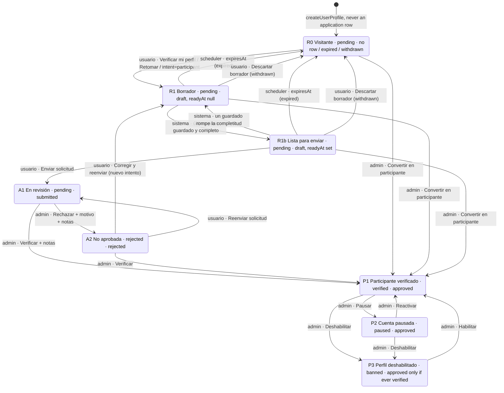

# PRD: Regular Accounts and Participant Verification Requests

**Product:** Glitter
**Feature area:** Account tiers, onboarding, participant verification, retention
**Status:** Proposed (revision 3), all decisions resolved
**Last updated:** 2026-09-22

> **Revision 3** resolves decision 1. Dennis (product owner, 2026-09-20) wants application history with reviewer notes and multiple attempts, so the request record is a dedicated `participant_applications` table, one row per attempt, in Phase 1 (migration 0284) — not the reserve column and not the `scheduled_tasks.profile_creation` row. Changes from revision 2: the resolver reads application rows (§6); every transition is a row write and submit stores a JSON snapshot of the reviewed fields (§6.2, §10.1); the row owns its reminder and expiry clock, so the cron routes keep their URLs and switch tables (§9, §11); the change rule becomes snapshot inequality instead of the cross-clock `updated_at` comparison (decision 3); Verificar and Rechazar gain internal notes and `/dashboard/users/[profileId]` gains a history panel with snapshot comparison (§7.4); `/dashboard/profile_requests` gets its own query, sort schema and table, because the ones it shares with `/dashboard/users` cannot sort or filter on an application row (§7.4); the legacy hook becomes `backfillParticipantApplications` with seven buckets (§10.3); all twenty decisions are resolved as of 2026-09-22 (1, 12, 19 and 20 chosen explicitly by Dennis: the applications table, admins only for verification actions and notes, Rechazar only on a sent request; the rest accepted as recommended) and five forks added (16–20). Phase 0, the vocabulary, the six wizard stops, the funnel safeguards and every verified gate are unchanged. **New accounts keep today's `profile_creation` task until `regular_accounts` goes public** — a sign-up never creates an application row, in either regime (§9, decision 15). Appendix C is this pass's log; Appendices A and B are untouched.

> Revision 2 folds in four adversarial reviews (schema/migration, conversion funnel, security/ops, completeness). All 40 issues were re-verified in the worktree on 2026-09-20; the Review log (Appendix A) records what changed for each. The base design is unchanged: derived tier, zero migration, explicit submission. What moved: profile-mutation hardening and the reminder race into Phase 0, the sign-up task insert removal out of Phase 0, a first-visit chooser page for intent-less accounts, six 1:1 wizard stops, a "ready but unsent" safety net, and the user-facing vocabulary (§4.1, decision 14).

---

## 1. Summary

Today every Glitter account is an exhibitor application in waiting. `createUserProfile` inserts a `users` row (`status = pending`, `category = none`) with a `scheduled_tasks.profile_creation` row due in three days (`app/lib/users/actions.ts:119-124`); a status-blind cron, run by an external scheduler, deletes any account whose task is still open at the due date (`app/lib/profile_tasks/actions.ts:214-230`); `/my_profile` force-opens a wizard that cannot be closed until every profile check passes (`complete-profile-modal.tsx:36-42,86`); and `/portal` replaces the home with "Tu perfil está en revisión" for anyone not verified (`portal/page.tsx:37-48`). A festival visitor who signs up to buy merch is deleted in three days for not being an artist.

This design makes the default account a **regular account** (UI noun: *visitante*) that is never deleted for lacking participant data, lands on a home that already works (Tiendita, pedidos, próximo festival), and can opt into an explicit, resumable **solicitud de verificación**. Becoming a participant keeps today's fields, six step forms, admin pages and `verifyProfile` / `rejectProfile` actions. It removes the defects that lose applicants now (leaving mid-wizard means deletion; rejection is a dead end; re-edits after rejection re-email admins on every save) and closes a hole the reviews surfaced: the profile actions the wizard reuses accept any `userId` and any column, including `status` (§5.4).

One additive schema change: `participant_applications` (Phase 1, migration 0284), one row per attempt, status `draft | submitted | approved | rejected | withdrawn | expired`, a snapshot of the reviewed fields taken at submit, the reviewer, the reason the applicant sees and notes the applicant never sees. The tier is derived, fail-closed, from `users.status` plus the rows; `users.status` and every `status === "verified"` gate stay as they are. Existing accounts are mapped in by an idempotent backfill (§10.3); new sign-ups keep today's task until the flag goes public and then get neither a task nor a row. Decision 1 is resolved (§19).

## 2. Goals

| # | Goal | How |
|---|---|---|
| G1 | A signed-in non-artist account is useful and permanent | Regular home on `/portal`; once `regular_accounts` is public a sign-up creates no task and no application; nothing deletes for missing data (§9) |
| G2 | Two non-admin kinds of user | `resolveAccountTier()` derives `regular \| applicant \| participant \| staff` from `users.status` plus the user's rows (§6) |
| G3 | Converting is not harder; ideally easier | Same fields, six forms, admin clicks; adds save-and-exit, auto-advance, "ready but unsent" nudges, resubmit loop, intent deep link, direct conversion (§14) |
| G4 | Participants lose nothing | All verified-only gates, `PARTICIPANT_STATUSES`, `user_status_events`, emails, admin pages unchanged (§8) |
| G5 | Small, reversible steps | Phase 0 is code-only; Phase 1 adds one additive table (§13) |
| G6 | Close the latent bugs | Fall-through-to-verified branches, status-blind banners, unguarded admin and profile actions, reminder double-send, orders cascade on delete (§5, §8, §18) |
| G7 | Review history | Every attempt keeps what was reviewed, when, by whom, why, and the team's notes; queue and user page show attempts side by side (§7.4, §10.1) |

## 3. Non-goals

- **Linking `visitors`/`tickets` to accounts.** Tickets stay email-keyed; the lookup privacy hole (`app/data/visitors/actions.ts:16-32`, `?visitorId=` at `festivals/[id]/registration/page.tsx:31-32`, `/visitors/[id]/tickets`) is a separate track (decision 11). Any future email-keyed claim uses Clerk's primary email with `verification.status === "verified"` read from the session at request time, never `users.email` (§5.4).
- **Activities for regular users.** `festival_activities.access_level` only filters listings (`festivals/actions.ts:774`); every enrollment/vote write requires `verified` (`festival_activites/actions.ts:104-131`). **Extension point:** those writes will call `resolveAccountTier` plus a per-activity audience check; a third `access_level` label inherits the enum `ADD VALUE` constraint in §10.4. This design guarantees regular users a stable `users.id` and a resolver to branch on, nothing more.
- Self-service deletion, inactivity reaper, marketing consent for regular accounts, dropping the `artist` role or `become_artist` enum values (code paths retired only).
- Lowering the review bar in the first release (decision 2); Clerk configuration changes (open sign-up stays, approval stays app-side); changing `PARTICIPANT_STATUSES` / `PROFILE_REQUEST_STATUSES` semantics from `docs/PRD-participant-status-management.md` §4.

## 4. Definitions and vocabulary

### 4.1 Spanish UI terms

Register: **voseo** everywhere this design touches (`restricted-dashboard.tsx:34-43`). Emails this design replaces or adds are voseo; emails it does not touch keep their tuteo.

| Concept | UI term | Why |
|---|---|---|
| Regular tier | **Visitante** (pill, end-user copy); admin cell **Sin solicitud** | Landing already says "Visitante" (`default-content.ts:160`); wizard copy says "participantes o visitantes" (`contact-info-step.tsx:13`). Admin ticket surfaces using "visitantes" for ticket holders (`tickets/columns.tsx:14`, `table-actions.tsx:119`, `festival-card.tsx:42`) are relabelled "Entradas" / "Registro de entradas" / "Titular" in the same PR as any admin "Cuentas de visitante" surface (Phase 3). Never "usuario regular", "Pro", "básico", "upgrade". |
| Participant | **Participante**; **expositor/a** in marketing CTAs | Unchanged. |
| The process | **Verificación de perfil**; a **solicitud de verificación**; verbs **verificar mi perfil / enviar / continuar / retomar / corregir y reenviar** | "Postulación" is the shipped word for festival enrollment and live acts (`festival-participation-approved.tsx:42,49`, `live-acts/page.tsx:8`); "verificación" is the shipped word for this process (badge "Perfil verificado", rejection email, admin "Por verificar", "volvé a solicitar la verificación", "Solicitudes de perfil"). Decision 14 keeps the alternative; the swap is mechanical. |
| User-facing states | Solicitud guardada · Solicitud lista para enviar · Verificación en revisión · No pudimos verificar tu perfil · Retomá tu solicitud | Admin keeps "Por verificar / Rechazado" (`users/utils.ts:31-44`); regulars show "Sin solicitud". An expired draft is never announced as a loss — nothing is lost — so the card reads **"Retomá tu solicitud"**, never "Solicitud vencida". |
| Approval outcome | **Perfil verificado** | Unchanged. |
| Banner audience label | "Solo público general (sin sesión o cuenta sin verificar)" | Aligns with programs' "público general" (`programs/definitions.ts:110-112`). |
| Canonical share link | **`/participar`** → 302 to the intent sign-up URL | Instagram bios, WhatsApp groups; works under either vocabulary. |

Payment amounts are "cobro" / "monto"; the invoicing term the repo rules forbid never appears in copy.

### 4.2 Code names

| Name | Meaning |
|---|---|
| `AccountTier = "staff" \| "participant" \| "applicant" \| "regular"` | Derived, never stored. `resolveAccountTier(profile, applications)` in new `app/lib/users/tier.ts`. Unknown status → `regular`. |
| `ParticipationState` | `regular.draft = none \| open \| ready \| expired` and `regular.attempts: number`; `applicant.phase = in_review \| rejected` with `attempt`, `submittedAt`, `decidedAt`, `decisionReason`; `applicant.draft` (rejected only: a resubmission draft may be open); `unsentChanges` is computed by `hasUnsentChanges(profile, rejectedRow)` and surfaced only while `draft === "none"` (§7.3). |
| `ParticipantApplication` | `typeof participantApplications.$inferSelect`. `ParticipantApplicationPublic = Omit<…, "reviewerNotes">` is a compile-time reminder on top of the query-level exclusion that actually enforces it (invariant 6). |
| "Application" / "attempt" | One row. `attempt` is 1-based per user and unique (`participant_applications_user_attempt_unique`); "latest" = highest `attempt`. Open = `draft \| submitted` (one per user, `participant_applications_one_open_per_user`); terminal = `approved \| rejected \| withdrawn \| expired`. |
| "Submission" | A `submitted` row. `submittedAt` = "Enviada el"; `attempt` = "n.º envío" (`formatAttemptLabel`), **rendered only when `attempt > 1`** outside the history panel. Decided rows keep their `submittedAt`. |
| "Draft"/"Ready"/"Expired"/"Withdrawn" | `draft` row; "ready" = `readyAt` set (last stop saved, `isApplicationComplete` true); `expired` = `expiresAt` passed; `withdrawn` = discarded by the user. |
| `ApplicationSnapshot` | `{ v: 1, category, subcategoryIds, displayName, bio, imageUrl, socials: { type, username }[], phoneNumber }`, built by `buildApplicationSnapshot(profile)` with sorted arrays so `snapshotEquals` is stable; stored at submit and at direct conversion (decision 16). |
| "Reconstructed row" | Any row with `snapshot IS NULL`. Only the backfill writes one (decision 16 makes the snapshot mandatory elsewhere), so this is the single marker for "the code did not observe this attempt". Drives "Registro reconstruido" (§7.4), exclusion from every funnel metric (§12) and the "Enviada el —" treatment. No `source` column is needed for it. |
| "Legacy task" | A `scheduled_tasks.profile_creation` row. Still **written** by `createUserProfile` until the flag is public and still **read** by the cron's legacy branch until the Phase 2 zero-count; the backfill closes the ones it maps. Every predicate on this path carries `task_type = 'profile_creation'`: the same table holds `stand_reservation` rows keyed to the same `profile_id` (`reservations/hold-service.ts:987-993`), and closing one drops a live payment deadline. |
| `isApplicationComplete` | `isProfileComplete` (`app/lib/utils.ts:59-80`) once aligned with `getMissingProfileFieldsKeys` and the SQL twin (Phase 1). |
| Not used | `visitor` as a code identifier; role `artist`; any new `user_status` / `user_role` value; `scheduled_tasks` on this path after the Phase 2 zero-count. |

## 5. Current implementation context

### 5.1 Lifecycle today

| Step | Code | Notes |
|---|---|---|
| Sign-up | Clerk `<SignUp/>` → `…SIGN_UP_FALLBACK_REDIRECT_URL=/my_profile/creation` (`.env.example:9`) | Sign-in fallback `/portal`. No webhook. The links Glitter actually shares are bare `/sign_up`: `festicker/page.tsx:285`, `emails/profile-deletion.tsx:49`, `redirect-drawer.tsx:45`, `blog/post-gate.tsx:49`. |
| Row creation | `creation/page.tsx:17-23` → `createUserProfile` (`users/actions.ts:106-159`), which also inserts the `profile_creation` task at +3 d / +1 d (`:119-124`) | Only live path; `fetchOrCreateProfile` is dead. `email` from `emailAddresses[0]`, not the primary verified address. Defaults `role user`, `category none`, `status pending` (`db/schema.ts:98-100`). |
| Completeness | `isProfileComplete` (`utils.ts:59-80`): 13 checks, three vacuous, **no avatar-provider clause** | `getMissingProfileFieldsKeys` (`:95-121`) additionally rejects Clerk/edgestore avatars (`:113-119`), so the modal keeps reopening for those users; the SQL twin (`helpers.ts:137-140`) sides with the modal, not with `isProfileComplete`. |
| Completion detection | `verifyProfileCompletion` (`users/actions.ts:290-318`), called only from `updateProfile` (`:171`) | Stamps `completedAt = now()` on **every** `profile_creation` row of the user with no `IS NULL` guard and no status filter (`:293-301`), so the column means "last completing save", not "when they applied"; the status check at `:305` only gates the admin email, re-sent on every completing save while `pending`/`rejected`. |
| Admin review | `/dashboard/profile_requests`; `verifyProfile` (`api/users/actions.ts:609-640`); `rejectProfile` (`:761-790`) | The verify modal has **no category control**; the form binds `verifyProfile.bind(null, profile.id, profile.category)` under `useFormState` (`verify-user-form.tsx:20-25`), so `none` stays `none` **and a third positional argument would arrive as React's `prevState`**. `verifyProfile` never completes the task. |
| Feature flags | `isFeatureVisible`: targeted users first, then `hidden`/`admin_only`/`public` (`feature_flags/visibility.ts:53-64`) | "Launched for everyone" is `rule.visibility === "public"`, a property of the rule, not the viewer — the check `createUserProfile` and the legacy auto-submit use. |

The forced wizard (`pages/user-profile.tsx:41-44`; opens while `getMissingProfileFieldsKeys` is non-empty, close hidden, `complete-profile-modal.tsx:36-42,86`) runs six steps in order (`:45-78`); birthdate is never set at creation, so on a first pass the last step is always Datos personales, saved through `updateProfile` → `verifyProfileCompletion`. The "only some saves detect completion" defect therefore bites re-edits — rejected users, Clerk-avatar users — not first-time applicants. On the portal, `pending|rejected|banned` → Restricted (`portal/page.tsx:37-48`) and `paused` (`:50-52`), while **anything else** falls through to the participant dashboard, the same fall-through as `atoms/verification-status-label.tsx:51-56`, with the greeting fallback "artista"; `fetchMarketingBannersForPortal` returns `all + participants_only` for any caller (`marketing_banners/actions.ts:62-79`), not a live leak only because Restricted and Paused return before `<PortalBanners />` (`:162-164`). Gated nav is `canViewSupplies = status === "verified"` (`navigation-menu.tsx:45`), with "Mi historial"/"Mis créditos" bouncing through `protectRoute` (`helpers.ts:91,97`). The signed-out dialog offers a single "Continuar" → `/sign_up` (`session-buttons.tsx:80-98`); the landing artist CTA is hidden in `default-content.ts:152-155` but the page renders the latest DB publication (`landing_content/data.ts:41-44`), so changing it is a CMS publish. Terms, blog gate, comment thread and activity pages pass `?returnUrl=`, which Clerk ignores in favour of `redirect_url` (`supplies-access-notice.tsx:10-14,26`).

### 5.2 Deletion machinery

Both cron routes **run in production via an external scheduler** (not `vercel.json`) and are unauthenticated `GET`s (`route.ts:3`), while siblings use `isAuthorizedCronRequest` (`cron/auth.ts:14-33`, fails closed without `CRON_SECRET`). `handleReminderEmails` (`profile_tasks/actions.ts:152-185`) selects on `completed_at IS NULL`, `reminder_sent_at IS NULL`, `reminder_time <= now()`, `due_date > now()` and `task_type = 'profile_creation'` — **`ran_after_due_date` is not in the predicate**, it appears only in the deletion claim (`:211-220`) — with **no lock**, sends, then stamps per task (`:427-434`); `queueEmails` sleeps 1 s per ten (`emails/helpers.ts:8-24`), so overlapping calls double-send. `handleDeletionEmails` (`:187-406`) claims overdue open tasks status-blind, Clerk-first through `pending_user_deletions` (`db/schema.ts:122-159`), and resumes an existing outbox row inside the claim path (`:270-300`); `drainDeletionEmails` only touches rows with `localDeletedAt` set (`:535-556`), so rows with `clerkDeletedAt` set and `localDeletedAt` null are finished **only** by that claim path. Landmines: `orders.user_id` cascades (`db/schema.ts:3139-3141`) while `session_purchases.user_id` restricts (`:5499-5501`); `orders_identity_check` (`:3170-3177`) requires all four guest fields when `user_id` is null, so anonymising needs a placeholder guest identity; `deleteProfile` blocks only on infractions, restrict-actor references (`hasRestrictActorReferences`, `api/users/actions.ts:315-341`: infraction notes, infraction evidence, rental return logs) and the credit ledger (`:343-352`).

### 5.3 Dormant and vestigial paths

- `user_requests.type` default `become_artist` (`db/schema.ts:881`) is never inserted; its review writes `role = 'artist'` (`review-service.ts:227-240`), hiding the user from lists filtered by `role = 'user'` (`helpers.ts:117`). Seed says zero prod users (`scripts/seed/demo-users.ts:7`).
- Seed never inserts `scheduled_tasks`; the `pending_user` persona has no task row, like every account created before `profile_tasks` existed (`users` since `drizzle/0000`, 2024-01-28; `profile_tasks` since `drizzle/0026`, 2024-04-01).
- `app/components/users/columns.tsx` (tanstack `columns`/`columnTitles`) has **zero importers**: both dashboards render `app/components/users/table.tsx`, whose eight columns are hardcoded. Deleting it is a Phase 1 housekeeping line (§20).

### 5.4 Security posture of the profile actions

`app/lib/users/actions.ts` is `"use server"` (`:1`). `updateProfile(userId, profile: Partial<NewUser>)` (`:161-185`) spreads a client-supplied object into `UPDATE users` with no session check; `UpdateUser = Partial<NewUser>` (`api/users/definitions.ts:57`) includes `status`, `role`, `verifiedAt`, `category`, `clerkId`, `email`. `updateProfileCategories` (`:187-236`), `upsertUserSocialProfiles` (`:239-288`) and `updateProfilePicture` (`:320-351`, also deletes the target's utfs file) take a client-supplied id with no ownership check. `PUT /api/users` (`api/users/route.ts:9-33`) sets any profile's `imageUrl` unauthenticated and has zero callers. `proxy.ts` protects six prefixes (`/dashboard`, `/my_profile`, `/my_participations`, `/my_history`, `/my_orders`, `/profiles`); server-action POSTs to `/` are not among them, and neither is `/public_profiles`. Any signed-in or anonymous client can therefore set its own or anyone's `status = 'verified'`. This is the first item in Phase 0. **Every new `"use server"` export in this design carries its own guard** (§10.2): the module boundary is an RPC boundary, not an access boundary.

## 6. The new model

### 6.1 Tiers

| Tier | Definition (in order) | Home |
|---|---|---|
| `staff` | `role ∈ {admin, festival_admin}` | dashboard (unchanged) |
| `participant` | `status ∈ PARTICIPANT_STATUSES` (`participants/definitions.ts:5-9`) | today's participant / paused / banned portal |
| `applicant` | a `submitted` row exists, **or** `status = rejected` and the latest decided row is `rejected` | regular home + status card |
| `regular` | everything else, including unknown status values and a `rejected` status with no row | regular home + chooser page or card |

```ts
// app/lib/users/tier.ts (sketch)
export function resolveAccountTier(
  profile: BaseProfile,
  applications: ParticipantApplicationPublic[], // every row of this user; a handful at most
): ParticipationState {
  if (profile.role === "admin" || profile.role === "festival_admin") return { tier: "staff" };
  if (isParticipantStatus(profile.status)) return { tier: "participant", status: profile.status };

  const byAttempt = [...applications].sort((a, b) => b.attempt - a.attempt); // newest first
  const latest = byAttempt[0] ?? null;
  const open = latest?.status === "draft" ? latest : null; // the partial unique index allows one
  const draft = open ? (open.readyAt ? "ready" : "open") : latest?.status === "expired" ? "expired" : "none";

  if (latest?.status === "submitted") {
    return { tier: "applicant", phase: "in_review", attempt: latest.attempt, submittedAt: latest.submittedAt! };
  }
  const lastDecided = byAttempt.find((a) => a.status === "approved" || a.status === "rejected") ?? null;
  if (profile.status === "rejected" && lastDecided?.status === "rejected") {
    return {
      tier: "applicant", phase: "rejected", attempt: lastDecided.attempt,
      decidedAt: lastDecided.decidedAt!, decisionReason: lastDecided.decisionReason, draft,
    };
  }
  // `pending`, an unknown status, or `rejected` without its row (a straggler the next
  // backfill run catches): the lowest tier, with the draft sub-state.
  return { tier: "regular", draft, attempts: byAttempt.length };
}
```

**How the rows reach it.** `fetchUserProfileById` (`app/api/users/actions.ts:47-80`) is **not** changed. It loads `/public_profiles/[id]` (`app/public_profiles/[id]/page.tsx:13`), which `proxy.ts` does not protect and which this design only gates in Phase 2, plus the terms, sector-selection and three activity pages that each take an arbitrary `profileId`. A `with: { participantApplications: … }` clause on it would put `reviewer_notes` and every past rejection reason into a public page's RSC payload. Instead:

| Reader | Function | Columns |
|---|---|---|
| `/portal`, `/my_profile`, the wizard | `fetchParticipantApplicationsForUser()` — no argument; target resolved from the Clerk session | `columns: { reviewerNotes: false }` → `ParticipantApplicationPublic[]` |
| `/dashboard/users/[profileId]` | `fetchParticipantApplicationsForAdmin(userId)` — staff guard; notes for `admin` only (decision 20) | every column for `admin`; `festival_admin` gets `ParticipantApplicationPublic[]` |
| `/dashboard/profile_requests` | `fetchProfileRequests()` (§7.4) | the two lateral rows, no `reviewer_notes` |

`resolveAccountTier` takes the rows as its second argument, fetched alongside the profile rather than through it. `/portal`, `VerificationStatusLabel`, the badge, the admin status cell, the announcements card and the banner query branch on the result through exhaustive `switch` with a `never` default.

### 6.2 States, transitions and server-side preconditions

| # | State | `users.status` | latest row | Tier |
|---|---|---|---|---|
| R0 | Regular | pending | none / `expired` / `withdrawn` | regular |
| R1 | Draft | pending | `draft`, `readyAt` null | regular (open) |
| R1b | Ready, unsent | pending | `draft`, `readyAt` set | regular (ready) |
| A1 | In review | pending | `submitted` | applicant |
| A2 | Not approved | rejected | `rejected` (a newer `draft` may be open) | applicant (rejected; `unsentChanges` only while no draft is open) |
| P1–P3 | verified / paused / banned | | `approved` (always for P1/P2; for P3 only if ever verified) | participant |

**The submit precondition, stated once.** `submitParticipantApplication` accepts a call when the caller owns the row and **either** (a) an open `draft` exists and is the caller's latest row, **or** (b) the caller resolves to `applicant.rejected`, in which case a `draft` at `coalesce(max(attempt), 0) + 1` is created and submitted in the same transaction. Nothing else. The A2 → A1 row, §7.3's banner and §16 all refer to this sentence.

| From → To | Trigger | Actor | Preconditions and writes |
|---|---|---|---|
| (none) → R0 | `/my_profile/creation` | system | `users` row, and **never an application row**. While the flag is not public, `createUserProfile` keeps today's `profile_creation` insert unchanged (+3 d / +1 d), so the day-1 reminder and the forced modal keep today's funnel alive through the cron's legacy branch; at the flip it stops inserting and writes nothing. A visitor therefore never appears in history, Borradores, the draft email or the funnel (decision 15). |
| R0 → R1 | "Verificar mi perfil" / "Retomar", or `intent=participant` | user | `startParticipantApplication`: caller owns; tier `regular`; `SELECT … FOR UPDATE` on the user row (pattern `status-events.ts:66-71`); returns the existing open draft, else inserts `draft`, `attempt = coalesce(max(attempt), 0) + 1`, `reminderAt now()+7 d`, `expiresAt now()+30 d`; the partial unique is the backstop; staff, participants and anyone with a `submitted` row refused |
| R1 → R1b | last stop saved and complete | system | `readyAt = now()`, `reminderAt = now()+2 d`, `reminderSentAt = null`; wizard auto-advances to Revisar y enviar. A later save that breaks completeness nulls `readyAt`. |
| R1/R1b → R0 | `expiresAt` passed | scheduler | `status = expired`; fields stay; `participant_application_expired` |
| R1/R1b → R0 | "Descartar borrador" | user | `withdrawParticipantApplication`: owner; `draft` → `withdrawn`; fields stay. Drafts only (decision 18) |
| R1b → A1 | "Enviar solicitud" | user | Precondition (a). Lock the user row; server re-checks completeness (on failure it returns the missing-stop list, not a generic error, so the caller can deep-link); `snapshot = buildApplicationSnapshot(profile)`; refused if the last decided row is `rejected` and `snapshotEquals` (decision 3); `status = submitted`, `submittedAt = now()`, **`reminderAt = expiresAt = reminderSentAt = null`**; if `users.status = rejected` → `updateUserStatusWithAudit(rejected → pending, "Solicitud reenviada por el usuario.", createdByUserId = user)` in the same transaction; one admin email after commit |
| A1 → P1 | Verificar (+ notas) | admin (decision 12) | `verifyProfile({ profileId, category, reviewerNotes })` — one object argument, because the form binds positionally under `useFormState` and a third positional parameter would receive `prevState` (`verify-user-form.tsx:20-25`). Existing audited flip → `verified`, `verifiedAt`, **category required**; then `ensureApprovedApplication(tx, …)`: the open row (`submitted`, or a `draft` for Convertir) → `approved`, `decidedAt = now()`, `reviewedByUserId`, **`decisionReason` left null**, `reviewerNotes`, snapshot taken now if the row has none; no open row and no `approved` row → insert `approved` (`attempt = max+1`, `submittedAt = decidedAt = now()`); an `approved` row already present (P3 → P1 "Habilitar" also calls this, `status-events.ts:20-21`) → no row write. Email unchanged. The audit string `verificationReasonForStatus` returns (`status-events.ts:18-30`) stays in `user_status_events.reason`: it is reviewer copy, and decision 17 shows `decisionReason` to the applicant |
| A1 → A2 | Rechazar + reason (+ notas) | admin | `rejectProfile(profile, reason, reviewerNotes?)`: **requires a `submitted` row** (decision 19; else refused "No hay una solicitud enviada para rechazar", control disabled with that reason); audited flip → `rejected`; row → `rejected`, `decidedAt`, `reviewedByUserId`, `decisionReason = reason`, `reviewerNotes`, **`reminderAt = now() + 3 d`, `reminderSentAt = null`** (the row owns the unsent-changes timer); existing email |
| A2 → R1 | "Corregir y reenviar" | user | `startParticipantApplication` from `applicant.rejected`: new `draft`; the rejected row is history; wizard opens at stop 1 with `decisionReason` pinned |
| A2 → A1 | "Reenviar solicitud" | user | Precondition (b); audited `rejected → pending`; snapshot rule; one admin email "(n.º envío)" |
| A2 → P1 | Verificar | admin | as A1 → P1; with no open row an `approved` row is inserted, snapshot taken now |
| R0/R1/R1b → P1 | "Convertir en participante" | admin | `verifyProfile` with a real category; open `draft` → `approved` (`submittedAt = now()`, snapshot now); no row → insert `approved` |
| P1 ↔ P2 → P3 → P1 | pause / unpause / disable / enable | admin | unchanged; `ensureApprovedApplication` is a no-op when an `approved` row exists |
| any → deleted | `deleteProfile` | admin | unchanged outbox; decision 13's blockers, which now also cover `participant_applications.reviewed_by_user_id`; the target's own rows cascade |

Clock rule: every writer stamps with `sql\`now()\`` (DB clock); `updateUserStatusWithAudit` moves to it in Phase 0 (`status-events.ts:77` uses `new Date()` while the event row gets `defaultNow()`, `db/schema.ts:171`). The change rule no longer compares clocks; `GREATEST(users.updated_at, max(user_socials.updated_at))` survives only as the content pre-filter for the unsent-changes email (§9), which is why the DB-clock item stays in Phase 0. `updateProfileCategories` touches `users.updated_at` (`users/actions.ts:197`); socials do not (`db/schema.ts:928`).

Not modelled: participant → regular; withdrawal while `submitted` (decision 18); changing a terminal row's `status` (corrections are new attempts; editing notes after the decision is Phase 3).

### 6.3 Diagram

States carry their `users.status` and the status of the account's latest `participant_applications` row. Every edge is one of the transitions in §6.2; the actor is in the label.



Not drawn, and deliberately absent from the model: participant → visitante, withdrawal while `submitted` (decision 18), and any edit of a terminal row's status (a correction is a new attempt).

### 6.4 Invariants

1. At most one open row per user (`participant_applications_one_open_per_user`); `attempt` unique per user and **never hardcoded to 1** outside `backfill.ts` — every other writer uses `coalesce(max(attempt), 0) + 1` under the user-row `FOR UPDATE`. Nothing reads `scheduled_tasks` to create, remind or delete anyone except the cron's legacy branch (until the Phase 2 zero-count) and `createUserProfile` (until the public flip).
2. Admins are emailed once per `submitted` transition, never on a plain save.
3. `users.status`, `role`, `verifiedAt`, `category`, `clerkId`, `email` are writable only by admin actions and `updateUserStatusWithAudit`; user-facing actions take a `Pick<>` of their form's fields and resolve the target from the session (true only after Phase 0).
4. `verified | paused` ⇒ at least one `approved` row, enforced by `ensureApprovedApplication` and by the backfill, whose outbox skip deliberately does **not** apply to the history buckets B1/B2 (§10.3). `banned` is exempt because `disableProfile` accepts any status (`api/users/actions.ts:721-744`). No DB CHECK: it would span two tables.
5. `resolveAccountTier` is the only interpreter of `pending` / `rejected`; a unit test greps `app/components` and `app/(routes)` for literal comparisons.
6. `reviewer_notes` is excluded **at the query level** by every read except `fetchParticipantApplicationsForAdmin`. `ParticipantApplicationPublic` is the type-level echo, not the enforcement: an `Omit<>` removes nothing at runtime. Emails never include notes; a runtime test asserts the column is absent from eight surfaces (§16).
7. Terminal rows never change `status`; corrections are new attempts.

## 7. Flows

### 7.1 Regular sign-up and first session

1. **Signed-out entry.** The "Crear cuenta" dialog (`session-buttons.tsx:71-83`) becomes a chooser: **"¿Cómo querés vivir Glitter?"** — **"Visitar los festivales"** ("Entradas, tiendita, actividades y novedades.") [Crear cuenta] · **"Participar con un stand"** ("Artistas, emprendimientos creativos y gastronomía.") [Quiero participar]; footer "Podés pedir la verificación más adelante desde tu cuenta." Every `/sign_up` link carries `redirect_url=/my_profile/creation?intent=<visitor|participant>&next=<path>`.
2. **Row creation.** `creation/page.tsx` creates the row (idempotent on `clerkId`), reads `intent` and `next` (allow-listed internal paths), and redirects: `intent=participant` → `/my_profile/verificacion`, otherwise `next` or `/portal`; an existing row plus participant intent goes to the wizard too. The `profile_creation` task is inserted exactly as today while the flag is not public and not at all once it is; **no application row in either regime**. PostHog `user_profile_created { intent, entry }`.
3. **First `/portal` visit with no recorded choice** (bare links, sign-in fallback, `redirect-drawer.tsx:45`): the page **is the chooser** — **"¿Qué querés hacer en Glitter?"** [Visitar los festivales] [Participar con un stand]. "Visitar" stores a per-device dismissal in `localStorage` (decision 15). Accounts with footprint (orders, purchases, any application row) skip it; since no sign-up writes a row, the only accounts hidden from the chooser really did something.
4. **Regular home** (tier `regular`): pill "Visitante"; **"Hola, {firstName}"**; banners `all + public_only`; cards **Próximo festival** (CTA "Obtener entrada" when `publicRegistration`), **Tiendita**, **Mis pedidos**, plus **Mis talleres** and **Blog** when visible; then **"¿Tenés algo para mostrar?"** — "Verificá tu perfil para participar con un stand en nuestros festivales. Te pedimos tu categoría, una foto, una bio corta, tu Instagram y un teléfono. Lleva unos 5 minutos y podés guardar y seguir después." [Verificar mi perfil] [Más adelante] (collapses for the session; stays in the account menu).
5. **`/my_profile`**: cards render, the modal does **not** auto-open, button **"Verificar mi perfil"**, `overview.tsx:63` renders "—" for a null birthdate, the badge slot becomes the same link.
6. **Navbar.** "Tiendita" for every signed-in profile; "Mercadito de Insumos" **disabled** with "Solo para participantes verificados"; "Mi historial"/"Mis créditos" disabled with "Disponible para participantes".
7. **Clerk session without a row**: `/portal` redirects to `/my_profile/creation`, which creates the row or renders its existing error screen with `TryAgainForm` (`creation/page.tsx:28-48`), so a `users_email_unique` conflict never throws on the home page; it is logged with `clerkId`/email for the Phase 4 relink.

### 7.2 Participant-intent sign-up

1. **Entry points** (all `redirect_url=/my_profile/creation?intent=participant`): chooser option 2; `/participar`; the landing artist CTA **"Quiero exponer"** (a CMS publish on launch day; `assertValidHref` accepts relative URLs with query strings, `marketing_banners/validate-href.ts:11-19`); the four bare links in §5.1; supplies notice; blog gate; activity/terms pages (`?returnUrl=` becomes `next=`).
2. `/my_profile/verificacion` (protected by `proxy.ts:6`). Intent arrivals land **on stop 1**, with the three explainer rows ("Qué revisamos / Qué desbloqueás / Cuánto tarda") as a collapsible header. The generic path shows them as an intro with [Empezar] and, **only here**, "Prefiero seguir como visitante". Entering stop 1 or pressing [Empezar] calls `startParticipantApplication`; the intro writes no row.
3. **Wizard: six stops mapped 1:1 to the six existing forms** (`categories-form.tsx` → `updateProfileCategories`; `display-name-form.tsx` → `updateProfile`; `profile_pic/form.tsx:26` → `updateProfilePicture`; `user-socials-form.tsx:60` → `upsertUserSocialProfiles`; `contact-info-form.tsx`, `personal-info-form.tsx` → `updateProfile`). Stops: **Qué hacés · Nombre y bio · Foto · Redes · Contacto · Datos personales**. Each form keeps its submit as "Siguiente"; a named rail shows done/pending; **"Guardar y salir"** on every stop. After every save the wizard re-evaluates `isApplicationComplete` and stamps or clears `readyAt`. Merging stops is Phase 3 with a mobile upload test (decision 2).
4. **Revisar y enviar**: reached by auto-advance when the last stop saves complete, or from the card. Read-only summary of the fields the snapshot will store; **[Enviar solicitud de verificación]** disabled with the missing-items list until complete, and the only primary action on screen. Submit runs `submitParticipantApplication`, fires `participant_application_submitted { attempt }` and redirects to `/portal`.
5. **Confirmation** is a card, not a screen: **"¡Recibimos tu solicitud!"** — "Te avisamos por correo cuando nuestro equipo la revise. Mientras tanto podés usar la Tiendita y registrarte para el próximo festival."
6. **In review**: regular home plus a timeline card **Enviada · {submittedAt}** → **En revisión** → **Resultado · te avisamos por correo** (SLA per decision 10); the attempt pill appears only from the second attempt. Footer: "Mientras tanto podés seguir mejorando tu perfil."
7. **Ready but unsent** (R1b): sticky banner **"Tu solicitud está lista, solo falta enviarla"** [Enviar solicitud] on `/portal` and `/my_profile`; one email at `readyAt + 2 d`; listed for admins under Borradores as **"Lista para enviar"** with Convertir.

### 7.3 Upgrade path from an existing regular account

- **Entry points** (→ `/my_profile/verificacion`): portal card; `/my_profile` button and badge slot; the disabled Insumos hint; `SuppliesAccessNotice` signed-in variant (**"El Mercadito de Insumos es para participantes verificados"** / "Cuando tu perfil sea verificado vas a poder comprar insumos acá." [Verificar mi perfil] or [Ver mi solicitud]); `PostGate` signed-in branch; activity and rental error strings.
- **Draft**: card **"Tu solicitud está guardada"** — "Te faltan {n} pasos." [Continuar]; secondary **"Descartar borrador"** (confirm dialog; fields stay; row → `withdrawn`). Reminder at day 7. At day 30 the row expires and the card becomes **"Retomá tu solicitud"** — "Lo que cargaste sigue guardado en tu cuenta." [Retomar] (attempt n+1 over the same fields). Nothing is deleted at expiry, so no copy here may imply it is.
- **Approval**: existing "Perfil verificado" email; participant dashboard with a one-time **"¡Ya sos participante!"** card. A converted account still missing fields meets the retained force-open modal (Phase 3 checklist replaces it).
- **Rejection**: the existing email gains a CTA **"Corregir y reenviar"**. Portal card **"No pudimos verificar tu perfil"** — `decisionReason` verbatim — "Corregí lo indicado y volvé a enviarla; la revisamos de nuevo." [Corregir y reenviar]. Home keeps working. Below it, per decision 17, a collapsed **"Solicitudes anteriores"**: date, outcome and, for rejections, the reason they already received; approved rows show outcome and date only, their `decisionReason` being null by design; never `reviewerNotes`.
- **Rejected with unsent changes**: `hasUnsentChanges` = current `buildApplicationSnapshot(profile)` ≠ the rejected row's `snapshot`, **and no draft is open**. Banner **"Tenés cambios sin reenviar"** [Reenviar solicitud]; one email after 3 days on the rejected row's own `reminderAt`. Today such edits re-email admins on every save; this keeps the user one click from the same outcome and admins free of the noise. If that submit fails the server completeness re-check, the response carries the missing-stop list and the UI deep-links to the first missing stop, never a generic error.
- **One CTA at a time.** Precedence on `/portal` and `/my_profile`: an open draft → the draft card only (the rejection reason rides along as pinned context inside the wizard); no draft, rejected, snapshot differs → the banner; no draft, rejected, snapshot identical → the rejection card; `submitted` → the timeline card.
- **Resubmission**: the wizard reopens at stop 1 with the reason pinned (new draft, attempt n+1); [Reenviar solicitud] disabled ("Cambiá algo de tu perfil antes de reenviar") while `snapshotEquals(previousRejected.snapshot, current)`; on send the audited flip and single admin email run (decision 3).

### 7.4 Admin review

`/dashboard/profile_requests` keeps its URL and title and gets **its own query, sort schema and table**. It cannot keep sharing `fetchUserProfiles` and `app/components/users/table.tsx` with `/dashboard/users`: the fetch is `db.query.users.findMany` ordered by `sql\`${users[sort]}\`` with `sort: keyof BaseProfile` (`app/lib/users/actions.ts:389-455`), which can neither order by nor select from a joined table, and the table's eight columns are hardcoded and shared (`table.tsx:52-110`); the tanstack `columns.tsx` has no importers (§5.3).

| Piece | Specification |
|---|---|
| Query | `fetchProfileRequests` / `fetchProfileRequestsAggregates` in `app/lib/participant_application/queries.ts`, builder API (`select().from(users)`), with **two** `LEFT JOIN LATERAL`s: `d` = latest decided-or-submitted row (`… where user_id = users.id and status in ('submitted','approved','rejected') order by attempt desc limit 1`), `o` = the open draft (`… and status = 'draft' limit 1`). One "latest row" lateral is not enough: a rejected applicant with an open resubmission draft has a `draft` as their latest row and would silently fall out. Neither lateral selects `reviewer_notes`. |
| Membership | `participation = "submitted"` → `d.status = 'submitted' OR (users.status = 'rejected' AND d.status = 'rejected')`; `participation = "draft"` → `o.attempt IS NOT NULL`, with **"Lista para enviar"** on `o.ready_at IS NOT NULL`. Membership is the application row; `profileCompletion` no longer filters this page. |
| Role | `includeAdmins = false` filters `users.role = 'user'` (`helpers.ts:117`); the requests predicate widens to `role IN ('user','artist')`, because `reviewBecomeArtistRequest` writes `role = 'artist'` (`review-service.ts:227-240`) and such an account with a `submitted` row would otherwise be invisible. Dennis runs the prod count first (§20). |
| Ordering | `ORDER BY (d.status = 'submitted') DESC, d.submitted_at ASC NULLS LAST`. Rejected accounts stay reachable (`DEFAULT_PROFILE_REQUEST_STATUSES` is `pending, rejected`, `participants/definitions.ts:26-29`, `helpers.ts:82-91`), but plain "oldest first" would open the page on the historical rejected backlog, whose reconstructed dates are years old. |
| Sort plumbing | `/dashboard/users` untouched. The page gets its own `ProfileRequestSortSchema` in `app/dashboard/users/schemas.tsx` (`submittedAt \| displayName \| category \| status \| createdAt`, default `submittedAt asc`) and its own `toProfileRequestSort` over `keyof BaseProfile \| "submittedAt"`; `PROFILE_REQUEST_SORT_FIELDS` (`participants/helpers.ts:93-110`) widens to that union. `participant_applications_queue_idx` makes `d` cheap. |
| Nav | Both entry points drop `profileCompletion=complete`, which excludes Clerk and edgestore avatars (`helpers.ts:137-140`) — the cohort §10.3 recovers — and which `UsersTableFilters` persists through every filter change (`users-table-filters.tsx:27-47`), making Borradores from the nav return zero rows by construction. New href in `app/components/navbar/navigation-menu.tsx:311` and `app/components/organisms/mobile-sidebar.tsx:255`: `?limit=10&offset=0&includeAdmins=false&participation=submitted&sort=submittedAt&direction=asc`. |
| Table | New `app/components/users/requests-table.tsx` and `requests-mobile-list.tsx` → `app/components/molecules/mobile-request-card.tsx`. Columns: Perfil · Categoría · Estado · **"Enviada el"** (`d.submitted_at`, "—" when null) · attempt pill (only when `d.attempt > 1`) · **"Días en cola"** (`now() - d.submitted_at`, only when `d.status = 'submitted'`) · Acciones. One component per file under `app/components/users/cells/`: `submitted-at.tsx`, `attempt-pill.tsx`, `days-in-queue.tsx`. The dead `columns.tsx` is deleted in the same PR. |

- **Verificar** is converted from the bound-action + `useFormState` shape to the react-hook-form + direct-call shape `reject-profile-form.tsx` uses, and `verifyProfile` takes **one object argument** `{ profileId, category, reviewerNotes }` — a third positional parameter would receive `prevState` (`verify-user-form.tsx:20-25`). It gains a required category `Select` and the textarea **"Notas internas (no las ve el usuario)"** (optional, ≤ 2000 chars, helper "Solo para el equipo. Quedan en el historial de solicitudes."), so one shared `reviewer-notes-field.tsx` serves both modals.
- **Category source:** `userCategoryOptions` (`app/lib/utils.ts:224`, from `userCategoryEnum`, `db/schema.ts:32-38`) minus `none` — the enum `users.category` and `verifyProfile` write. **Not** `fetchSelectableCategories`, which returns `subcategories` rows (`categories/queries.ts:71-86`) whose ids are unassignable. Subcategories stay on `/dashboard/users/[profileId]/edit-categories`.
- **Rechazar** (reason ≥ 10 chars unchanged) gains the same notes field and is **disabled** with "Solo se puede rechazar una solicitud enviada" without a `submitted` row (`quick-actions.tsx:135-143` renders it for any `pending` account today). That is decision 19. Deshabilitar remains the tool for spam and for accounts that never applied.
- Role guard on `verifyProfile`, `rejectProfile`, `disableProfile`, `deleteProfile` per decision 12 (`requireAdmin`, matching pause/unpause at `participants/actions.ts:566-572`); `festival_admin` controls render disabled with "Solo administradores". Only `admin` reads the notes (decision 20, resolved): for `festival_admin` the history panel shows the "Notas internas" label with "Solo administradores" in place of the text, and the notes field in any modal they can open renders disabled with the same reason.
- `verifyProfile` writes its row through `ensureApprovedApplication` so a converted participant never receives a draft reminder and invariant 4 holds; `rejectProfile` writes `decisionReason`, `reviewerNotes` and the 3-day timer.
- Status cells route through the resolver: regular → **"Sin solicitud"**; applicant → "Por verificar" / "Rechazado". `getProfileStatusLabel` (`users/utils.ts:31-44`) stays a pure status map — it builds the filter comboboxes, which must keep saying "Por verificar", and feeds `ProfileStatusCell` from `table.tsx:87`, `mobile-user-card.tsx:74`, `participants-table.tsx:111` and `participant-mobile-card.tsx:59`, the last two from queries that never load applications. The tier label is a new `getAccountTierLabel(state)`; `ProfileStatusCell` takes an optional `ParticipationState` with a fallback.
- `/dashboard/users/[profileId]` gains an **application history panel** after `PublicProfile`: one item per attempt, newest first — "n.º envío · Enviada {submittedAt} · {Aprobada | Rechazada | Retirada | Vencida | En revisión} {decidedAt} · por {reviewer or "—"}", "Motivo (lo vio el usuario)" = `decisionReason`, "Notas internas" = `reviewerNotes` in a muted panel (no colored edge), admins only per decision 20. The attempt number is always shown here. Expanding shows a **side-by-side** of that attempt's snapshot against the previous one's (and, for the latest, the current profile), changed fields on a soft tint; `snapshot IS NULL` renders "Registro reconstruido: sin captura del perfil" and a null `submittedAt` renders "Enviada el —". Components, one per file: `app/components/participant_application/admin/{application-history-panel,application-history-item,application-snapshot-compare,reviewer-notes-field,attempt-pill}.tsx`; data from `fetchParticipantApplicationsForAdmin(userId)`. **"Convertir en participante"** for regular accounts (Phase 2); announcements card switches on tier.
- Phase 3: "Cuentas de visitante" tab + counts with the ticket relabel (decision 8); editable reviewer notes.

### 7.5 What each tier sees

| Surface | Regular (R0/R1/R1b) | In review (A1) | Rejected (A2) | Verified (P1) | Paused (P2) | Banned (P3) |
|---|---|---|---|---|---|---|
| `/portal` | chooser (first visit) or regular home + one card per §7.3's precedence | regular home + timeline | regular home + draft card, banner or rejection card — one of the three | today's dashboard | `PausedParticipantDashboard` | `RestrictedDashboard` |
| Portal banners | `all + public_only` | same | same | `all + participants_only` | none (unchanged) | none |
| `/my_profile` modal | opt-in | opt-in | opt-in | force-open kept | force-open kept | **never** |
| Navbar Insumos | disabled + hint | same | same | enabled | disabled + hint | disabled + hint |
| User menu row | "Verificar mi perfil" | "Mi solicitud" | "Corregir solicitud" | unchanged | unchanged | unchanged |
| Header label | pill "Visitante" | "Verificación en revisión" | "No pudimos verificar tu perfil" | "Perfil verificado" | "Cuenta pausada" | "Perfil deshabilitado" |
| Admin status cell | "Sin solicitud" | "Por verificar" | "Rechazado" | "Verificado" | "Pausado" | "Deshabilitado" |
| `/public_profiles/[id]` | 404 (Phase 2) | 404 | 404 | rendered | rendered | as today |
| `protectRoute` failure | → `/portal` | → `/portal` | → `/portal` | n/a | → `/portal` | → `/portal` |

## 8. Gating changes

| Surface | Today | After |
|---|---|---|
| Merch storefront + checkout | guest orders (`orders/actions.ts:724-839`) | unchanged; linked from the regular home |
| Supplies, rentals, paid programs, blog posts, activities, reservations/terms/invites | `verified` gates | unchanged; error copy points to "Verificar mi perfil" |
| `protectRoute` | failure → `/my_profile` (`helpers.ts:97`) | failure → `/portal`, which shows the right card |
| Marketing banners | `all + participants_only` for any caller | tier-aware; regular/applicant get `all + public_only` (decision 5) |
| `/portal`, label, badge, admin cell, announcements card | fall-through to verified | exhaustive switch on `ParticipationState`; removes the fail-open |
| `fetchUserProfileById` | profile + six relations | **unchanged**; application rows come from the session-scoped or staff-guarded readers (§6.1), because it loads a public page |
| `/public_profiles/[id]` | any row | participant statuses or staff viewer, else 404 |
| Admin queue | `pending\|rejected` over `fetchUserProfiles`, `profileCompletion` pinned to `complete` by the nav href | `fetchProfileRequests` with two laterals, `participation`, submitted-first ordering, attempt pill, "Días en cola"; **`profileCompletion` no longer filters this page** |
| Verificar / Rechazar | no category control; bound action; reason only; Rechazar on any non-rejected status | object-argument action, required category `Select`, notes on both, Rechazar disabled without a `submitted` row (decision 19) |
| `/dashboard/users/[profileId]` | profile + quick actions | + history panel with snapshot comparison (G7) |
| **Profile mutations** | any client, any id, any column (§5.4) | session-resolved target, admin override, `Pick<>` payloads; `PUT /api/users` deleted (Phase 0) |
| Admin server actions | no role guard | `requireAdmin` (decision 12); the new read actions carry a staff guard, and `reviewerNotes` leaves the server for `admin` only (decision 20) |
| Admin `deleteProfile` | cascades orders; blocks on infractions, three actor references, credit ledger | decision 13's blocker/anonymisation plus a fourth probe on `participant_applications.reviewed_by_user_id`; the target's own rows cascade by design |
| Deletion cron | deletes overdue owners | expires overdue drafts and any open legacy `profile_creation` task, finishes in-flight outbox rows, deletes nobody new |
| Reminder cron | unlocked select then stamp | atomic claim on `participant_applications`; legacy tasks in the Phase 0 form, now also excluding `ran_after_due_date = true`; soft secret gate |
| `CompleteProfileModal` | force-open for all | opt-in for regular/applicant; kept for `verified\|paused`; never for `banned` |
| `users.email` | editable via `public-info-form.tsx:38-42` | read-only in forms; Clerk is the source |
| Ticket lookup | unauthenticated | unchanged, out of scope |

---

## 9. Retention and deletion policy

**Rule 1 — accounts are never deleted for lacking data.** Only admin `deleteProfile` (existing outbox) or a future self-service/inactivity policy through the same outbox.

**Rule 2 — requests, not accounts, have a lifecycle.**

| Data | Kept | Removed |
|---|---|---|
| Regular account with footprint | indefinitely | admin only, subject to decision 13 |
| Regular account, zero footprint | indefinitely in v1 | optional Phase 4 reaper (decision 6) |
| Draft | open 30 days | row becomes `expired` and stays as history; fields stay; "Retomar" starts a new attempt |
| Submission | until an admin decides | never expires; queue shows age |
| Decided, withdrawn and expired rows (snapshot, reason, notes) | indefinitely | only with the account (`onDelete: cascade`) |
| Legacy `profile_creation` tasks | as today, closed by the backfill once mapped | still **written** by `createUserProfile` until the public flip and still **read** by the cron's legacy branch until the Phase 2 zero-count; never read again after that; the enum label stays |

**Spam and cost.** Clerk MRU bills accounts active in a month, so a sign-up burst is billed that month and dormant later months are free. Every profile may upload a 4 MB avatar (`api/uploadthing/core.ts:57-77`); orphan uploads fall to the existing storage-cleanup jobs (`uploadthing/actions.ts:82,388`). Phase 1 exit criterion: Clerk bot protection and sign-up rate limits confirmed before the flag goes public.

**Mechanics.**

- **Phase 0 keeps the sign-up task insert with today's timings** so the day-1 reminder keeps firing. `handleDeletionEmails`: overdue open tasks → `ranAfterDueDate = true`; no new Clerk deletes; an **in-flight branch** finishes outbox rows with `clerkDeletedAt` set and `localDeletedAt` null through the existing local-delete transaction (anonymise purchases, detach posts, delete `users`, stamp `localDeletedAt`, drain the email); rows with `clerkDeletedAt` null get an idempotent Clerk `getUser` check (404 → treat as above; present → leave and log). `handleReminderEmails` gains `ran_after_due_date = false`: it filters on `completed_at IS NULL` and never reads that column (`profile_tasks/actions.ts:158-166`), so a task the deletion branch expired but did not complete stays eligible to remind. Dry-run SQL includes `select count(*) from pending_user_deletions where clerk_deleted_at is not null and local_deleted_at is null` and the exhausted-attempt count.
- **Phase 1, first deploy** (schema 0284 + backfill + row-writing code, always on): `createUserProfile` is **unchanged** — task at +3 d / +1 d, no application row. Recording a visitor's sign-up as a `draft` would contradict decision 15, hide the first-visit chooser behind the footprint test, mail them "quedó a medias" for a request they never made, list every new account under Borradores and count every sign-up in the funnel — permanently, since the rows survive the flip. The legacy task already carries the day-1 reminder through the cron's legacy branch. At the public flip (`rule.visibility === "public"`, read once per request, not per viewer) `createUserProfile` stops inserting the task and writes nothing.
- Accounts created during the `admin_only` window therefore arrive with a task and no row. That is the legacy regime on purpose: the flag is off for them, the forced modal is on, and completing the profile still means applying. The next deploy's backfill maps them (B5 → `draft`, B7 → nothing) and closes the task; until then the legacy branch reminds and expires them. User-started rows use +30 d / +7 d; the ready nudge re-arms `reminderAt` to `readyAt + 2 d`.
- **Cron handlers** (`app/lib/participant_application/cron.ts`; routes unchanged). `profileReminders` → `handleApplicationReminders`:
  1. **Drafts** — atomic claim `UPDATE participant_applications SET reminder_sent_at = now(), updated_at = now() WHERE status = 'draft' AND reminder_at <= now() AND reminder_sent_at IS NULL RETURNING id, user_id, ready_at`, then send outside the claim: the "lista para enviar" template when `ready_at` is set and completeness re-checks true, else "quedó a medias".
  2. **Unsent changes** — same shape on the rejected row's own timer: `WHERE status = 'rejected' AND reminder_at <= now() AND reminder_sent_at IS NULL`, with the snapshot comparison run in TS between `RETURNING` and the send; a row whose snapshot still matches is released (null `reminder_sent_at`, re-arm `reminder_at` to `now() + 3 d`). This is why submit nulls `reminderSentAt` and reject re-arms both (§6.2): a stale marker carried through `submitted` into `rejected` would block this email forever. `GREATEST(users.updated_at, max(user_socials.updated_at)) <= now() - interval '3 days'` survives only as a cheap pre-filter, never as the timer.
  3. **Legacy branch** — Phase 0's `handleReminderEmails` over open `profile_creation` tasks, deleted in Phase 2 after the production zero-count.
  `profileDeletion` → `handleApplicationExpiry`: `UPDATE … SET status = 'expired', updated_at = now() WHERE status = 'draft' AND expires_at <= now() RETURNING …` plus `participant_application_expired` per row; then Phase 0's legacy expiry (`ran_after_due_date = true`, `task_type = 'profile_creation'` only), the in-flight outbox branch and `drainDeletionEmails` (`profile_tasks/actions.ts:535-570`).
- **Backfill** (§10.3) maps every existing account and closes the `profile_creation` tasks it mapped, in the same deploy as 0284, so the queue is truthful on day one of Phase 1 rather than at the flip.
- Routes keep their URLs. Soft secret gate: enforce `isAuthorizedCronRequest` when an `Authorization` header is present or `PROFILE_CRON_REQUIRE_SECRET=true`, so Dennis flips it right after adding the header to the scheduler without a deploy (`cron/auth.ts:15-18` fails closed).

---

## 10. Data model changes

### 10.1 `participant_applications` (Phase 1, migration 0284)

One row per attempt. `users`, its enums and defaults, `user_status_events`, `scheduled_tasks`, `pending_user_deletions`, `visitors` / `tickets` are untouched. Decided rows are history: later profile edits never change what an attempt recorded.

```ts
// db/schema.ts — after userStatusEventsRelations (db/schema.ts:173-187)
export const participantApplicationStatusEnum = pgEnum(
  "participant_application_status",
  ["draft", "submitted", "approved", "rejected", "withdrawn", "expired"],
);

/** What the reviewer judged, frozen at submit. Declared here to avoid an import cycle with app/lib. */
export type ApplicationSnapshot = {
  v: 1;
  category: (typeof userCategoryEnum.enumValues)[number];
  subcategoryIds: number[]; // sorted
  displayName: string | null;
  bio: string | null;
  imageUrl: string | null;
  socials: { type: (typeof userSocialTypeEnum.enumValues)[number]; username: string }[]; // sorted by type
  phoneNumber: string | null;
};

export const participantApplications = pgTable(
  "participant_applications",
  {
    id: serial("id").primaryKey(),
    userId: integer("user_id")
      .notNull()
      .references(() => users.id, { onDelete: "cascade" }),
    attempt: integer("attempt").notNull(),
    status: participantApplicationStatusEnum("status").default("draft").notNull(),
    readyAt: timestamp("ready_at"),
    submittedAt: timestamp("submitted_at"),
    decidedAt: timestamp("decided_at"),
    reviewedByUserId: integer("reviewed_by_user_id").references(() => users.id, {
      onDelete: "set null",
    }),
    decisionReason: text("decision_reason"),
    reviewerNotes: text("reviewer_notes"),
    snapshot: jsonb("snapshot").$type<ApplicationSnapshot>(),
    reminderAt: timestamp("reminder_at"),
    reminderSentAt: timestamp("reminder_sent_at"),
    expiresAt: timestamp("expires_at"),
    updatedAt: timestamp("updated_at").defaultNow().notNull(),
    createdAt: timestamp("created_at").defaultNow().notNull(),
  },
  (t) => [
    index("participant_applications_user_created_idx").on(t.userId, t.createdAt),
    uniqueIndex("participant_applications_user_attempt_unique").on(t.userId, t.attempt),
    uniqueIndex("participant_applications_one_open_per_user")
      .on(t.userId)
      .where(sql`${t.status} IN ('draft', 'submitted')`),
    index("participant_applications_queue_idx").on(t.status, t.submittedAt),
  ],
);

// participantApplicationsRelations names both sides ("participantApplicationsOwned",
// "participantApplicationsReviewed"), and usersRelations (db/schema.ts:224-229) adds the two
// matching `many(...)` entries: two FKs to `users` need named relations, the same reason
// statusEvents / createdStatusEvents are named.
```

| Column | Written by | Meaning |
|---|---|---|
| `attempt` | start, `ensureApprovedApplication`, legacy auto-submit, backfill | 1-based per user; always `coalesce(max(attempt), 0) + 1` under the user-row `FOR UPDATE` except in `backfill.ts`, which only writes attempt 1; unique index as backstop |
| `status` | §6.2's transitions | open: `draft`, `submitted`; terminal: `approved`, `rejected`, `withdrawn`, `expired` |
| `readyAt` | wizard stop saves | draft complete and unsent; drives the day-2 nudge and "Lista para enviar"; cleared when a save breaks completeness. Beyond the brief's list: the nudge needs an anchor and `users.updated_at` is not one (socials writes do not touch it, `db/schema.ts:928`) |
| `submittedAt` | submit, direct conversion, legacy auto-submit, backfill B3/B4 | "Enviada el"; queue age; kept on decided rows. **Null on B1/B2 rows**, which render "Enviada el —" |
| `decidedAt`, `reviewedByUserId` | verify / reject, backfill | when and by whom; FK `set null` is the last-resort behaviour, but decision 13's new probe blocks the reviewer's deletion first, so attribution is not silently lost |
| `decisionReason` | reject only (the ≥ 10-char reason); backfill B2 (the rejection event's `reason`) | shown to the applicant (card, email, own history). **Never written on approval**: the only string available is `verificationReasonForStatus`'s reviewer copy ("Habilitación manual por administrador.", `status-events.ts:18-30`), which already lives in `user_status_events.reason` |
| `reviewerNotes` | Verificar / Rechazar modals | `admin` only (decision 20); excluded at the query level by every other read, `festival_admin` included (invariant 6) |
| `snapshot` | submit, direct conversion, legacy auto-submit | `ApplicationSnapshot` v1; null **only** on backfilled rows, which is what makes `snapshot IS NULL` the reconstruction marker (decision 16) |
| `reminderAt`, `reminderSentAt` | start (+7 d), ready (+2 d), reject (+3 d), cron claims | one timer per row; cleared at submit so the next state starts clean |
| `expiresAt` | start (+30 d), backfill B5/B6 | drafts only; nulled at submit |

Index notes: `(user_id, created_at)` ascending serves `ORDER BY created_at DESC LIMIT 1` (btree scans backwards) and avoids `.desc()` on index columns, which has no precedent in `db/schema.ts`; `(status, submitted_at)` serves the queue's `d` lateral and the cron's small `status = 'draft'` scans. The partial unique follows `festival_terms_versions_one_draft_per_document` (`db/schema.ts:792-794`) and `invoice_settlement_submissions_one_submitted` (`:1728-1730`), with an `IN` list; it still admits the resubmission flow, where the previous row is terminal and only the new `draft` is open.

### 10.2 Types, modules and guards

Every `"use server"` export carries its own guard; §5.4 is what happens when they do not.

| Module | Exports | Guard |
|---|---|---|
| `app/lib/participant_application/definitions.ts` | `ParticipantApplication`, `ParticipantApplicationPublic`, `ParticipantApplicationStatus`, `ApplicationSnapshot` re-export, `formatAttemptLabel` | pure |
| `…/snapshot.ts` | `buildApplicationSnapshot`, `snapshotEquals`, `hasUnsentChanges` | pure |
| `…/actions.ts` (`"use server"`) | `startParticipantApplication`, `submitParticipantApplication`, `withdrawParticipantApplication` | owner resolved from the Clerk session; no client-supplied id |
| | `fetchParticipantApplicationsForUser()` | same; `columns: { reviewerNotes: false }` |
| | `fetchParticipantApplicationsForAdmin(userId)` | `admin` → every column; `festival_admin` → `ParticipantApplicationPublic[]` (decision 20); anyone else → `[]`. Degrading instead of throwing means a mis-wired client cannot leak notes by ignoring an error, and a non-staff caller never sees another user's history |
| `…/queries.ts` | `fetchProfileRequests`, `fetchProfileRequestsAggregates` | staff guard; no `reviewer_notes` in the projection |
| `…/cron.ts` | `handleApplicationReminders`, `handleApplicationExpiry` | called only from the two route handlers (soft secret gate) |
| `…/backfill.ts` | `backfillParticipantApplications`, `LEGACY_NO_TASK_CUTOFF` | not a server action; imported by `scripts/migrate.ts` the way `ensureDefaultFestivalTerms` is (`:12`) |
| `app/api/users/actions.ts` | `ensureApprovedApplication(tx, …)` used by `verifyProfile`; `rejectProfile` writes its row inline | decision 12 |

### 10.3 Backfill: `backfillParticipantApplications`

Idempotent post-hook in `scripts/migrate.ts`, right after `migrate()` and before `backfillProductSlugs()` (`:156-161`), **unconditional** like `backfillProductSlugs` (`:161`), not marker-gated like the invoice backfill (`:152-160`).

**Every `scheduled_tasks` predicate and both closing UPDATEs carry `task_type = 'profile_creation'`.** The table also holds `stand_reservation` rows with the same `profile_id` (`hold-service.ts:987-993`, `admin-actions.ts:369-375`, `admin-service.ts:770-776`), active while `completed_at IS NULL` (`admin-service.ts:733-741`, `payment-service.ts:1300-1308`, `extend-deadline-modal.tsx:25-26`). Without the filter, B1 would close a verified participant's live payment deadline — the normal case mid-reservation — and B5 would stamp `ran_after_due_date` on it and file that participant as a draft applicant.

**Selection by shape**, never by date except the one cutoff: `users` with `role IN ('user','artist')` and **zero** application rows. First matching bucket wins; every insert is `ON CONFLICT (user_id, attempt) DO NOTHING`, so an interrupted run resumes and a second run selects nothing.

**The outbox skip is scoped.** An active outbox row (`pending_user_deletions.local_deleted_at IS NULL`) suppresses **B3–B6** only — the buckets that create work. B1/B2 are pure history and are written regardless; skipping them for a `verified` or `paused` account would break invariant 4 with nothing left to repair it.

**Dates.** `scheduled_tasks.completed_at` is not a submission date and is not read as one for decided rows: `verifyProfileCompletion` re-stamps it on every completing save, for every status, with no `IS NULL` guard (`users/actions.ts:290-301`), so a participant who edits a bio in 2026 rewrites the column a naive backfill would read as a 2024 submission — rows whose "Enviada el" is after their "Aprobada el", feeding "Días en cola" and the `submittedAt` sort with the date of someone's last profile edit. B1/B2 therefore leave `submittedAt` **null**; B3/B4 keep a best-available value flagged as an upper bound and reconstructed (`snapshot IS NULL`). `least(candidate, decided_at)` clamps wherever a decision exists. "Latest event" reads `user_status_events` (`db/schema.ts:160-172`) ordered by `created_at DESC`; there is no timestamp of the verification itself, so `users.verified_at` comes first.

**"SQL-complete"** for B4 is `isProfileComplete` (`app/lib/utils.ts:59-80`) expressed in SQL — the `profileCompletion = "complete"` branch of `buildWhereClauseForProfileFetching` **minus the two avatar clauses** (`helpers.ts:137-140`) — because that is the predicate `verifyProfileCompletion` (`:292`) used to decide a legacy profile had applied. It is **not** "what the modal accepted": `getMissingProfileFieldsKeys` pushes `imageUrl` for Clerk and edgestore avatars (`utils.ts:113-119`), so the modal kept reopening for those users while the completion path counted them as applicants. Keeping the clauses would drop every legacy applicant with a Clerk avatar out of the queue. `buildWhereClauseForProfileFetching` carries drizzle and raw twins (`helpers.ts:132-190`, `:191+`); the backfill mirrors the raw one.

**`LEGACY_NO_TASK_CUTOFF`** is not a date guessed before the deploy. On its first run the hook inserts a `0284_participant_applications` marker into the existing `category_catalog_backfill(name, completed_at)` table (`CREATE TABLE IF NOT EXISTS` + `ON CONFLICT DO NOTHING`, `scripts/backfill-categories.ts:29-64`) and reads `completed_at` back as the cutoff on that and every later run. The TS constant survives only as a floor for fresh databases. A drifting date misfiles in both directions: too early sweeps complete pre-flip sign-ups into the queue, too late drops pre-2024 no-task applicants into B7.

| # | Shape (owner has no application row) | Row | Fields | Legacy `profile_creation` task after |
|---|---|---|---|---|
| B1 | `verified`/`paused`, or `banned` with `verified_at` or a `to_status = 'verified'` event | `approved`, 1 | `submittedAt = null`; `decidedAt = coalesce(verified_at, verify_event.created_at, users.updated_at)`; `reviewedByUserId = verify_event.created_by_user_id`; `decisionReason`, `reviewerNotes`, `snapshot` null | `completed_at = coalesce(completed_at, now())` |
| B2 | `rejected` | `rejected`, 1 | `submittedAt = null`; `decidedAt = coalesce(reject_event.created_at, users.updated_at)`; `reviewedByUserId = reject_event.created_by_user_id`; `decisionReason = reject_event.reason` (null without an event); `reminderAt = null` (no snapshot to compare, so no unsent-changes email); `snapshot` null | `completed_at = coalesce(completed_at, now())` |
| B3 | `pending`, a `profile_creation` task with `completed_at` set (any `ran_after_due_date`) | `submitted`, 1 | `submittedAt = task.completed_at` — an **upper bound**; `snapshot` null; timers null | already closed |
| B4 | `pending`, no completed task, SQL-complete per above, and (a `profile_creation` task exists **or** `created_at < LEGACY_NO_TASK_CUTOFF`) | `submitted`, 1 | `submittedAt = users.updated_at` (upper bound); `snapshot` null | open task: `completed_at = now()` |
| B5 | `pending`, an open incomplete `profile_creation` task (`completed_at IS NULL AND ran_after_due_date = false`) | `draft`, 1 | `createdAt = task.created_at`; `reminderAt = greatest(task.reminder_time, now() + 1 d)`; **`reminderSentAt = null`**; `expiresAt = greatest(task.created_at + 30 d, now() + 7 d)` | **`completed_at = now()`** and `ran_after_due_date = true` |
| B6 | `pending`, only expired `profile_creation` tasks, incomplete | `expired`, 1 | `createdAt = task.created_at`; `expiresAt = task.due_date` | already closed |
| B7 | `pending`, no `profile_creation` task, incomplete (or complete but created after the cutoff) | none | plain visitante | n/a |
| S | staff role; `banned` never verified; **and, for B3–B6 only**, an active outbox row | skipped | | untouched |

Two details the tests pin. **B5 must close its task with `completed_at`, not only `ran_after_due_date`**: the legacy reminder handler never reads that column (`profile_tasks/actions.ts:158-166`), so a task under three days old is still claimed by the legacy branch while the new draft carries the same due `reminder_at` — two "quedó a medias" emails from two claims on two tables that cannot see each other. **B5 must also null `reminderSentAt`** rather than copy the task's, or the draft can never be reminded again.

Per-bucket counts are logged (`backfillParticipantApplications: B1=… S=…`) and Dennis gets dry-run SQL over the same predicates before the deploy. B6 is small: before Phase 0 an expired task meant a deleted account. Because `vercel-build` runs `migrate` while old code still serves (`package.json:23`), a sign-up on old code during the window creates a task and no row; the shape predicate catches it next deploy, and until then the legacy auto-submit covers it.

Test `app/lib/participant_application/backfill.migration.test.ts`, added to `test:integration` **in the `vitest.reservations.integration.config.mts` group** where every other `.migration.test.ts` runs (`environment: "node"`, `fileParallelism: false`), in the style of `app/lib/stands/individual-price-backfill.migration.test.ts`. Cases: every bucket; the three skips; `banned` never verified; a `verified` user with an open `stand_reservation` task gets his B1 row **while that task stays `completed_at IS NULL, ran_after_due_date = false`**; a `verified` user who edited his profile after verification gets `submittedAt = null` rather than a date after `decidedAt`; a `verified` user with an active outbox row still gets his B1 row while a `pending` one with the same row gets nothing; one B5 user + one cron run = exactly one email; idempotency on a second run with the cutoff unchanged; a straggler caught; legacy tasks closed.

### 10.4 Migration notes

- Change `db/schema.ts`, run `pnpm generate` → `drizzle/0284_<name>.sql` (`drizzle/meta/_journal.json` ends at idx 283). Never hand-edit; if the unrun file is wrong, delete and regenerate. Applying is Dennis's call and one-way; Vercel preview deploys run `vercel-build`, which applies it to the preview database, so a pushed migration is already applied somewhere: fix forward, never regenerate a pushed file.
- `build` and `vercel-build` both run `drizzle-kit generate` first (`package.json:12,23`): the schema edit and its generated file **always land in one commit**, or Vercel generates a differently named file, applies it to the preview DB, and the later committed file fails.
- The file contains `CREATE TYPE "public"."participant_application_status" AS ENUM (…)`, `CREATE TABLE "participant_applications"`, two FKs and four indexes (the partial unique generates as `CREATE UNIQUE INDEX … WHERE …`, like `drizzle/0237_black_old_lace.sql:47`). **It adds a new enum type, not a label**: Postgres forbids only *using* a label added by `ALTER TYPE … ADD VALUE` inside the same transaction, and a type created in that transaction is exempt. The one-transaction trap does not apply, the two workarounds at `scripts/migrate.ts:69-110` are irrelevant here, and the post-hook runs in autocommit regardless. Purely additive: old code serving during the deploy ignores the table.
- Not folded in: the `user_requests.type` default flip (`db/schema.ts:881`, Phase 4) and revision 2's `scheduled_tasks` indexes. One migration, one purpose.
- Rollback is the feature flag, not a down migration: the table stays; `regular_accounts` back to `admin_only` restores the Phase 0 experience while admins keep the history.

### 10.5 Alternatives rejected

| Alternative | Why not |
|---|---|
| Task row `completedAt` as the record (revision 2 base, decision 1a) | One attempt, no reason, no reviewer, no snapshot; the review record lived in the deletion machinery's table; the column is re-stamped on every completing save, so it is not even a date. Retired by Dennis's decision. |
| `users.participant_applied_at` (decision 1b) | Same limits with one column; cannot hold attempts or notes. Retired. |
| A `source` column (`signup \| user \| admin`) | Proposed to keep sign-up rows out of the funnel and the chooser. Not needed once sign-up writes no row; `snapshot IS NULL` already separates reconstructed from observed. |
| Reviewer notes on `user_status_events.reason` | Events are per status flip, not per attempt; `reason` is already both the applicant-visible text and the reviewer-facing audit string, which is the ambiguity the two new columns remove. |
| `applicant_message` / appeal column now | Not asked for; decision 3 records it as the cheap variant if the change rule is dropped. |
| New `user_status` value | Two UI sites route unknown statuses to the verified branch; admin lists drop it; `ADD VALUE` irreversible; programs snapshots persist status strings (`programs/eligibility.ts:29`). |
| New `user_role` value | Admin lists and infractions key on `role = 'user'` (`helpers.ts:117`, `infractions/actions.ts:96,777`); no role audit; `artist` shows the failure mode. |
| Revive `become_artist` | Writes `role = 'artist'`; hides the user; "solicitud" already the festival-request word. |
| Nullable `users.status` | 27 type sites break. |
| Infer "applied" from completeness | Regulars who complete a profile land in the queue — why B4 is bounded by the cutoff and why the legacy auto-submit switches off at the flip. |
| DB trigger for invariant 4 | No trigger precedent in `drizzle/`; code path + backfill + test is the repo's way. |

## 11. Emails and notifications

| Trigger | Recipient | Today | After |
|---|---|---|---|
| Sign-up (regular) | — | none | none |
| Draft reminder | user | promises deletion (`profile-completion-reminder.tsx:44-47`) | Phase 0: same timing, deletion sentence removed. Phase 1: the row's `reminderAt` (day 7), subject **"Tu solicitud de verificación quedó a medias"**, body "Lo que cargaste queda guardado en tu cuenta. Retomá la solicitud cuando quieras." plus, while decision 4 keeps the 30 days, one sentence framing it as a check-in: "Si pasan 30 días te vamos a pedir que confirmes que seguís interesado; no perdés nada de lo que ya cargaste." CTA "Continuar solicitud"; the template prop becomes `application` (today `task`, `:16-18`) |
| Ready but unsent | user | n/a | `readyAt + 2 d`: **"Tu solicitud está lista, solo falta enviarla"** [Enviar solicitud] |
| Draft expiry | user | deletion email | none; the card becomes "Retomá tu solicitud" |
| Submission | admins | on any completing save | **"Nueva solicitud de verificación: {displayName}"**, categoría + Instagram from the snapshot, link to the user page; once per `submitted` transition |
| Submission | user | none | optional **"Recibimos tu solicitud de verificación"** |
| Approval / Rejection | user | "Perfil verificado" / "No pudimos verificar tu perfil" + reason | subjects unchanged; the rejection reason is `decisionReason` and the email gains "Podés corregirla y volver a enviarla desde tu cuenta." with a CTA **"Corregir y reenviar"** |
| Rejected with unsent changes | user | n/a | on the rejected row's own `reminderAt` (`now() + 3 d` at rejection), claimed and marked with that row's `reminderSentAt`: **"Tus cambios están listos para reenviar"**. Never for a reconstructed rejection (B2 leaves `reminderAt` null: no snapshot to compare) |
| Resubmission | admins | re-email per save | **"{displayName} reenvió su solicitud de verificación ({n}.º envío)"**, once |
| Account deleted | user | cron email | retired from the cron path except the in-flight drain; template kept for a future reaper |

Sender addresses unchanged (`perfiles@`, `no-reply@`, `equipo@`). No email ever includes `reviewerNotes`.

## 12. Analytics

`app/lib/posthog-events.ts` gains, with `application_id` and `attempt` on every application event: `user_profile_created { intent, entry }` (dropping the dead `category`); `onboarding_choice_made { choice }`; `participant_application_started { entry: card | intent | resubmit }`, fired only by `startParticipantApplication` — the backfill fires nothing and sign-up creates no row, so it counts people who chose to apply; `participant_application_step_completed { step }`; `_ready { days_since_started }`; `_submitted { days_since_ready, resubmission }` (replacing revision 2's separate `_resubmitted`); `_withdrawn { was_ready }`; `_expired { days_open, was_ready }`; and `profile_verified` / `profile_rejected { days_since_submitted, direct, has_notes }`, which move to Phase 1 because the row write is where the data lives.

Funnel: `created → started → ready → submitted → verified`, with **ready-but-unsent** (`status = 'draft' AND ready_at IS NOT NULL`) as a first-class metric. **Every funnel and baseline query excludes reconstructed rows (`snapshot IS NULL`)**: their `submitted_at` is null (B1/B2) or an upper bound from `users.updated_at` or a re-stamped `completed_at` (B3/B4), which piles synthetic volume into the most recent weeks and would overstate the number the flip is judged against. The four-week baseline comes instead from sources that recorded real decisions at real times: weekly counts of `user_status_events` with `to_status IN ('verified','rejected')`, plus `users.verified_at`. Go/no-go: submissions per week not below that baseline for two consecutive weeks.

## 13. Rollout plan

PR base is `develop`. S ≤ 1 day, M 2–4 days, L a week+.

**Phase 0 — close the write hole, stop deleting people (S–M, always on).** Profile mutations resolve the target from the session, admin override, `Pick<>` payloads, `PUT /api/users` deleted, tests for anonymous and other-user calls (§5.4) · `requireAdmin()` in verify/reject/disable/delete with festival_admin controls disabled and a reason (decision 12) · `handleDeletionEmails` expires instead of deleting, plus the in-flight outbox branch and dry-run SQL · `handleReminderEmails` atomic claim plus `ran_after_due_date = false` · soft secret gate · deletion sentence removed from the email · `deleteProfile` decision 13 blocker/anonymisation · DB-clock `updated_at` · delete `fetchOrCreateProfile`. **Effect on conversion: none** — task insert, day-1 reminder, modal, completion email and admin pages unchanged; abandoners simply survive. One-way while the scheduler runs.

**Phase 1 — regular tier and explicit request, flag `regular_accounts` (M–L).**

| Item | Gating |
|---|---|
| Table + enum + indexes + relations; migration 0284; `backfillParticipantApplications` + `backfill.migration.test.ts` + `schema.integration.test.ts` | always on; first PR; the hook runs every deploy |
| `tier.ts` + matrix tests; completeness alignment; `app/lib/participant_application/{definitions,snapshot,actions,queries,cron,backfill}.ts` | always on (inert without callers) |
| `createUserProfile` | **unchanged** while the flag is not public (task at +3 d / +1 d, no application row); stops inserting the task once `rule.visibility === "public"` and writes nothing |
| `verifyProfileCompletion` | **legacy auto-submit only while the flag is not public**, wrapped in the same `rule.visibility === "public"` check and a no-op once it is — otherwise every visitante who completes a profile after the flip is auto-submitted, the failure §10.5 and G1 exist to prevent. While it runs it moves the user's open `draft`, or inserts at `coalesce(max(attempt), 0) + 1` (**never a hardcoded 1** — a terminal attempt-1 row from B2/B6 hits the unique index, and because `updateProfile` awaits it inside its own try block, `users/actions.ts:161-178`, the 23505 surfaces as "Error al actualizar el perfil" on a save that already committed), to `submitted` with a snapshot and one admin email; deleted in Phase 2 |
| Cron handlers switch to `participant_applications` (drafts, ready nudge, unsent-changes, expiry) with the Phase 0 legacy branch | always on |
| `verifyProfile` single-object argument + `ensureApprovedApplication`; `rejectProfile` row write; notes field; Rechazar precondition; category `Select` | always on |
| `fetchProfileRequests` + aggregates; `ProfileRequestSortSchema`; `requests-table.tsx` + `mobile-request-card.tsx` + three cells; nav hrefs; Borradores; tier-aware status cells; history panel | always on |
| `creation/page.tsx` `intent`/`next` redirects | redirect `/my_profile` while the viewer's flag is off |
| `/portal` chooser page, regular home, cards, tier-aware banners; `/my_profile/verificacion` + its components; modal opt-in; nav disable-don't-hide; `protectRoute` → `/portal` | flag per viewer; off → `RestrictedDashboard` |
| `/sign_up` links → intent URLs; `/participar`; chooser dialog | always on (harmless while off) |
| Seed personas `regular_user`, `applicant_draft`, `applicant_ready`, `applicant_submitted`, `applicant_rejected` with rows; verified personas get an `approved` row | targeted per user (`isTargetedUser`) |
| Landing CTA "Quiero exponer" | CMS publish on launch day |

Flag `admin_only` with targeted seed personas for one week, then `public`.

**Phase 2 (S–M).** Resubmission UI (pinned reason, unsent-changes banner and email, rejection email CTA); "Convertir en participante"; the applicant's "Solicitudes anteriores" (decision 17); `/public_profiles/[id]` gate; exhaustive switches; delete `verifyProfileCompletion`; delete the cron legacy branch once production reports `select count(*) from scheduled_tasks where task_type = 'profile_creation' and completed_at is null and ran_after_due_date = false` = 0; retire the `become_artist` role write after prod counts.

**Phase 3, each its own PR.** "Cuentas de visitante" tab + ticket relabel (decision 8); merged wizard stops with a mobile upload test; post-approval checklist + reservation precondition (decision 2; `reservations/policy.ts` has no completeness check today although `docs/PRD-paid-reservation-addons-and-change-fees.md:665-667` describes one — that prose predates code); editable `reviewerNotes`; discount-code picker; durable intent marker via Clerk `publicMetadata` (decision 15); `user_requests.type` default flip.

**Phase 4, out of scope.** Ticket/order claims by verified primary email; regular-user activities; self-service deletion; inactivity reaper; cron rename after the scheduler edit; orphan-row relink; retiring every read of `scheduled_tasks.profile_creation` (the enum label stays); an appeal path (`applicantMessage`) if decision 3's rule proves too strict.

## 14. Conversion safeguards

Clicks after Clerk for a first-time applicant: from an intent link (chooser option 2, `/participar`, landing CTA, updated bare links) 6 form saves today becomes 6 saves — stop 6 auto-advances — plus one [Enviar], so **+1**, with the confirmation as a card; from a bare `/sign_up` or the sign-in fallback it is the chooser page plus 6 plus 1, so **+2**; from the signed-out dialog it stays one click, now a choice; Phase 3's merged stops land at 4 + 1, **−1 vs today**.

That +1 is the explicit submit, and it is defended by auto-advance, the "lista para enviar" banner, the day-2 email, the admin "Lista para enviar" view with direct conversion, and a funnel metric that counts it. It cannot get harder overall: same fields, same six forms, same admin actions; intent links land on stop 1 with no intro; the chooser page catches every bare link so the participant path is never below the fold; nine entry points replace one forced modal; admins convert known artists directly. Guardrails: the PostHog funnel against the `user_status_events` baseline; flag back to `admin_only` if submissions fall below baseline for two weeks (Phase 0 stays); if `ready → submitted` drops, shorten the day-2 email to day 1 and auto-open the review step on the next `/portal` visit; if admins cannot find applicants, Borradores is one click away.

## 15. User stories

A **regular user** signs up to buy merch and gets a home that works, no deletion, nothing claiming they asked to be an exhibitor, and the verification entry point in the same place. An **artist from Instagram** lands on stop 1, can save and leave, is brought back by a reminder, and sends with one button. A **ready but distracted applicant** gets a banner and one email saying the only thing left is "Enviar". A **rejected applicant** reads why, fixes it, presses "Corregir y reenviar" and sees "2.º envío"; edits made outside the wizard raise one banner, never three cards at once; earlier attempts are listed under their card, never the team's notes. An **admin** sees sent requests first, oldest first, with days in queue and the attempt number when there has been more than one, verifies with a real category or converts a known artist directly, leaves an internal note, and cannot be impersonated by a client call. On a **second look** the panel shows what we rejected before, who, why, the colleague's note, and which fields changed. A **festival admin** sees the pages and the history with verify/reject disabled and a reason (decision 12); whether the notes are included is decision 20. **Staff previewing** walk every tier with the flag `admin_only` and targeted seed personas.

## 16. Acceptance criteria and testing plan

- **Resolver** (`app/lib/users/tier.test.ts`): `users.status` × latest-row status (none / draft / ready / submitted / approved / rejected / withdrawn / expired) × role; unknown status → `regular`; `rejected` with no row → `regular`; `rejected` with an open resubmission `draft` → `applicant.rejected` with `draft = open | ready`; `banned` never verified → `participant`; `regular.attempts` counts terminal rows.
- **Schema** (`schema.integration.test.ts`): a second open row fails on `participant_applications_one_open_per_user`; a terminal `rejected` plus a new `draft` is allowed; a duplicate `attempt` fails; deleting the user cascades; deleting a reviewer nulls `reviewed_by_user_id` when forced past the blocker.
- **Profile actions:** anonymous and other-user calls rejected; `status`/`role`/`verifiedAt` not settable through any user action (type-level `Pick<>` + runtime); `PUT /api/users` gone.
- **Admin actions, per role** (admin allowed, festival_admin per decision 12 for writes and receiving no `reviewerNotes` from `fetchParticipantApplicationsForAdmin` per decision 20, plain user refused and served `[]`) for `verifyProfile`, `rejectProfile`, `disableProfile`, `deleteProfile`, `fetchParticipantApplicationsForAdmin`, `fetchProfileRequests`: `verifyProfile` yields exactly one `approved` row for the submitted, draft, no-row and already-approved (`banned → verified`) cases and never writes `decisionReason`; `rejectProfile` refuses without a `submitted` row and arms `reminderAt = now() + 3 d` with `reminderSentAt` null; notes persisted; `deleteProfile` blocked for an account that reviewed an application.
- **Notes containment** (runtime, not type-level): the payloads of `/portal`, `/my_profile`, `/public_profiles/[id]`, terms, sector-selection, the three activity pages and `/dashboard/profile_requests` contain no `reviewer_notes` key; `fetchUserProfileById`'s result shape is unchanged from today.
- **Snapshot:** `buildApplicationSnapshot` deterministic (sorted `subcategoryIds`, socials by type), `v: 1` present; `hasUnsentChanges` false right after a rejection, true after any snapshot field changes, false after a non-snapshot edit (birthdate), false while a draft is open.
- **Submit/resubmit** against §6.2's single precondition: double submit refused; staff/participant cannot start; resubmit refused while `snapshotEquals`; a failed completeness re-check returns the missing-stop list; the audited flip and the row write commit together or not at all; admin email exactly once per `submitted` transition; submit nulls `reminderSentAt`; **legacy auto-submit for a user whose latest row is terminal creates attempt n+1 and the save succeeds**.
- **Queue:** a rejected user with an open resubmission draft is returned (the two-lateral case); `submitted` sorts above decided rows regardless of date; "Días en cola" is null for anything but a live submission; an `artist`-role account with a `submitted` row appears; `profileCompletion` in the URL changes nothing; `submittedAt` is accepted by `ProfileRequestSortSchema` and rejected by `/dashboard/users`' own schema.
- **Cron:** the rewritten `deletion-tasks.test.ts` proves a run deletes nobody new, expires overdue legacy tasks, finishes an in-flight outbox row, leaves `stand_reservation` rows alone, and that two concurrent reminder runs send one email per task; `cron.test.ts` proves expiry flips only overdue drafts, two concurrent runs send one email per row, the ready template is chosen by `readyAt`, the unsent-changes email goes once per rejected row and never for a null snapshot, and **one backfilled B5 user plus one cron run produces exactly one email across both tables**.
- **Backfill** `backfill.migration.test.ts`: the cases at the end of §10.3. **Portal:** banners per tier; paused and banned unchanged; the chooser shown once per device; §7.3's card precedence never renders two calls to action.
- **End-to-end (Playwright):** `/participar` → Clerk → stop 1 → six saves → auto-advance → submit → timeline; bare `/sign_up` → chooser; admin rejects with a note, applicant resubmits after a change, the queue shows "2.º envío" and the panel shows both attempts with the changed field highlighted and the note visible only to staff.
- `pnpm test:integration` gains the backfill and schema tests in the `vitest.reservations.integration.config.mts` group; the unit suite gains the matrix, snapshot and cron tests.

## 17. Research references

Only URLs cited by the research sessions; one line each on what to borrow.

| Reference | Borrow |
|---|---|
| Airbnb — "Become a host" card on the guest Profile, https://mobbin.com/flows/667e933d-17bb-4969-a4a6-a1067add6812 | One quiet card below the user's own content; no modal, no badge. |
| Depop — Settings "Start selling" row + empty listings state, https://mobbin.com/flows/29748431-3329-44b6-8e9e-84bcba13296c | Same entry point in a settings row and in the empty state of the gated feature; privacy line under sensitive fields. |
| Etsy — "I'm mainly here to explore" + Skip, https://mobbin.com/flows/3136cebf-ed85-4880-87ce-3fa8edd84010 | The visitor path must not feel like opting out. |
| Eventbrite — "How would you like to get started?" two equal cards, https://mobbin.com/flows/44c56cc4-3423-49b8-ad0a-6f8addc5910d | Shape of the chooser dialog. |
| Patreon — "Not a creator? Join as a fan", https://mobbin.com/flows/b0ac95d0-7d28-45c4-b231-751b566af6e2 | "Prefiero seguir como visitante" once, at entry. |
| Faire — "I'm just shopping for myself", https://mobbin.com/flows/4ffcf1d2-a144-4794-aad2-e9b33154c3d2 and its dead end https://mobbin.com/flows/49ba30d2-f2d7-49dc-8df6-4304dc5aecaa | One classification question up front; route non-producers to a working home, never to "not available". |
| Airbnb — listing wizard with "Save & exit" and pinned Back/Next, https://mobbin.com/flows/ac0a721e-274d-4b18-97eb-403b4c59b394 | Mobile layout of the application wizard. |
| Etsy — named 6-stop rail, https://mobbin.com/screens/3dc5ef38-2249-47ad-ba42-4b4c1c620070 | Named stops, checkmarks on done ones. |
| Melio — "Takes 4-5 minutes · Info you'll need", https://mobbin.com/screens/f380e3c1-0c86-400e-aaff-5821143e501f | The intro screen before the first field. |
| Uber — "How we verify / What you get / What others see", https://mobbin.com/flows/13a4917a-c61e-46a2-b34b-3aa5248f3b4e | Three-row explainer with "Not now". |
| Whop — required vs suggested checklist, submit disabled until ready, https://mobbin.com/flows/3045e2d1-7261-4ebe-85fd-095a7f390c18 | "Enviar solicitud" disabled with the missing list (disable-don't-hide). |
| Revolut Business — collapsible review timeline on a working home, https://mobbin.com/screens/785cad2b-1c55-4a83-adfb-cafb61d01340 | The in-review card: timestamps, ETA, home still usable. |
| Mercury — "in review" timeline + "to expedite, complete the steps below", https://mobbin.com/screens/ba12a2c5-a3f8-440d-a52d-ae9af7afbef9 | Let applicants keep improving optional fields while waiting. |
| DoorDash Dasher — "You can continue to dash in the meantime", https://mobbin.com/screens/27919063-dbc0-49df-99c0-cb5dbabb7778 | State what the user can still do. |
| Etsy — post-approval "Customize your shop 1/5", https://mobbin.com/flows/c6a98869-ebf7-4434-8434-f1ec8134393e | Dismissible post-approval checklist (Phase 3). |
| Patreon — "Your Patreon is ready, 1 of 5 complete", https://mobbin.com/flows/e71256c7-a276-4146-b1fa-17fe0eedfb1a | Same, first item pre-checked from wizard data. |
| Airtasker — "Before you make an offer" just-in-time requirements, https://mobbin.com/screens/7ec9b841-99a8-4b42-96de-9ed89d385ae7 | The reservation precondition if fields are deferred. |
| Upwork — "Your profile was not accepted … Resubmit Profile", https://mobbin.com/screens/b4f66861-4add-4eb5-8c9c-56dc0bd9d813 | Rejection banner + resubmit; account stays usable. |
| Shopify — per-section "Action required" with inline hints, https://mobbin.com/screens/9284d9d4-6e84-4f78-80d1-87bc91012bed | Future per-step rejection flags. |
| X — "Get verified" pill in the badge slot, https://mobbin.com/screens/629f9fa8-ff84-4961-ae5c-3618bf681df8 | The unverified state is the CTA. |
| Linktree — dismissible setup checklist bottom sheet, https://mobbin.com/screens/ef2b7777-205e-4831-86bf-37ba007f2630 | Mobile replacement for the forced modal. |
| Railway — feature page gated by "Verify your account" empty state, https://mobbin.com/screens/4c9560b6-fd97-474f-986b-58b1c365908a | Gate in place on `/supplies` instead of redirecting. |
| Binance — verification levels ladder + limits table, https://mobbin.com/screens/a1877f0f-4f58-4dfb-b181-88c9844e4496 | Template for a "Visitante vs Participante" capabilities table. |
| Google — Inactive Account Policy, https://support.google.com/accounts/answer/12418290?hl=en | Deletion only for real inactivity, months of notices, exemptions for accounts holding purchases. |
| UK ICO — Storage limitation, https://ico.org.uk/for-organisations/uk-gdpr-guidance-and-resources/data-protection-principles/a-guide-to-the-data-protection-principles/storage-limitation/ | Write a retention rule per data class; anonymise instead of delete when records depend on the row. |
| Clerk — Pricing (Monthly Retained Users), https://clerk.com/pricing | Dormant accounts do not bill; removes the cost argument for purging. |
| Clerk — Customize redirect URLs, https://clerk.com/docs/guides/development/customize-redirect-urls | `redirect_url` beats the fallback; do not use FORCE redirects; fix the `returnUrl` callers. |
| Clerk — Add custom onboarding, https://clerk.com/docs/guides/development/add-onboarding-flow | Middleware redirects are a convenience, not an access boundary; enforcement stays in `protectRoute` and eligibility modules. |
| Clerk — Restricting access modes, https://clerk.com/docs/guides/secure/restricting-access | Waitlist/Restricted modes block public sign-up; approval stays app-side. |
| Clerk — Sync data with webhooks, https://clerk.com/docs/guides/development/webhooks/syncing | Webhooks are eventually consistent and not guaranteed; keep idempotent lazy creation. |
| Baymard — Delayed account creation, https://baymard.com/blog/delayed-account-creation | Offer the account on the order/ticket confirmation, once. |
| NN/g — Login walls, https://www.nngroup.com/articles/login-walls/ and "Get Started" stops users, https://www.nngroup.com/articles/get-started/ | Two specific CTAs, never one generic "Empezar". |
| NN/g — EAS framework, https://www.nngroup.com/articles/eas-framework-simplify-forms/ | Split account fields from application fields; ask each where it is needed. |
| Uber Engineering — Onboarding state machine, https://www.uber.com/en-CA/blog/driver-onboarding-funnel/ | Explicit states, branches instead of drop-off, server decides the next step. |
| Airbnb Help — one account, hosting and traveling modes, https://www.airbnb.com/help/article/3546 | One identity, participant as an added capability, never a second account. |
| Eventbrite Help — claim tickets registered on your behalf, https://www.eventbrite.com/help/en-us/articles/548760/how-to-claim-tickets-registered-on-your-behalf/ | The email-claim bridge for Phase 4 ticket linking. |

---

### 17.1 Eventbrite deep-dive (Appendix B)

Eventbrite is the closest analogue to the model above and was studied separately at Dennis's request. What it confirms, and where it differs:

| Eventbrite (observed) | This design |
|---|---|
| One account and one login; "organizer" is a mode plus attached records (organizer profile, organization, payout data), not an account type. | Same: one `users` row, tier derived; the participant profile is the same row's fields plus the request record. |
| Attendee tier is complete at sign-up and useful on day one: tickets wallet, saved events, followed organizers. No verification, no deletion threat; data kept until 7 years of inactivity. | Regular home with Tiendita, pedidos, próximo festival; nothing deleted for missing data (§9). Tickets-in-account deferred (decision 11). |
| Upgrade by intent: a persistent "Create an event" link in the attendee header plus an optional "Find an experience / Organize an event" fork right after sign-up. | Chooser dialog and chooser page (§7.1), `/participar` link, portal card, `intent=participant` deep link (§7.2). |
| Gates are lazy and explained: SMS verification blocks only the Publish button, with a "why we ask" banner; payout/KYC blocks payouts, not publishing; free events publish with no approval. | **Not copied for the core gate.** Glitter allocates scarce physical stands, so admin verification stays before the first reservation. Copied for the shape: disabled primary action plus the missing-items list (§7.2 step 4), and the Phase 3 reservation precondition for deferred fields (decision 2). |
| Organizer mode has its own chrome and an account-menu "Switch to attending" row (single capture, unconfirmed by help docs). | Participant dashboard keeps its own chrome; no explicit mode switch, since a participant's home is a superset. |
| Multi-organization, team roles, US KYC/tax forms, password-optional email-code sign-up. | Out of scope; Clerk handles identity, collectives are not modelled. |

Full memo with URLs in Appendix B.

## 18. Risks

| Risk | Mitigation |
|---|---|
| A regular account self-promotes to `verified` through `updateProfile` before Phase 0 lands | Phase 0 ships first; no regular-home code merges before it |
| Explicit submit loses applicants who never press Enviar | Auto-advance, banner, day-2 email, admin "Lista para enviar" + Convertir, funnel metric |
| Bare links strand artists on the visitor home | Chooser page on first `/portal` visit; four bare links updated; `/participar` published |
| A backfill predicate closes a live stand-reservation deadline | `task_type = 'profile_creation'` in every predicate and both closing UPDATEs; a dedicated test asserts the reservation task is untouched |
| Backfill misfiles the queue | Shape selection, no avatar clauses, per-bucket log, dry-run SQL, migration test, `ON CONFLICT DO NOTHING` |
| Reconstructed dates read as real ones | B1/B2 leave `submittedAt` null; B3/B4 are upper bounds; `snapshot IS NULL` renders "Registro reconstruido" and excludes the row from every metric |
| Pre-2024 complete pending accounts vanish from the queue | B4 with the marker-derived cutoff, which cannot drift from the deploy |
| Half-deleted accounts stranded | In-flight branch; dry-run counts; outbox owners skipped only for the work-creating buckets |
| Reminder double-send across two tables | Atomic claim on the row; B5 closes its task with `completed_at`; `ran_after_due_date = false` added to the legacy predicate; one cron test covers the pair |
| A visitor is recorded as an applicant | Sign-up writes no application row in either regime; the legacy task covers the pre-flip day-1 reminder |
| `verifyProfileCompletion` auto-submits visitantes after the flip | Same `rule.visibility === "public"` check as `createUserProfile`; deleted in Phase 2 |
| Snapshot equality masks a real change | Snapshot covers every reviewed field (§4.2); a non-snapshot edit (birthdate, gender) is not a reason to re-review |
| Snapshot shape drifts as profile fields change | `v` key; the compare view tolerates missing keys; old snapshots are never migrated |
| Reviewer notes reach the applicant | Query-level exclusion on every non-admin read, runtime payload test on eight surfaces, no notes in any email |
| Reviewer attribution lost when an admin is deleted | Fourth probe in `hasRestrictActorReferences` (decision 13) blocks the delete; `set null` is only the last-resort behaviour |
| Concurrent "Verificar mi perfil" clicks create two drafts | `FOR UPDATE` on the user row; `participant_applications_one_open_per_user` |
| 0284 applied to a preview DB before its code merges | Additive table; old code ignores it; fix forward, never regenerate |
| Rechazar disabled for accounts admins used to reject (incomplete, never applied) | Decision 19 puts the choice in front of Dennis; Deshabilitar covers spam; release note |
| `participants_only` banners on the regular home | Tier-aware query in the same PR |
| Adding `CRON_SECRET` before the scheduler sends it | Soft gate only |
| Regulars invisible to admins | "Sin solicitud" cell; Phase 3 tab |
| `/public_profiles/[id]` 404 breaks shared links | Accepted; release note |
| Vocabulary collision ("postulación" / "visitantes") | Decision 14; ticket relabel with the Phase 3 tab |
| Orphan `users` row blocks re-sign-up | Pre-existing; `/portal` → creation error screen; Phase 4 relink |
| Email-keyed claims read another person's data | Verified primary Clerk email only; `users.email` read-only |
| Sign-up spam with nothing ever deleted | Clerk bot protection exit criterion; storage cleanup; reaper decision tied to observed rate |
| Seed verified personas without an `approved` row | Seed writes rows in the same PR |

## 19. Decisions

All twenty are resolved as of 2026-09-22. Decisions 1, 12, 19 and 20 were chosen explicitly by Dennis; the rest were accepted as recommended.

1. **Where "applied" is recorded** — **Resolved 2026-09-20 (Dennis): a dedicated `participant_applications` table in Phase 1, one row per attempt**, because he wants history, reviewer notes and multiple attempts, which neither the task row (a) nor a single `participant_applied_at` column (b) can hold. Cost: one additive migration, a backfill hook, a queue query and table of its own, the ~20 files revision 2 counted. Gain: the record leaves the deletion machinery's table (whose `completed_at` is not even a submission date, §10.3), the change rule loses its clock dependency, the DB enforces one open request per user, and admins see attempts side by side.
2. **Wizard shape and bar** — **Resolved 2026-09-22 (Dennis, as recommended): keep the six 1:1 stops and today's completeness bar in Phase 1;** merge to four stops and defer Datos personales behind a reservation precondition in Phase 3, which must ship together with that precondition because `reservations/policy.ts` has no completeness check today.
3. **Resubmission and the change rule** — **Resolved 2026-09-22 (Dennis, as recommended): (a).** Sending after a rejection flips `rejected → pending` automatically and audited. The applicant must change something first: `snapshotEquals(previousRejected.snapshot, current)` keeps the button disabled with "Cambiá algo de tu perfil antes de reenviar". Reconstructed rejections (B2, no snapshot) can always resend once. If an appeal channel is wanted later, it is a "Mensaje para el equipo" textarea in a future `applicantMessage` column, not dropping this rule.
4. **Draft expiry** — **Resolved 2026-09-22 (Dennis, as recommended): 30 days with a day-7 reminder.** The row expires, fields stay, "Retomar" starts a new attempt, nothing is deleted. Copy frames it as a check-in, not a deadline (§11).
5–11. **Resolved 2026-09-22 (Dennis, as recommended):** **Banners:** regular and applicant accounts see `all + public_only`. **Inactivity reaper:** none in v1. **Admin direct conversion:** kept, with a required category. **Admin visibility of regulars:** Phase 3, shipped with the ticket relabel. **Cron routes:** keep the URLs, soft secret gate until the external scheduler sends the header. **SLA on the in-review card:** none in Phase 1; revisit once "Días en cola" shows a realistic number. **Tickets on the regular home:** deferred to the ticket-lookup hardening track.
12. **Who may verify/reject/disable/delete** — **Resolved 2026-09-22 (Dennis): admins only.** `requireAdmin` on `verifyProfile`, `rejectProfile`, `disableProfile`, `deleteProfile`, matching pause/unpause. For `festival_admin` the controls render disabled with "Solo administradores". Consistent with decision 20: festival admins neither make nor read verification decisions.
13. **Deleting shoppers, and deleting reviewers** — **Resolved 2026-09-22 (Dennis, as recommended): (a).** Phase 0 blocks admin deletion of any account with orders or program purchases, with the copy "Esta cuenta tiene pedidos. Anonimizala antes de eliminarla."; `anonymizeOrdersForUser` (placeholder guest identity satisfying `orders_identity_check`) ships in Phase 2. `hasRestrictActorReferences` (`api/users/actions.ts:315-341`) gains a fourth probe: an account that reviewed a verification request cannot be deleted, like an infraction-note author. The FK stays `set null` as the last resort; a denormalised `reviewed_by_name` was rejected.
14. **Vocabulary** — **Resolved 2026-09-22 (Dennis, as recommended): "verificación de perfil / solicitud de verificación".** "Postulación" stays reserved for festival enrollment and live acts.
15. **Intent choice persistence** — **Resolved (designer's call): per-device `localStorage` in Phase 1.** "Visitar los festivales" is a preference, not a request; recording it as an application row would put visitors into the history and inflate attempt counts. The same objection applies to a system-created draft at sign-up, which is why sign-up writes no row in either regime (§9). The footprint rule hides the chooser only for accounts with orders, purchases or a row they started; a durable marker stays Phase 3 (Clerk `publicMetadata`).
16. **Snapshot** — **Resolved 2026-09-22 (Dennis, as recommended): (a).** Every row written by code carries a snapshot; the column is nullable only for backfilled rows, so `snapshot IS NULL` is the "Registro reconstruido" marker and the exclusion key for every metric.
17. **Applicant sees own history** — **Resolved 2026-09-22 (Dennis, as recommended): (b).** A collapsed "Solicitudes anteriores" on the applicant's side shows each past attempt's date, outcome and, for rejections, the reason they already received. Approved rows show outcome and date only. `reviewerNotes` never.
18. **Withdraw while submitted** — **Resolved 2026-09-22 (Dennis, as recommended): (a), drafts only in Phase 1.** A sent request waits for the admin; the applicant can keep improving their profile meanwhile. "Retirar solicitud" on a submitted row is a one-line addition later if needed.
19. **Rechazar only on a sent request** — **Resolved 2026-09-22 (Dennis): (a).** `rejectProfile` requires a `submitted` row; on any other account the control renders disabled with "Solo se puede rechazar una solicitud enviada". A visitor who never asked to be verified can never be told they were not approved. Junk accounts are handled with Deshabilitar. Ship with a release note for admins.
20. **Who reads the internal notes** — **Resolved 2026-09-22 (Dennis): admins only.** `festival_admin` sees each attempt's number, dates, outcome, reviewer and the reason the applicant was shown, with "Solo administradores" where the notes would be. Enforced in `fetchParticipantApplicationsForAdmin`, not the component. Accepted consequence: a festival admin reading a returning applicant's file sees that they were rejected and the reason the applicant got, but not the team's internal reasoning.
## 20. Implementation checklist

**Phase 0.** `app/lib/users/actions.ts` session-resolved targets, admin override, `Pick<>` payload types in `app/api/users/definitions.ts`, DB-clock `updated_at`, tests · delete `app/api/users/route.ts` (`PUT`) and `fetchOrCreateProfile` · `app/api/users/actions.ts` role guard per decision 12 and decision 13's blocker/anonymisation · `app/lib/users/status-events.ts:77` → `updatedAt: sql\`now()\`` · `app/lib/profile_tasks/actions.ts` expiry instead of delete, in-flight outbox branch, atomic reminder claim, `ran_after_due_date = false` in `handleReminderEmails`, soft secret gate in both routes, `deletion-tasks.test.ts` rewrite including concurrency and a `stand_reservation` row that must stay untouched · `app/emails/profile-completion-reminder.tsx` drops the deletion sentence · festival_admin disabled controls with a reason in `quick-actions.tsx` and the request table · Dennis: dry-run SQL (outbox counts), scheduler cadence, and do not set `PROFILE_CRON_REQUIRE_SECRET` yet.

**Phase 1**
- [ ] `db/schema.ts`: `participantApplicationStatusEnum`, `participantApplications`, `ApplicationSnapshot`, named relations on both sides (`usersRelations`, `db/schema.ts:224-229`); `pnpm generate` → `drizzle/0284_*.sql` in the same commit; Dennis applies
- [ ] `app/lib/participant_application/backfill.ts`: B1–B7, scoped skips, `task_type = 'profile_creation'` everywhere, marker-derived cutoff in `category_catalog_backfill`, per-bucket counts; wired in `scripts/migrate.ts` after `migrate()`; `backfill.migration.test.ts` and `schema.integration.test.ts` added to `package.json`'s `test:integration` **in the `vitest.reservations.integration.config.mts` group**; dry-run SQL for Dennis
- [ ] Dennis, before that deploy: `select count(*) from users where role = 'artist'` (expected 0; if not, the queue's role widening is load-bearing rather than defensive)
- [ ] `…/{definitions,snapshot}.ts` + tests; `…/actions.ts` (`startParticipantApplication` with `FOR UPDATE` and the attempt counter, `submitParticipantApplication` per §6.2's single precondition with the snapshot rule, audited flip, timers nulled, one email and a missing-stop list on failure, `withdrawParticipantApplication`, `fetchParticipantApplicationsForUser` session-scoped with `columns: { reviewerNotes: false }`, `fetchParticipantApplicationsForAdmin` behind the decision-20 guard); `…/queries.ts` (`fetchProfileRequests` + aggregates: builder API, two laterals, widened role, submitted-first ordering, no `reviewer_notes`); `…/cron.ts` + `cron.test.ts`, called by the two existing route handlers with the legacy branch delegating to `profile_tasks/actions.ts`
- [ ] `app/lib/users/tier.ts` + matrix tests + `getAccountTierLabel`; applications loaded beside the profile on `/portal`, `/my_profile` and the admin user page — **`fetchUserProfileById` is not touched**
- [ ] `app/lib/utils.ts` / `helpers.ts` completeness alignment; `app/dashboard/users/schemas.tsx` gains `ProfileRequestSortSchema` and `participation`; `PROFILE_REQUEST_SORT_FIELDS` / `toProfileRequestSort` widen to `keyof BaseProfile | "submittedAt"`
- [ ] `app/api/users/actions.ts`: `verifyProfile({ profileId, category, reviewerNotes })` + `ensureApprovedApplication`; `rejectProfile(profile, reason, reviewerNotes?)` precondition, row write and 3-day timer
- [ ] `verify-user-form.tsx` converted to react-hook-form + direct call with the category `Select` and notes; `reject-profile-form.tsx` notes; `app/components/participant_application/admin/{reviewer-notes-field,attempt-pill,application-history-panel,application-history-item,application-snapshot-compare}.tsx`; `quick-actions.tsx` disabled reason; `pages/dashboard/user/user.tsx` mounts the panel
- [ ] `app/components/users/requests-table.tsx`, `requests-mobile-list.tsx`, `molecules/mobile-request-card.tsx`, `users/cells/{submitted-at,attempt-pill,days-in-queue}.tsx`; `app/dashboard/profile_requests/page.tsx` switches to the new query and table; **delete the unused `app/components/users/columns.tsx`**
- [ ] nav hrefs in `navbar/navigation-menu.tsx:311` and `organisms/mobile-sidebar.tsx:255` → `?limit=10&offset=0&includeAdmins=false&participation=submitted&sort=submittedAt&direction=asc` (no `profileCompletion`)
- [ ] `createUserProfile` unchanged until the flip, then no task and no row (`rule.visibility === "public"`); `verifyProfileCompletion` → legacy auto-submit behind the same check with attempt `max+1`; `intent`/`entry` telemetry
- [ ] `app/(routes)/my_profile/verificacion/page.tsx` + `app/components/participant_application/{intro,stepper,step-rail,review-step}.tsx` (six stops, existing forms, `readyAt` stamping); `complete-profile-modal.tsx` opt-in (never for banned); `pages/user-profile.tsx`; `overview.tsx` null birthdate; badge link
- [ ] `app/(routes)/portal/page.tsx` exhaustive branch, chooser page and §7.3 card precedence; `app/components/regular_dashboard/{onboarding-chooser,regular-home,participation-card,participation-timeline,ready-banner,unsent-changes-banner,discard-draft-dialog}.tsx`; no-row → `/my_profile/creation`
- [ ] `marketing_banners/actions.ts` tier-aware + `banner-form.tsx` label; `creation/page.tsx` `intent` and `next` allow-list; `app/(routes)/participar` redirect route
- [ ] `/sign_up` links: `session-buttons.tsx` chooser, `festicker/page.tsx:285`, `profile-deletion.tsx:49`, `redirect-drawer.tsx:45`, `post-gate.tsx:49`, `comment-thread.tsx:99`, `terms/page.tsx:22`, `activity/[activityId]/page.tsx:45`, `voting/page.tsx:28`; nav / sidebar / dropdown disable-don't-hide; `protectRoute` → `/portal`; copy in the supplies notice, post gate, activity and rental errors
- [ ] `profile-status.tsx` takes an optional `ParticipationState` and falls back to `getProfileStatusLabel`, which stays a pure status map; `feature_flags/registry.ts` `regular_accounts`; seed personas with rows (`scripts/seed/demo-users.ts`)
- [ ] `app/emails/profile-completion-reminder.tsx` → `application` prop and voseo copy without the deletion framing; ready-nudge, unsent-changes and admin submission templates read the snapshot; `posthog-events.ts` with reconstructed rows excluded from every funnel query; `public-info-form.tsx` email read-only; Clerk bot protection confirmed; PRD-participant-status §4 addendum

**Phase 2.** Resubmission UI (pinned reason, unsent-changes banner and email), rejection email CTA, applicant "Solicitudes anteriores" · "Convertir en participante" on the user page · `/public_profiles/[id]` gate and exhaustive switches in label, badge and announcements card · delete `verifyProfileCompletion`, delete the cron legacy branch after the prod zero-count, retire `reviewBecomeArtistRequest`'s role write.

**Phase 3.** Visitor accounts tab + ticket relabel; merged stops; checklist + reservation precondition; editable reviewer notes; discount picker; durable intent marker; `user_requests` default flip.

---

## Appendix A — Review log

*Section numbers and bucket labels in this log refer to revision 2. Revision 3 renumbered them: buckets 1–3 became B1–B7 in §10.3, and the reserve column that was §10.3 became the table in §10.1. The log text below is unchanged. See Appendix C.*

**Critique 1 (schema & migration)**
- 1.1 No-task cohort — **accepted**: bucket 3 (insert completed row for SQL-complete `pending|rejected` owners with zero rows, created before `LEGACY_NO_TASK_CUTOFF`); §5.3, §9, §10.2.
- 1.2 Cross-clock change rule — **accepted**, variant (a): DB clock in `updateUserStatusWithAudit` and profile writers, strict `>`, `user_socials.updated_at` included; fingerprint not adopted (no storage without a migration); §6.2.
- 1.3 Hook gating/precedent — **accepted**: precedents corrected (marker-gated invoice backfill vs unconditional `backfillProductSlugs`); shape-based selection, idempotent, every deploy, plus expiry-step fallback; migration test; §9.
- 1.4 No indexes/uniqueness — **accepted**: `FOR UPDATE` on the user row; indexes folded into any migration; §6.2, §10.1.
- 1.5 `generate` at build, CHECK ordering — **accepted**; §10.3, §10.4.
- 1.6 Lazy `/portal` create 23505 — **accepted**: redirect to `/my_profile/creation` and its error screen; §7.1.

**Critique 2 (funnel)**
- 2.1 Bare links — **accepted**: chooser page on first intent-less `/portal` visit, four links updated, `/participar`; decision 15 for persistence.
- 2.2 Explicit submit drop-off — **accepted with nuance**: framing of the detection defect corrected (§5.1); explicit submit kept as the audit anchor, defended by auto-advance, ready banner, day-2 email, admin "Lista para enviar", metric.
- 2.3 Click count — **accepted**: honest table (§14.1); intro removed for intent arrivals; confirmation is a card.
- 2.4 Merged stops are a rewrite — **accepted**: six 1:1 stops in Phase 1; merge is Phase 3 (decision 2).
- 2.5 Phase 0 removes the day-1 reminder — **accepted**, other variant: Phase 0 keeps the insert and today's timings, changes only deletion → expiry and the email sentence; insert removal moves to the Phase 1 public flip.
- 2.6 admin_only week kills completions — **accepted**: `verifyProfileCompletion` stays until public; flag-gating table in §13.
- 2.7 Rejected loop worse — **accepted**: unsent-changes banner + email; rejection email CTA (today it has none).
- 2.8 `redirect_url` bypasses row creation — **accepted**: `intent` + allow-listed `next` through `/my_profile/creation`; existing-row + participant intent handled.
- 2.9 Landing CTA is a CMS publish — **accepted**; §7.2, §13.
- 2.10 "no hay fecha límite" — **accepted**: copy states the 30 days.
- 2.11 Visitor exit per step — **accepted**: intro only.

**Critique 3 (security & ops)**
- 3.1 Unauthenticated profile mutations — **accepted**, Phase 0 item 1; §5.4; invariant 3 restated as post-Phase-0.
- 3.2 festival_admin silent failure — **accepted**: decision 12; disabled controls.
- 3.3 Stranded half-deleted accounts — **accepted**: in-flight branch, hook skip, dry-run counts.
- 3.4 Reminder race + public GET — **accepted**: atomic claim; soft secret gate.
- 3.5 Preconditions on new actions — **accepted**; §6.2 table, §16.
- 3.6 Email as identity — **accepted**: verified primary Clerk email rule; `users.email` read-only; §3, §8.
- 3.7 Spam/upload cost — **accepted**: MRU nuance, uploadthing note, Clerk bot-protection exit criterion; §9.
- 3.8 Date constant — **accepted** (merged with 1.3).

**Critique 4 (completeness)**
- 4.1 Blocker without anonymisation — **accepted**: decision 13 with the `orders_identity_check` placeholder requirement and admin copy.
- 4.2 "Postulación" collision — **accepted**: vocabulary switched to "verificación de perfil / solicitud de verificación"; decision 14 keeps the alternative.
- 4.3 Missing user stories / acceptance / testing — **accepted**: §15, §16.
- 4.4 Regulars labelled "Por verificar" — **accepted**: "Sin solicitud" through the resolver; Phase 1.
- 4.5 Paused banners — **accepted**: P2 cell "none (unchanged)".
- 4.6 Verify modal has no category control — **accepted**: `Select` specified; post-conversion modal behaviour stated.
- 4.7 festival_admin — **accepted** (merged with 3.2); note: the cited PRD line 706 is about participant counts, but the layout/no-inner-guard evidence stands.
- 4.8 admin_only + seed personas — **accepted**: per-user targeting; gating table.
- 4.9 Phase 0 default `complete` hides incomplete rejected — **accepted by removal**: the Phase 0 default change is dropped; Phase 1 predicate covers it.
- 4.10 Banned modal rule — **accepted**: never force-open.
- 4.11 "Visitante" collision — **accepted**: user-facing pill kept, admin cell "Sin solicitud", ticket relabel with the Phase 3 tab, banner label "público general".
- 4.12 voseo/tuteo — **accepted**: rule in §4.1; new strings normalised.
- 4.13 Activities extension point — **accepted**; §3.
- 4.14 `/portal` lazy-create failure UI — **accepted** (merged with 1.6).
- 4.15 Citation slips — **accepted**: `db/schema.ts:881`; addons PRD prose flagged as aspirational; "Submission" definition covers expired-then-stamped rows.

---

## Appendix B — Eventbrite: attendee vs organizer accounts (focused study)

Requested by Dennis on 2026-09-19 as a dedicated comparison. Researched from Mobbin captures (web + iOS) and Eventbrite help/legal pages; "observed" means seen in a capture or help text, "inferred" is the researcher's reading.

Sources: Mobbin captures (web + iOS consumer app) and Eventbrite help/legal pages. "Observed" = seen in a capture or help text; "inferred" = my reading.

### How Eventbrite models it

Observed: there is one account and one login for everyone. Settings split into **Account** (contact info, password, cards, tickets, likes, follows) and **Organization** (organizer profiles, team roles, payout data), with the organization attached to the same account ([help 103302](https://www.eventbrite.com/help/en-us/articles/103302/how-to-manage-your-organization-settings/)). The Terms define Organizer and Consumer by activity ("event creator" vs someone who consumes information or attends), not as account types ([ToS](https://www.eventbrite.com/help/en-us/articles/251210/eventbrite-terms-of-service/)). Eventbrite auto-creates an "unnamed organizer" profile; a user can add several ([help 161196](https://www.eventbrite.com/help/en-us/articles/161196/how-to-set-up-your-organizer-profile-page/), [Mobbin flow](https://mobbin.com/flows/44c56cc4-3423-49b8-ad0a-6f8addc5910d)). One login can belong to multiple organizations via owner invitation, with a "Switch organization" control ([help 891439](https://www.eventbrite.com/help/en-us/articles/891439/how-to-switch-between-organizations/)).

Inferred: "organizer" is a mode plus attached records, not a tier flag. Whether Eventbrite stores an explicit role bit is not observable from UI or help.

### Entry points and navigation

Observed (web): sign-up is email-first with name and a one-time code; password is optional and set later. Right after sign-up a fork screen offers "Find an experience" or "Organize an event" ([Mobbin onboarding flow](https://mobbin.com/flows/59eef1a7-6881-4fa9-b6bf-05767bf0387d)). Whether every new sign-up sees this fork is unconfirmed. Logged-in attendee header carries a persistent "Create an event" link next to Likes and Tickets ([Mobbin](https://mobbin.com/flows/3b85f96b-28c4-44eb-b4f6-658c1f971c23)). Help articles route organizers through "Manage my events" in the account menu. Inside organizer mode the avatar dropdown shows exactly "Switch to attending / Account Settings / Log out", and the chrome changes to a left icon rail ([Mobbin screen](https://mobbin.com/screens/40991655-7dac-48ae-ac42-d67f6b5e4b6b)). The reverse row (attendee dropdown) was not captured, and no help article names "Switch to attending"; treat the exact label as Mobbin-only evidence.

Observed (iOS): the consumer app has tabs Discover / Saved / Tickets / Account with no organizer entry point ([Mobbin](https://mobbin.com/screens/56906503-5f47-4daf-84f4-f8b973901f5c)). Organizing lives in a separate "Eventbrite Organizer" app using the same credentials ([help 883605](https://www.eventbrite.com/help/en-us/articles/883605/set-up-the-organizer-app-on-your-phone-or-tablet/)).

### What the attendee tier gets

Observed: tickets wallet with QR and Apple Wallet, saved/liked events, interests, followed organizers (Follow + Contact on public organizer pages), friends (following/followers), linked social logins, notification prefs ([Mobbin tickets](https://mobbin.com/screens/5b91dc84-3006-430e-84ef-07efa7b27773), [help 783059](https://www.eventbrite.com/help/en-us/articles/783059/)). Buying a ticket implicitly creates an account keyed on the checkout email ([help 810506](https://www.eventbrite.com/help/en-us/articles/810506/help-an-attendee-access-their-tickets/)). iOS onboarding asks location, optional phone, interests, all skippable ([Mobbin iOS](https://mobbin.com/flows/9d467314-13bd-4e39-a7e5-59f7a88ad7b7)). No verification, no deletion threat; the Privacy Policy retains data until 7 years of inactivity ([privacy](https://www.eventbrite.com/help/en-us/articles/460838/eventbrite-privacy-policy/)).

### What becoming an organizer requires

Observed: click Create; first-timers answer a short unskippable questionnaire (event types, how many per year) then land in the builder ([Mobbin](https://mobbin.com/flows/3b85f96b-28c4-44eb-b4f6-658c1f971c23), [Zapier](https://zapier.com/blog/how-to-use-eventbrite/)). Free events publish with no approval ([help 551351](https://www.eventbrite.com/help/en-us/articles/551351/how-to-create-an-event/)). Gates are lazy and tied to the consequential action: SMS phone verification appears as a banner on the Publish step with "Publish now" disabled until done, framed with a why ("keep Eventbrite a place to host real events") ([Mobbin](https://mobbin.com/screens/de56cfdc-6350-4959-8567-c18f4e076666)). Payout method, Organization Profile (KYC) and Stripe identity/tax verification block **payouts**, not publishing ([help 856831](https://www.eventbrite.com/help/en-us/articles/856831/verify-your-financial-information-through-stripe/), [help 640593](https://www.eventbrite.com/help/en-us/articles/640593/get-started-with-event-payouts/)). The Merchant Agreement lets Eventbrite approve/deny organizer registration and withhold payouts at any time ([merchant agreement](https://www.eventbrite.com/help/en-us/articles/346993/eventbrite-merchant-agreement/)). Moderation is post-publish ([help 571283](https://www.eventbrite.com/help/en-us/articles/571283/how-eventbrite-moderates-content/)).

### States and messaging

Observed states: unnamed organizer placeholder; "Organized by" name field on publish that auto-creates the profile; disabled Publish with a yellow verify banner; Finance empty states ("You haven't added a bank account yet") ([Mobbin](https://mobbin.com/screens/a39ee91d-f686-4588-8f0c-8b571aca793e)); organizer home "your next event + checklist" with a profile-completeness side card ([Mobbin](https://mobbin.com/screens/944144ab-7283-47b6-be15-bee973984035)). Account closure is blocked by live obligations (upcoming tickets, published events, pending payouts) ([help 408017](https://www.eventbrite.com/help/en-us/articles/408017/how-to-close-your-eventbrite-account/)). No documented purge of incomplete accounts.

### What Glitter should borrow

1. **One user, attached participant record.** Keep a single `users` row; the artist/vendor profile becomes an attached entity (Eventbrite's organizer profile). "Visitante" is the default state of every account and is complete at sign-up.
2. **Conversion by intent, not application.** Trigger the participant flow from a persistent CTA ("Quiero participar") and from the first "Reservar stand" click, with a light intake (disciplina, tipo de stand) before the full profile.
3. **Lazy, explained gates.** Move admin verification to the moment of confirming a stand reservation, with a disabled button plus a "por qué lo pedimos" banner, mirroring the phone-verify pattern. Status pill: "Perfil en revisión" / "Participante verificado".
4. **Mode switch, not second login.** Account menu row "Cambiar a modo visitante / modo participante"; participant dashboard keeps its own chrome.
5. **Tickets, saved festivals, followed participants** as the visitante bundle, so an unverified account is useful on day one.
6. **Drop the 3-day deletion.** Eventbrite has no equivalent; idle visitantes cost nothing.

### What Glitter should NOT copy and why

- **Self-serve publish with post-hoc moderation.** Eventbrite trusts by default because the platform is open; Glitter allocates scarce physical stands, so pre-verification before reservation stays (inference).
- **Multi-organization / team roles.** Overkill for individual artists; note it only if collectives share stands.
- **US-style KYC/Stripe/tax forms.** Country-scoped to AU/CA/UK/US; irrelevant to Bolivian cobros. Keep money data in a participant-only module but do not mirror the forms.
- **Password-optional, email-code sign-up.** Clerk already handles identity; changing auth for parity is scope creep (inference).
- **The exact "Switch to attending" label** as ground truth; it is one capture, unconfirmed by help docs.

### Sources (URLs)

Mobbin: https://mobbin.com/flows/59eef1a7-6881-4fa9-b6bf-05767bf0387d ; https://mobbin.com/flows/3b85f96b-28c4-44eb-b4f6-658c1f971c23 ; https://mobbin.com/screens/40991655-7dac-48ae-ac42-d67f6b5e4b6b ; https://mobbin.com/flows/44c56cc4-3423-49b8-ad0a-6f8addc5910d ; https://mobbin.com/screens/de56cfdc-6350-4959-8567-c18f4e076666 ; https://mobbin.com/flows/a1237bf2-069f-4a07-8038-efa88a2257ee ; https://mobbin.com/screens/a39ee91d-f686-4588-8f0c-8b571aca793e ; https://mobbin.com/screens/56906503-5f47-4daf-84f4-f8b973901f5c ; https://mobbin.com/flows/9d467314-13bd-4e39-a7e5-59f7a88ad7b7 ; https://mobbin.com/screens/5b91dc84-3006-430e-84ef-07efa7b27773 ; https://mobbin.com/screens/944144ab-7283-47b6-be15-bee973984035

Eventbrite help/legal: https://www.eventbrite.com/help/en-us/articles/103302/how-to-manage-your-organization-settings/ ; https://www.eventbrite.com/help/en-us/articles/891439/how-to-switch-between-organizations/ ; https://www.eventbrite.com/help/en-us/articles/161196/how-to-set-up-your-organizer-profile-page/ ; https://www.eventbrite.com/help/en-us/articles/551351/how-to-create-an-event/ ; https://www.eventbrite.com/help/en-us/articles/856831/verify-your-financial-information-through-stripe/ ; https://www.eventbrite.com/help/en-us/articles/640593/get-started-with-event-payouts/ ; https://www.eventbrite.com/help/en-us/articles/346993/eventbrite-merchant-agreement/ ; https://www.eventbrite.com/help/en-us/articles/251210/eventbrite-terms-of-service/ ; https://www.eventbrite.com/help/en-us/articles/571283/how-eventbrite-moderates-content/ ; https://www.eventbrite.com/help/en-us/articles/783059/ ; https://www.eventbrite.com/help/en-us/articles/810506/help-an-attendee-access-their-tickets/ ; https://www.eventbrite.com/help/en-us/articles/883605/set-up-the-organizer-app-on-your-phone-or-tablet/ ; https://www.eventbrite.com/help/en-us/articles/408017/how-to-close-your-eventbrite-account/ ; https://www.eventbrite.com/help/en-us/articles/460838/eventbrite-privacy-policy/

Third party: https://zapier.com/blog/how-to-use-eventbrite/

---

## Appendix C — Revision 3 review log

**Trigger.** Dennis, 2026-09-20: application history with reviewer notes and multiple attempts. Decision 1 resolved as a dedicated `participant_applications` table in Phase 1. The first revision-3 draft was then read by three adversarial lenses (schema/migration/backfill; internal consistency; admin & applicant UX); every issue was re-verified against the worktree on 2026-09-20. One line each below; the evidence and the resulting specification live in the sections named.

### C.1 Changes the table brought with it, not from a critique

Table, enum, four indexes, two-sided relations, column semantics (§10.1–10.2); reserve column gone · `readyAt` added beyond the brief's list, because the day-2 nudge and "Lista para enviar" need an anchor and `users.updated_at` is not one (`db/schema.ts:928`) · `verifyProfile` also serves `banned → verified` (`status-events.ts:20-21`), so its write is `ensureApprovedApplication` · change rule → `snapshotEquals`, with the Phase 0 DB-clock item surviving only as the unsent-changes pre-filter · index `(user_id, created_at)` ascending, since btree scans backwards and `.desc()` has no precedent · 0284 carries only this table and adds a new enum **type**, not a label, so `scripts/migrate.ts:69-110`'s workarounds do not apply · `participant_application_resubmitted` folded into `submitted { resubmission }`, `profile_verified`/`profile_rejected` and "Días en cola" moved to Phase 1 · decision 15 resolved as `localStorage` · the revision-2 state diagram is dropped as redundant with §6.2's transition table.

### C.2 Accepted

| # | Issue | Resolution |
|---|---|---|
| S1 | **blocker** no `task_type = 'profile_creation'` in the bucket predicates | Filter added to §4.2, §10.3's preamble, every bucket row and both closing UPDATEs, with a test: `stand_reservation` rows share the table and `profile_id` and are active while `completed_at IS NULL`, so B1 would have closed a live payment deadline. Evidence correction: the reservation consumers *do* filter the type (`admin-service.ts:737`); only the backfill was wrong. |
| S2 | **major** `completed_at` is "last completing save", not a submission date | Pushed past the proposed clamp: B1/B2 write `submittedAt = null`; B3/B4 are explicit upper bounds; `least(candidate, decided_at)` clamps where a decision exists (§10.3). |
| S3 | **major** B5's `ran_after_due_date` does not stop the legacy reminder | B5 closes with `completed_at = now()`; Phase 0's predicate gains `ran_after_due_date = false`; `cron.test.ts` asserts one email across both tables (§9, §10.3, §16). |
| S4 | **major** the with-clause leaks notes | See I1. |
| S5 | **major** legacy auto-submit "inserts attempt 1" | Now `coalesce(max(attempt),0)+1`; invariant 1 forbids the literal outside `backfill.ts`; §16 pins the failing save it caused. |
| S6 | **minor** `reviewed_by_user_id` `set null` erases attribution | Fourth probe in `hasRestrictActorReferences` under decision 13; §10.1 no longer claims `set null` "keeps the history". The `reviewed_by_name` variant is **rejected** — a second, staleable source for a name that is already a row. |
| S7 | **minor** B4's rationale was backwards | Restated around `isProfileComplete`, the predicate `verifyProfileCompletion` used, not "what the modal accepted"; drizzle/raw twins noted (§10.3). |
| S8 | **minor** `LEGACY_NO_TASK_CUTOFF` unknowable when written | Marker row in the existing `category_catalog_backfill` table, read back every run; the constant is only a floor for fresh DBs (§10.3). |
| I1 | **blocker** (with S4, U1) the profile fetch | `fetchUserProfileById` is **not touched** — it loads the unprotected `/public_profiles/[id]` and five other pages taking an arbitrary `profileId`. Three purpose-built readers replace it; invariant 6 becomes a query-level rule; §16 asserts the absent key on eight surfaces (§6.1). |
| I2 | **blocker** the pre-public sign-up `draft` row | Variant (a): **no application row at sign-up in either regime**, today's task insert kept until the public flip. The row contradicted decision 15, hid the chooser behind the footprint test, mailed people about a solicitud they never made, filled Borradores and counted every sign-up in the funnel — permanently. The proposed `source` column is **rejected**: `snapshot IS NULL` already separates reconstructed from observed. The first draft's C.16 dissolves with it. |
| I3 | **blocker** nothing switches off the legacy auto-submit at the flip | Wrapped in the same `rule.visibility === "public"` check `createUserProfile` uses (§9, §13). |
| I4 | **major** `reminderSentAt` never cleared | Submit nulls all three timer columns; reject arms `reminderAt = now()+3 d` with `reminderSentAt` null; the cron reads the row's own timer; B5 nulls and re-arms (§6.2, §9, §10.3). |
| I5 | **major** (with U3) the queue's sort has nowhere to live | The page gets its own builder-API query, sort schema and table (§7.4). **Deviation:** one "latest row" lateral is not enough — a rejected applicant with an open resubmission draft would fall out — so there are two. |
| I6 | **major** (with U7) `profileCompletion=complete` pinned in the nav href | Dropped from both hrefs — `navbar/navigation-menu.tsx:311` **and** `organisms/mobile-sidebar.tsx:255`, which the issue missed (it cited `components/landing/`; the path is `navbar/`) — and the page no longer filters on SQL completeness at all (§7.4, §8). |
| I7 | **major** attempt 1 | Duplicate of S5. |
| I8 | **major** the baseline is fabricated | Issue accepted, **fix rejected**: it would read `scheduled_tasks.completed_at`, the column S2 proves is re-stamped. §12 uses `user_status_events` plus `users.verified_at` and excludes `snapshot IS NULL` rows from every funnel query. |
| I9 | **major** invariant 4 vs the backfill's own skip | Outbox skip scoped to B3–B6; B1/B2 are pure history and written regardless (§10.3). |
| I10 | **major** `decisionReason` filled with reviewer copy on approvals | Approved rows leave it null; the audit string stays in `user_status_events.reason` (§6.2, §10.1). |
| I11 | **major** submit precondition stated three ways | §6.2 states it once, with branches (a) and (b). |
| I12 | **major** `role = 'artist'` rows invisible | Requests predicate widened to `role IN ('user','artist')`; the prod-count ask restored in §20. |
| I13 | **minor** `fetchParticipantApplicationsForAdmin` unguarded | §10.2 is a module/guard table; decision 20 owns the read rule; §16's per-role test covers it. |
| I14 | **minor** Appendix A's cross-references are stale | One bracketed line under its heading; log text untouched. |
| I15 | **minor** `ParticipationState` vs the resolver; missing checklist lines | `regular.attempts` added; `schema.integration.test.ts` + its `package.json` entry added to §20. |
| I16 | **minor** "never read again" | §9 now reads "never *written* again … read only by the cron's legacy branch until the Phase 2 zero-count". |
| U1 | **blocker** public leak | Merged into I1. |
| U2 | **blocker** `users/columns.tsx` is dead | Verified by grep: zero importers. §7.4/§20 specify `requests-table.tsx`, `mobile-request-card.tsx` and three cells, one per file, and delete `columns.tsx`; §5.3 records that it was dead. |
| U3 | **major** sort unreachable | Merged into I5. |
| U4 | **major** `verifyProfile`'s third argument would be `prevState` | The modal is converted to the react-hook-form + direct-call shape `reject-profile-form.tsx` uses and the action takes one object argument, so one shared notes field serves both (§7.4). |
| U5 | **major** category Select from the wrong table | `userCategoryOptions` minus `none` instead of `fetchSelectableCategories`, which returns subcategory rows; subcategories stay on the edit-categories page (§7.4). |
| U6 | **major** the queue opens on the rejected backlog | Ordering is `(d.status='submitted') DESC, d.submitted_at ASC NULLS LAST`; "Días en cola" only for a live submission (§7.4). |
| U7 | **major** Borradores unreachable | Merged into I6. |
| U8 | **major** three CTAs at once mid-correction | The banner is gated on `draft === "none"`; §7.3 states a card precedence; a failed submit returns the missing-stop list and deep-links. |
| U9 | **major** two behaviour changes lived only in the review log | They became decisions 19 (Rechazar only on a sent request) and 20 (who reads the notes), each with its consequence named; §7.4 cites decision 20 instead of asserting. |
| U10 | **minor** tier-aware `getProfileStatusLabel` breaks filters and participant tables | It stays a pure status map; the tier label is a new `getAccountTierLabel(state)`, and `ProfileStatusCell` takes an optional resolved state with a fallback (§7.4). |
| U11 | **minor** reminder copy invents a deadline; "Solicitud vencida" reads as failure | Accepted in what it asks for; one premise **rejected** — under decision 4 the expiry is not a no-op, so the fix is to describe a check-in, not to say nothing (§4.1, §7.3, §11). |
| U12 | **minor** "1.er envío" on every row | Rendered only above attempt 1 outside the history panel (§4.2, §7.2, §7.4). |

### C.3 Deviations from the lead's direction

`decisionReason` on approvals was to hold `verificationReasonForStatus(from)`; it is null (I10). `submittedAt` on backfilled decided rows was to come from `task.completed_at` / `verifiedAt`; it is null for B1/B2 (S2). The `profile_creation` task was to stop at Phase 1 for new accounts; it stops at the public flip (I2). The queue predicate was to live in `buildWhereClauseForProfileFetching`; it lives in `fetchProfileRequests` with two laterals (I5/U3). `fetchUserProfileById` was to gain the relation; it is untouched (I1). Prose throughout is tighter than revision 2's, for length; §17, §17.1, Appendix A and Appendix B are verbatim.

### C.4 Open for the next review

Whether the history panel should suppress the attempt pill on reconstructed rows · whether B3/B4's `submitted` rows need a visible "fecha aproximada" hint, their `submittedAt` being an upper bound · whether Phase 3's editable reviewer notes append or overwrite.

### C.5 Resolved after review (2026-09-22)

- **Decision 20 → admins only** (Dennis). Applied to §6.1's read table, §7.4's history panel and role-guard paragraph, §8's admin-actions row, §10.1's column table, §10.2's guard table and §16's per-role test. While applying it, §10.2's rule was also tightened: the old wording served `ParticipantApplicationPublic[]` to *any* non-staff caller of `fetchParticipantApplicationsForAdmin(userId)`, which would have exposed another user's attempt history and rejection reasons; non-staff callers now receive `[]`.
- **Decision 12 → admins only** and **decision 19 → (a)** (Dennis). No body changes needed: §6.2, §7.4, §8, §10.2 and §16 were already written to the recommended options; only §19 and the revision note changed. The "admins use Rechazar on spam sign-ups" premise in the earlier decision text was an assumption from review, not a reported practice, and was removed with it.
- **Remaining decisions accepted as recommended** (Dennis): 2, 3(a), 4, 5–11, 13(a), 14, 16(a), 17(b), 18(a). §19 rewritten from alternatives to outcomes; retitled "Decisions". No body section needed changes: every section was already written to the recommended options.
